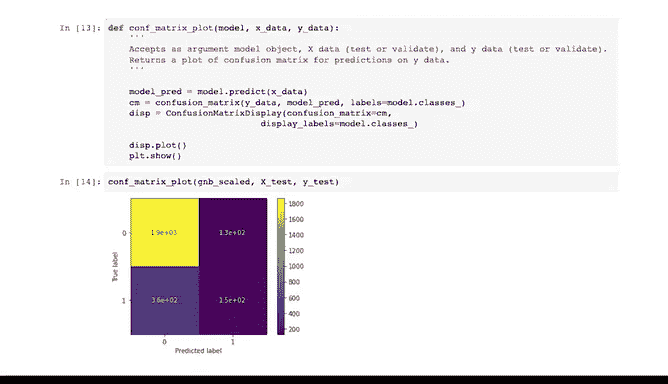

# 026：用Python构建朴素贝叶斯模型 🧮


## 概述

在本节课中，我们将学习如何使用Python的Scikit-learn库来构建一个高斯朴素贝叶斯分类器模型。我们将使用银行客户流失数据集，涵盖从数据准备、模型训练到评估的完整流程。

---

## 数据准备回顾

上一节我们讨论了朴素贝叶斯的工作原理，本节我们将使用Python来实现它。

我们将继续使用在特征工程笔记本中准备好的银行客户流失数据框。

我们删除了行号、客户ID、姓氏和性别列。

我们对地理列进行了虚拟编码，将其从分类变量转换为布尔变量，并创建了一个名为“忠诚度”的新特征，其值为客户任期除以年龄。

需要记住的是，该数据的预测变量类型不同。例如，余额和估计薪资是连续变量，而地理是分类变量。

同时，Scikit-learn有几种不同的朴素贝叶斯算法实现，每种都假设你的所有预测变量是单一类型。

作为一名数据专业人员，你在工作中首先会学到的一点是，现实世界的数据从来都不是完美的。有时数据会违反模型的假设，在实践中，你必须在现有条件下尽力而为。

对于本课程，我们将使用高斯朴素贝叶斯分类器。该实现假设你的所有变量都是连续的，并且服从高斯分布或正态分布。

我们的数据并不完全符合这些假设，但即使数据不完美，高斯模型仍可能为我们提供可用的结果。让我们开始吧。

---

## 导入必要库

首先需要导入所需的包和库。

我们将首先导入NumPy、pandas和Matplotlib。我们还将导入`train_test_split`来帮助我们将数据拆分为训练集和测试集。

我们将使用的模型称为`GaussianNB`，我们从Scikit-learn的`naive_bayes`模块中导入它。

接下来，我们将导入用于计算模型准确率、精确率、召回率和F1分数的函数。

最后，我们将导入`confusion_matrix`和`ConfusionMatrixDisplay`，它们将帮助我们计算和绘制模型结果的混淆矩阵。

以下是导入代码：
```python
import numpy as np
import pandas as pd
import matplotlib.pyplot as plt
from sklearn.model_selection import train_test_split
from sklearn.naive_bayes import GaussianNB
from sklearn.metrics import accuracy_score, precision_score, recall_score, f1_score
from sklearn.metrics import confusion_matrix, ConfusionMatrixDisplay
```

---

## 加载与检查数据

让我们读入数据框并将其命名为`churn_df`。

在开始建模之前，我们先做几件事。首先，我们将检查`exited`列（我们的目标变量）的类别平衡。我们可以通过对pandas序列调用`value_counts`方法来实现。

类别比例大约为80:20。换句话说，该数据中大约20%的人流失了。

这是一个不平衡的数据集，但并不极端，因此我们将继续处理，不对目标变量进行任何类别重新平衡。

其次，当预测变量彼此条件独立时，朴素贝叶斯模型效果最佳。

当我们准备数据时，我们通过将任期除以年龄创建了一个名为“忠诚度”的特征。由于这个新特征只是两个现有变量的商，它不再条件独立，因此我们将删除任期和年龄。

此步骤可能有益，也可能无益，但我们将执行它以帮助符合模型的假设。

---

## 拆分数据

我们已经准备好了数据，可以开始建模了。现在我们需要拆分数据，首先拆分为特征和目标变量，然后拆分为训练数据和测试数据。

让我们将预测特征分配给一个名为`X`的变量，将`exited`列（我们的目标）分配给一个名为`y`的变量。

然后我们可以拆分为训练数据和测试数据。我们使用`train_test_split`函数来完成此操作。我们将25%的数据放入测试集，并使用剩余的75%来训练模型。

请注意，我们包含了参数`stratify=y`。如果我们的主数据类别比例为80:20，分层可以确保在训练数据和测试数据中都保持这个比例。

`stratify=y`告诉函数应使用在`y`变量（即我们的目标）中找到的类别比例。

你拥有的总数据越少，类别不平衡越严重，在拆分数据时进行分层就越重要。如果我们不分层，那么函数将随机拆分数据，我们可能会得到一个不幸的拆分，导致测试数据中没有任何少数类。

那样的话，我们将无法有效地评估我们的模型。最糟糕的是，如果不进行一些调查工作，我们甚至可能意识不到问题出在哪里。

最后，我们设置一个随机种子，以便我们和其他人可以复现我们的工作。

以下是拆分代码：
```python
X = churn_df.drop(columns=['exited'])
y = churn_df['exited']
X_train, X_test, y_train, y_test = train_test_split(X, y, test_size=0.25, stratify=y, random_state=42)
```

---

## 构建初始模型

现在是时候构建模型了。

与线性和逻辑回归一样，我们的建模过程将从将模型拟合到训练数据开始，然后使用该模型对测试数据进行预测。

首先，我们将实例化高斯朴素贝叶斯模型，将其分配给一个名为`gnb`的变量。

然后，我们将其拟合到`X_train`和`y_train`数据。

最后，我们将使用`predict`方法让模型对`X_test`数据进行预测，并将结果分配给一个名为`y_preds`的变量。

以下是建模代码：
```python
gnb = GaussianNB()
gnb.fit(X_train, y_train)
y_preds = gnb.predict(X_test)
```

---

## 评估初始模型

现在我们可以使用我们导入的评估指标来检查模型的性能。对于每个指标，我们首先传递实际的`y_test`数据，然后传递预测值。

这个结果并不理想。我们的精确率、召回率和F1分数都是零。这是怎么回事？

让我们考虑一下精确率公式。模型精确率为零有两种可能：第一种是分子为零，这意味着我们的模型没有预测出任何真正例；第二种是分母也为零，这意味着我们的模型根本没有预测出任何正例。

除以零会导致未定义的值，但Scikit-learn在这种情况下会返回值0。

根据你的建模环境，你可能会收到一个警告，告诉你分母为零。

我们没有收到警告，所以让我们检查一下这里发生的是哪种情况。为此，我们将在预测值上调用NumPy的`unique`函数。

模型对测试数据中的每个样本都预测为零（即未流失）。分子和分母都为零。

考虑一下为什么会这样。也许我们在建模过程中做错了什么，或者对不同类型的预测变量和分布使用高斯朴素贝叶斯根本无法建立一个好模型。也许数据有问题。

---

## 数据探索与特征缩放

在我们放弃之前，也许数据可以让我们深入了解可能发生的情况，或者我们可以采取哪些进一步的步骤。让我们使用`describe`来检查`X`数据。

一个突出的问题是，我们创建的“忠诚度”变量与某些其他变量（如余额或估计薪资）的尺度差异巨大。“忠诚度”的最大值是0.56，而余额的最大值超过250,000，几乎大了六个数量级。

建模时可以尝试的一件事是缩放你的预测变量。有些模型要求你缩放数据才能按预期运行，而另一些则不需要。朴素贝叶斯不需要数据缩放。

然而，有时包和库需要在计算中进行假设和近似。我们已经通过在这个数据集上使用高斯朴素贝叶斯分类器打破了一些假设，而我们的一些预测变量尺度差异很大可能也无济于事。

一般来说，缩放可能不会改善模型，但可能也不会使其更糟。让我们试试看。

我们将使用一个名为`MinMaxScaler`的函数，我们从Scikit-learn的`preprocessing`模块导入它。

`MinMaxScaler`对每一列进行归一化，使每个值都落在0到1的范围内。列的最大值将缩放到1，其最小值将缩放到0，其他所有值将落在两者之间。

这是其公式：
```
X_scaled = (X - X_min) / (X_max - X_min)
```

要使用缩放器，你必须将其拟合到训练数据，并使用同一个缩放器转换训练数据和测试数据。

让我们应用这个并重新训练模型。

首先，导入缩放器。

然后我们实例化它并将其分配给一个名为`scaler`的变量。

现在，我们通过将`X_train`数据传递给它来拟合缩放器。

接下来，我们使用`transform`方法缩放`X_train`数据。

最后，我们转换`X_test`数据。

以下是缩放代码：
```python
from sklearn.preprocessing import MinMaxScaler
scaler = MinMaxScaler()
scaler.fit(X_train)
X_train_scaled = scaler.transform(X_train)
X_test_scaled = scaler.transform(X_test)
```

---

## 使用缩放数据重建模型

现在我们将重复拟合模型的步骤，只是这次我们将拟合到我们新的缩放数据。

当我们计算这个模型的性能指标时，我们没有得到错误。模型并不完美，但至少它现在可以预测流失的客户了。

让我们更仔细地检查我们的模型如何分类测试数据。我们将使用混淆矩阵来完成此操作。

请记住，混淆矩阵是一个图形，显示模型的真正例、假正例、真反例和假反例。

我们可以使用我们导入的`ConfusionMatrixDisplay`和`confusion_matrix`函数来绘制它。

以下是一个辅助函数，允许我们为模型绘制混淆矩阵：
```python
def plot_confusion_matrix(y_true, y_pred):
    cm = confusion_matrix(y_true, y_pred)
    disp = ConfusionMatrixDisplay(confusion_matrix=cm)
    disp.plot()
    plt.show()
```

我们所有的模型指标都可以从混淆矩阵中推导出来，每个指标都讲述了故事的一部分。

混淆矩阵中最突出的是，模型遗漏了很多将会流失的客户。换句话说，有很多假反例，确切地说是355个。这就是为什么我们的召回分数只有0.303。

---

## 总结



在本节课中，我们一起学习了使用Python和Scikit-learn构建高斯朴素贝叶斯分类器的完整流程。我们从回顾数据准备开始，导入了必要的库，加载并检查了数据的类别平衡。接着，我们拆分了数据，特别注意了使用分层抽样来处理类别不平衡问题。

然后，我们构建了初始模型并进行了评估，发现模型性能不佳，所有关键指标均为零。通过分析，我们发现预测变量尺度差异巨大可能是原因之一。因此，我们引入了`MinMaxScaler`对特征进行归一化处理，并使用缩放后的数据重新训练了模型。

最后，我们使用混淆矩阵等工具对改进后的模型进行了更深入的评估，发现模型虽然有所改善，但在识别流失客户（召回率）方面仍有很大提升空间。这为我们后续探索其他模型评估指标和优化方向奠定了基础。

接下来，你将研究各种模型评估指标及其使用时机。你将探索使用多个指标来评估模型性能，然后确定哪个模型最能满足数据项目的业务需求。我们下次课再见。