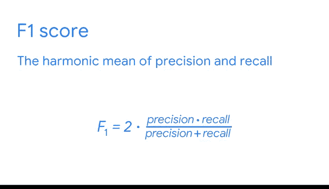

# 027：分类模型的关键评估指标 📊

在本节课中，我们将学习如何评估分类模型，特别是当面对类别不平衡的数据集时。我们将回顾准确率、精确率、召回率和F1分数等核心指标，并理解它们在模型迭代与优化过程中的作用。

你已经到达了机器学习工作流程的最后阶段——模型分析。这是模型最终投入生产前的关键步骤。你已经学习了许多关于模型评估指标的知识，了解了可用的选项，以及这些指标如何向数据专业人员展示已构建模型的性能。同时，你也构建了包括逻辑回归在内的监督学习分类模型。

## 回顾核心评估指标 🔍

上一节我们介绍了模型构建的流程，本节中我们来看看用于评估分类模型的具体指标。用于评估之前模型的指标同样适用于评估朴素贝叶斯等模型。

以下是分类模型中最常用的几个评估指标：

*   **准确率**：反映了正确预测的数量除以预测总数。其公式为：
    `准确率 = (正确预测数) / (总预测数)`
*   **精确率**：衡量在所有被模型预测为正类的样本中，真正为正类的比例。其公式为：
    `精确率 = 真阳性 / (真阳性 + 假阳性)`
*   **召回率**：衡量在所有实际为正类的样本中，被模型正确识别出来的比例。其公式为：
    `召回率 = 真阳性 / (真阳性 + 假阴性)`
*   **F1分数**：是精确率和召回率的调和平均数，用于综合评估模型性能。其公式为：
    `F1分数 = 2 * (精确率 * 召回率) / (精确率 + 召回率)`

## 处理类别不平衡问题 ⚖️

然而，准确率并不总能反映全貌。有些数据集存在严重的类别不平衡问题，即绝大多数样本只属于一个类别，此时数据集被视为不平衡的。

这里有一个二元分类问题的例子：一位IT专业人员希望用一个模型来检测公司电脑中的恶意软件。假设数据集中有5000个实例，但只有500个是电脑中确实存在恶意软件的阳性实例。那么这个人的数据集就是不平衡的，因为在所有检查中发现恶意软件的概率相对较低。

在这种情况下，精确率和召回率指标就能提供帮助。精确率关注的是“预测出的威胁有多少是真实的”，而召回率关注的是“真实的威胁有多少被找出来了”。

## 指标应用与模型迭代 🚀

准确率、精确率、召回率和F1分数是分类技术中的顶级评估指标。更具体地说，精确率、召回率和F1分数对于衡量不平衡类别的模型性能尤其有用。

无论如何，数据专业人员会使用全部四个指标来评估分类监督学习模型。正如你开始发现的那样，每个模型的表现都不同，有些算法比其他算法效果更好。在构建任何旨在投入生产的模型时，改进结果是至关重要的。你可能会调整特定参数以探索性能如何提升。

因此，你应该始终记住，模型构建本质上是一个迭代的过程。你构建的第一个模型几乎永远不会是最终部署的那个。这个迭代过程提供了在调整参数或改变每个模型中特征工程方式后，使模型达到最佳工作状态所需的信息。性能指标为模型之间的相互比较以及模型自身的纵向比较提供了基础。

## 总结与展望 📈

本节课中，我们一起学习了分类模型的关键评估指标：准确率、精确率、召回率和F1分数。我们理解了它们在评估模型性能，特别是在处理不平衡数据集时的重要作用，并认识到模型优化是一个持续的迭代过程。

接下来，我们将利用这些指标来揭示我们模型的更多信息，评估我们构建的其他模型，并研究如何提升模型性能。持续改进是数据专业人员工作的关键部分，因此这些练习正在为你不断推进各种数据流程做好准备。