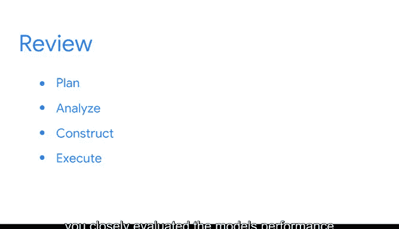

# 028：PAC工作流程总结 🎯

在本节课中，我们将总结用于构建机器学习模型的PAC工作流程。我们将回顾计划、分析和执行三个阶段的关键步骤，并理解这一框架如何帮助解决复杂的业务问题。

---

开发一个机器学习模型是一个复杂的过程。然而，无论业务需求如何，拥有一个坚实的框架作为依靠，都能帮助你奠定成功的基础。

在本课程的这个部分，PAC工作流程为你提供了一个支持框架，帮助你应对一个示例业务场景的不同阶段。

## 计划阶段 📋

上一节我们介绍了PAC工作流程的整体概念，本节中我们来看看第一个阶段：计划。

在计划阶段，你评估了业务需求，以确定哪种类型的模型最适合预测银行客户流失。这个决策是基于可用数据做出的。

## 分析阶段 🔍

在完成了计划之后，我们进入下一个关键阶段：分析。

接下来，在分析阶段，你使用探索性数据分析实践和特征工程技术检查了数据。这个过程揭示了关于数据的更多细节，有助于为你构建模型的计划提供信息。

以下是分析阶段的核心实践：
*   **探索性数据分析**：初步检查数据，了解其分布、关系和潜在问题。
*   **特征工程**：创建、选择或转换数据特征，以更好地表示问题。

## 构建与测试阶段 ⚙️

基于分析阶段的发现，我们便可以开始动手构建模型了。

从那里开始，你继续构建了朴素贝叶斯模型的第一个迭代版本。然后，你使用初步的评估指标测试了模型，以确定其在测试数据上的性能。

朴素贝叶斯分类器的核心公式基于贝叶斯定理：
`P(A|B) = [P(B|A) * P(A)] / P(B)`
在分类问题中，我们计算每个类别的后验概率 `P(类别|特征)`，并选择概率最高的类别。

## 执行阶段 🚀

模型构建并初步测试后，最后一步是深入评估与优化。

最后，在执行阶段，你仔细评估了模型的性能，并考虑了如何改进它。这可能涉及调整超参数、尝试不同的算法或收集更多数据。

---

这就是机器学习模型的PAC工作流程。在你的技能库中拥有这个过程，将使你能够解决许多业务问题。

虽然在你继续学习的过程中，模型很可能会变得更加复杂，但坚持在这个框架内工作将帮助你获得所需的结果。

本节课中我们一起学习了PAC工作流程，它包含了**计划**、**分析**、**构建与测试**以及**执行**四个核心阶段。掌握这个结构化方法，是成功应用机器学习解决实际业务问题的重要基础。