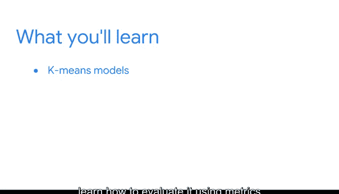

# 029：《机器学习的基础知识》第3模块 🎯

## 概述


在本节课中，我们将要学习机器学习中的一个重要分支——**无监督学习**。我们将探讨其核心概念、应用场景，并重点介绍一种常用的无监督学习算法：**K均值聚类**。

---

## 课程内容

你已经深入数据世界，并为数据建模打下了坚实基础。

到目前为止，你已经学习了线性回归、逻辑回归和朴素贝叶斯模型。

这些都是监督学习技术，用于对已标记的数据进行预测。

当前大多数机器学习应用都基于监督学习。

但当我们考虑世界上所有可用数据时，绝大多数数据是未标记的。

照片、录音、视频、社交媒体帖子，这些都是未标记数据的例子。

你可能在数据分析的背景下熟悉这个概念。

如果你获得了谷歌数据分析职业证书，你曾学到：任何未以易于识别的方式组织的数据都被称为非结构化数据。

在本课程中，我们有时会将其称为未标记数据，但含义相同。

那么，我们如何理解所有这些未标记数据呢？

当我们的数据未标记时，我们使用无监督学习技术。

这些方法使数据专业人员能够了解数据的底层结构，并找出不同特征之间的相互关系。

在课程早期，你探索了一种非常常见的无监督学习类型：推荐系统。

你了解到它们是机器学习算法的一个子类，用于向用户提供相关建议，例如为你的播放列表推荐新歌，或为冬季推荐新外套。

现在，你将了解无监督学习的许多其他令人兴奋的方法和应用。

在课程的这一部分，你将首先学习**K均值聚类**，这是一种无监督建模技术。

你将研究它如何根据每个观测值与数据中其他观测值的相似性来对数据进行聚类。

你还将构建一个K均值模型，并学习如何使用称为**惯性**和**轮廓系数**的指标来评估它。

我很高兴能与你一起探索无监督学习。

未来发展的潜力巨大。

我们才刚刚开始挖掘世界上大量的非结构化数据。

让我们开始建模吧。

---

## 核心概念与算法

上一节我们介绍了无监督学习的背景和重要性，本节中我们来看看其核心算法之一：K均值聚类。

K均值聚类是一种迭代算法，旨在将数据集划分为K个不同的、非重叠的子组（簇），其中每个数据点只属于一个组。

以下是该算法的基本步骤：

1.  **初始化**：随机选择K个数据点作为初始簇中心（质心）。
2.  **分配**：将每个数据点分配到距离其最近的质心所在的簇。
3.  **更新**：重新计算每个簇的质心（即该簇所有点的平均值）。
4.  **迭代**：重复步骤2和3，直到质心的位置不再发生显著变化，或达到预设的迭代次数。

该过程可以用以下伪代码表示：

```python
# K-Means 算法伪代码示例
初始化 K 个簇中心
while 簇中心变化大于阈值或未达到最大迭代次数:
    for 每个数据点:
        将其分配到最近的簇中心
    for 每个簇:
        将簇中心更新为该簇所有点的均值
```

---

## 模型评估指标



构建模型后，我们需要评估其效果。以下是两个常用的评估指标：

**惯性**：衡量每个样本到其所属簇的质心的距离平方和。惯性越小，说明簇内样本越紧密。公式为：
`Inertia = Σ(样本i到其质心的距离²)`

**轮廓系数**：结合了簇内凝聚度和簇间分离度，其值在-1到1之间。值越接近1，表示聚类效果越好。公式为：
`Silhouette Score = (b - a) / max(a, b)`
其中，`a`是样本到同簇其他样本的平均距离（簇内不相似度），`b`是样本到其他簇中所有样本的平均距离的最小值（簇间不相似度）。

---

## 总结

本节课中，我们一起学习了机器学习中**无监督学习**的基本概念。我们了解到，与使用已标记数据的监督学习不同，无监督学习用于探索未标记数据的底层结构和模式。我们重点介绍了**K均值聚类算法**，了解了其工作原理、步骤以及如何使用**惯性**和**轮廓系数**来评估聚类结果。掌握这些知识是理解更复杂无监督学习技术的重要基础。