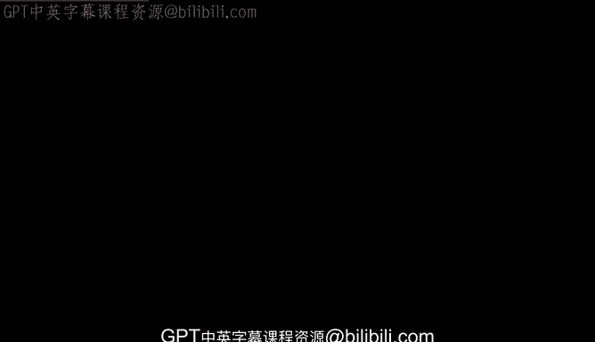
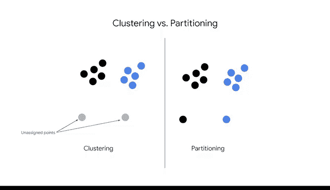

# 030：K均值聚类入门 🎯

在本节课中，我们将要学习K均值算法的基础知识。这是一种无监督学习算法，用于将未标记的数据组织成不同的组或簇。

---

## 什么是K均值算法？ 🤔

K均值是一种**无监督分区算法**。它用于将未标记的数据组织成组或簇。

它通过创建一个逻辑方案来理解数据。在K均值中，每个簇由一个中心点或**质心**定义。其位置代表簇的中心，也称为数学平均值，因此得名“K均值”。

---

## 构建K均值模型的四个步骤 🔄

构建一个K均值模型包含四个步骤。让我们逐一进行检视。

### 步骤1：选择并放置质心

在步骤1中，你选择质心的数量并将它们放置在数据空间中。

`K`代表模型中质心的数量，也就是你将拥有的簇的数量。这是一个由你做出的决定。

有时，你可能对项目所需的簇数量有所了解。例如，如果你的公司生产五种不同的产品，你可能希望将`K`值设置为5。

其他时候，你可能不知道数据应该被分成多少个簇。因此，可以尝试不同的`K`值，并确定哪个能提供最佳结果。

以下是一个示例：
*   有时你已知簇的数量（例如，对应5种产品）。
*   有时你需要尝试不同的`K`值来寻找最佳结果。

在这里，很明显我们的数据被分成了两个簇，一个在上方，另一个在下方。在步骤1中，我们将随机初始化两个质心，用蓝色和红色的“X”表示。

---

### 步骤2：将每个数据点分配到最近的质心

步骤2是将每个数据点分配到其最近的质心。最近的质心是指在空间上距离最近的那个。

在这个例子中，顶部的两个观测点被分配到蓝色质心，底部的两个观测点被分配到红色质心。

作为快速回顾，在此上下文中，一个**观测点**就是任何被观察的数据点。

---

### 步骤3：重新计算每个簇的质心

再次强调，质心的位置是通过计算其簇内所有点的**平均值**来确定的。

请注意，质心移动到了其簇的中点。在算法达到收敛之前，每次迭代都会发生这种情况。

**收敛**是在一系列解决方案结束时找到的稳定点。

---

### 步骤4：重复步骤2和3，直到算法收敛

在这种情况下，我们的数据非常少，因此模型很简单，并且已经收敛。如果你有更多的数据，质心会越来越接近其相关的簇。

你可能还会发现，随着质心位置在每次迭代中移动，每个数据点的簇分配也会发生变化。

---

## 需要注意的关键点 ⚠️

上一节我们介绍了K均值的基本步骤，本节中我们来看看一些关键的注意事项。

需要留意的一点是，用不同的质心起始位置运行模型非常重要。这有助于避免由**局部最小值**导致的糟糕聚类。换句话说，就是避免簇之间没有适当的距离。

让我们用我们的例子来探讨这个概念。

如果这是我们的质心初始位置，注意会发生什么。

在步骤2中，我们将点分配到它们最近的质心。对于这些特定的起始位置，左边的两个观测点被分配到红色簇，右边的两个观测点被分配到蓝色簇。

对于步骤3，我们重新计算每个簇质心的位置。模型已经收敛，但簇的划分结果并非我们所期望的。

我们知道，最直观的聚类应该是顶部的两个观测点在一个簇中，底部的两个在另一个簇中。但事实并非如此。并且进一步的迭代也不会改变这一点。

这就是为什么用不同的质心初始化运行模型很重要，以避免模型在局部最小值收敛而导致的糟糕聚类。

请注意，这种聚类并非错误。它仍然是模型的一个有效解决方案。只是在这个上下文中，它没有太大意义。毕竟，目标是找到一个能理解你数据的聚类方案。

---

## 算法特性与总结 📝

最后，请注意，尽管K均值是一种分区算法，但数据专业人员通常将其称为聚类算法。

区别在于，在聚类算法中，离群点可以存在于簇之外。然而，对于分区算法，所有点都必须被分配到一个簇中。换句话说，**K均值不允许未分配的离群点**。

以下是核心特性的总结：
*   **分区算法**：所有数据点都必须属于某个簇。
*   **无离群点**：K均值不允许存在未分配的数据点。

---

## 课程总结

本节课中我们一起学习了K均值聚类的基础知识。

**K均值**是一种无监督学习技术，它根据相似性将未标记的数据分组到`K`个簇中。聚类过程包含四个步骤，这些步骤会重复直到模型收敛。

`K`的值是由建模者决定的一个参数。最后，构建多个模型以避免糟糕的聚类非常重要。

在本节后面的内容中，你将学习如何确定`K`的最佳值。你还将发现K均值模型的一些局限性。更多内容即将到来。