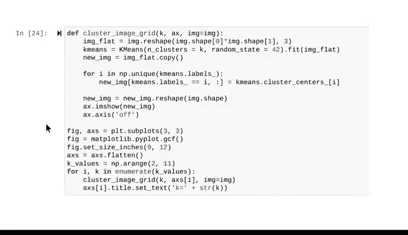

# 031：使用K均值聚类进行颜色压缩 🎨


在本节课中，我们将学习如何将K均值聚类算法应用于一个实际案例：压缩照片中的颜色。我们将通过一个具体的图像处理示例，来加深对K均值算法工作原理的理解。

---

## 准备工作：理解图像数据

上一节我们介绍了K均值算法的基本直觉，本节中我们来看看如何将其应用于真实数据。

我们将使用一张郁金香的照片作为数据。使用Matplotlib库的`imread`函数将图像读取为一个数组，并用`imshow`函数显示它。

```python
import matplotlib.pyplot as plt
import matplotlib.image as mpimg

# 读取图像
image = mpimg.imread('tulips.jpg')
plt.imshow(image)
plt.show()
```

检查图像的形状（以像素为单位），我们得到`(320, 240, 3)`。这些数字可以解释为像素信息：
*   `320` 和 `240` 分别代表图像的垂直和水平像素数量。
*   维度 `3` 指的是编码每个像素颜色的值。

每个像素都有三个参数：红色（R）、绿色（G）和蓝色（B）。这些值统称为RGB值。每个颜色（R、G、B）的取值范围是0到255。这意味着有 `256^3`（超过1600万）种不同的RGB组合，每种组合对应一种独特的颜色。

为了便于建模，我们将数据重塑为一个数组，其中每一行代表一个像素的RGB颜色值。

```python
# 将图像数据重塑为像素列表
pixels = image.reshape(-1, 3)
print(pixels.shape)  # 输出: (76800, 3)
```

现在我们得到一个 `76800 x 3` 的数组，每一行是一个像素的颜色值。

---

## 可视化颜色空间

为了更好地理解和可视化这些数据，我们可以创建一个Pandas DataFrame。DataFrame的每一行代表一个像素，三列分别是其R、G和B值。

由于只有三个维度，我们可以在三维空间中可视化这些数据。下图在3D坐标系中绘制了照片的每个像素。

```python
import pandas as pd
from mpl_toolkits.mplot3d import Axes3D

df = pd.DataFrame(pixels, columns=['R', 'G', 'B'])
fig = plt.figure()
ax = fig.add_subplot(111, projection='3d')
ax.scatter(df['R'], df['G'], df['B'], c=pixels/255.0, s=1)
ax.set_xlabel('Red')
ax.set_ylabel('Green')
ax.set_zlabel('Blue')
plt.show()
```

每个轴的范围是0到255，与RGB值范围一致。图中的每个点都是由其RGB值指定的颜色，就像原始照片中一样。颜色越强烈，该区域中的点就越集中。图中最具代表性的颜色是照片中最丰富的颜色——主要是红色、绿色和黄色。

我们可以从不同角度检查这个图形，甚至可以缩放。

---

## 应用K均值聚类：从K=1开始

我们可以在这些数据上训练一个K均值模型。该算法通过最小化每个点到其最近质心的平方距离来创建K个簇。

以下是一个实验：如果我们用仅一个质心（即K=1）构建一个K均值模型，你预期会发生什么？让我们来验证一下。

首先，实例化模型。作为复习，实例化涉及创建类的一个副本，该类继承了所有类变量和方法。

```python
from sklearn.cluster import KMeans

# 创建K=1的K均值模型
kmeans1 = KMeans(n_clusters=1, random_state=42)
kmeans1.fit(pixels)
```

现在，我们将复制原始图像，用其最近聚类中心的RGB值替换每一行（即每个像素），然后重塑图像以便显示。

```python
# 获取质心颜色并替换所有像素
centroid_color = kmeans1.cluster_centers_[0]
compressed_image_1 = centroid_color.reshape(1, -1).repeat(pixels.shape[0], axis=0)
compressed_image_1 = compressed_image_1.reshape(image.shape)

# 显示结果
plt.imshow(compressed_image_1)
plt.title('K=1')
plt.show()
```

我们得到的图像完全不像郁金香。发生了什么？

让我们回顾一下K均值的步骤：
1.  算法在255x255x255的颜色空间中随机放置一个质心。
2.  它将每个点分配给最近的质心。因为只有一个质心，所有点都被分配给它，因此属于同一个簇。
3.  算法将质心的位置更新为其所有点的平均位置。同样，只有一个质心，所以它更新为图像中每个点的平均位置。
4.  通常，这些步骤会重复直到模型收敛。但在这里，只需要一次迭代。

我们将每个像素的RGB值更新为与质心相同。结果就是一张每个像素都被替换为平均颜色的郁金香图像。

我们可以通过手动计算数组中每列的平均值来验证这一点。

```python
manual_average = pixels.mean(axis=0)
print("手动计算的平均RGB值:", manual_average)
print("K均值模型计算的质心:", kmeans1.cluster_centers_[0])
```

两者是相同的。现在，让我们回到颜色空间的3D渲染图，但这次添加上质心。质心是颜色空间中间的一个大圆点，可以看作是图中所有点的“重心”。

---

## 应用K均值聚类：K=3的情况

现在，让我们用K=3重新拟合另一个K均值模型。花点时间思考一下你预期会得到什么结果。像上面一样，在脑海中过一遍模型正在执行的步骤。你可能会看到什么颜色？

我们重新拟合模型，将簇的数量设置为3，得到三个质心位置，这些就是我们可以用来显示每个质心颜色的RGB值。

```python
# 创建K=3的K均值模型
kmeans3 = KMeans(n_clusters=3, random_state=42)
kmeans3.fit(pixels)

# 获取质心颜色
centroids_k3 = kmeans3.cluster_centers_
print("三个质心的RGB值:\n", centroids_k3)

# 使用辅助函数显示颜色样本
def plot_colors(centroids):
    plt.figure(figsize=(3, 1))
    for i, color in enumerate(centroids):
        plt.subplot(1, len(centroids), i+1)
        plt.axis('off')
        plt.imshow([[color/255.0]])
    plt.show()

plot_colors(centroids_k3)
```

你可能会假设三簇模型会产生相似的颜色。这是正确的。照片中的主要颜色——红色、绿色和黄色——都出现在这里。

同样，我们可以用新K均值模型分配的质心的RGB值替换原始图像中的每个像素。

```python
def compress_image(pixels, kmeans_model, original_shape):
    labels = kmeans_model.predict(pixels)
    compressed_pixels = kmeans_model.cluster_centers_[labels]
    return compressed_pixels.reshape(original_shape)

compressed_image_3 = compress_image(pixels, kmeans3, image.shape)
plt.imshow(compressed_image_3)
plt.title('K=3')
plt.show()
```

我们现在得到一张只有三种颜色的照片，就是上面样本中的那三种颜色。每种颜色的RGB值对应于其最近质心位置的RGB值。

我们可以再次返回到我们的3D坐标空间。这次，我们将根据其质心的颜色重新为每个点上色，这能让我们看到K均值算法如何在空间上对数据进行聚类。

```python
# 在3D图中用质心颜色重新着色点
fig = plt.figure()
ax = fig.add_subplot(111, projection='3d')
colors_k3 = kmeans3.cluster_centers_[kmeans3.labels_] / 255.0
ax.scatter(df['R'], df['G'], df['B'], c=colors_k3, s=1)
ax.set_xlabel('Red')
ax.set_ylabel('Green')
ax.set_zlabel('Blue')
plt.title('3D Color Space with K=3 Clusters')
plt.show()
```

每个像素现在都根据其质心的RGB值着色，并且簇位于空间的顶点处。

---

## 探索不同的K值

整个过程可以应用于任何K值。以下是K从2到10时，每张照片的输出结果。

```python
plt.figure(figsize=(15, 10))
for i, k in enumerate(range(2, 11)):
    kmeans = KMeans(n_clusters=k, random_state=42).fit(pixels)
    compressed_img = compress_image(pixels, kmeans, image.shape)
    plt.subplot(3, 3, i+1)
    plt.imshow(compressed_img)
    plt.title(f'K={k}')
    plt.axis('off')
plt.tight_layout()
plt.show()
```

注意，每次增加一种颜色后，越来越难看出图像之间的差异。这是所有聚类模型都会发生的情况的一个视觉示例，即使数据不是你可以看到的图像。当你将数据分成越来越多的簇时，超过某个点后，额外的簇对你理解数据的贡献越来越小。

---



## 总结与展望

本节课中，我们一起学习了如何将K均值聚类算法应用于图像颜色压缩。我们通过从K=1到K=10的示例，直观地理解了算法如何将像素分组，以及随着簇数量的增加，图像细节如何变化。这个演示加深了我们对K均值算法工作原理的理解。

很快，我们将探索用数值方法确定特定数据的最佳K值。一如既往，欢迎你自行探索代码笔记本，继续构建你的技能。