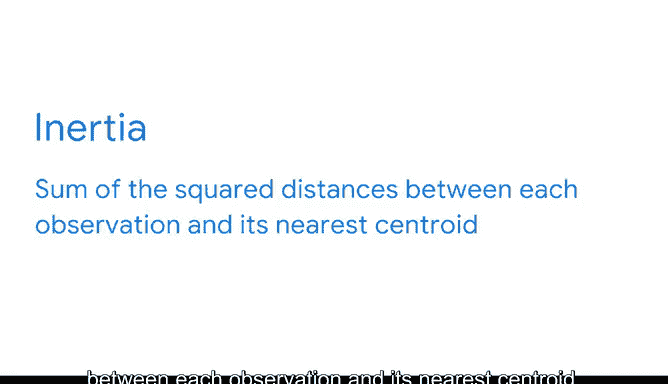

# 032：K均值聚类的关键评估指标 🎯

在本节课中，我们将要学习如何评估K均值聚类模型的有效性。我们将探讨在没有标签数据的情况下，如何判断模型是否成功地将数据点分成了有意义的组，并介绍两个核心的评估指标。

---

上一节我们介绍了K均值方法的基本原理。在一些二维或三维空间的例子中，我们可以直观地看到数据点是否被正确地分配到了簇中。

然而，在实际工作中，数据通常具有远超三个维度的特征，这使得我们无法通过可视化来直接判断聚类效果。我们甚至可能不知道数据中应该存在多少个簇。

那么，如何决定K的值？一旦确定了K，又该如何知道模型是否按预期工作呢？

在线性回归和逻辑回归中，我们可以使用R平方、均方误差、ROC曲线下面积、精确率和召回率等指标来评估模型。但在无监督学习中，我们没有带标签的数据作为比较基准，这些指标并不适用。

事实上，聚类模型并不进行预测，而是根据数据点之间的相似性对其进行分组。因此，需要由你来调查和理解不同的簇。

如果你拥有相关的领域知识，或者你试图解决的问题本身存在约束条件，请充分利用这些信息。例如，如果你正在为一项提供四种不同订阅等级的服务进行客户细分，那么你很可能应该将K的值设为4。

但是，如果你无法预先知道K的值，也无需担心，还有其他方法可以解决这个问题。

在开始介绍评估指标之前，我们先来思考一下，一个好的聚类模型应该是什么样的。本质上，我们希望得到清晰可辨的簇。

这意味着，在每个簇内部，数据点之间应该彼此接近。同时，在不同的簇之间，应该有足够的空白空间。

以下是评估K均值模型簇内紧密程度的一种方法：

**惯性**是K均值模型的一个核心评估指标。请注意，这里的“惯性”与物理学中的定义不同。在K均值中，惯性被定义为每个观测点到其最近质心的**平方距离之和**。

**公式：**
`Inertia = Σ (distance(point_i, centroid_i))²`

本质上，这是一个衡量同一簇内观测点之间紧密相关程度的指标。该信息会在所有簇上进行汇总，为这个特定的度量标准产生一个单一的分数。

另一个评估K均值模型的重要指标是**轮廓系数**。这是一个比惯性更精确的评估指标，因为它同时考虑了簇与簇之间的分离程度。

轮廓系数定义为模型中所有观测点的轮廓系数的平均值。我们稍后会对此进行更深入的探讨。现在只需知道，轮廓系数有助于评估你的模型，为K的最优值提供见解，并且在计算中同时使用了簇内和簇间的度量。

---

😊 做得很好。现在你对什么是一个好的聚类模型有了更好的理解，也对一些用于确定模型有效性的指标有了更多的认识。

在接下来的课程中，我们将进一步探索这些指标，并学习数据专业人士如何在工作中运用它们。

本节课中，我们一起学习了：
1.  **评估无监督学习模型的挑战**：由于没有标签数据，传统监督学习的评估指标不适用。
2.  **好聚类的标准**：簇内紧密，簇间分离。
3.  **两个核心评估指标**：
    *   **惯性**：衡量簇内紧密度的指标，计算所有点到其所属簇质心的距离平方和。值越小，表示簇内越紧密。
    *   **轮廓系数**：一个更全面的指标，同时考虑簇内凝聚度和簇间分离度。其值介于-1到1之间，越接近1表示聚类效果越好。