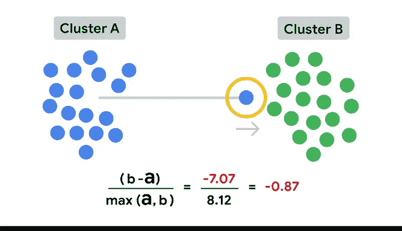

# 033：评估聚类模型的核心指标 📊

在本节课中，我们将学习如何评估K均值聚类模型。我们将重点介绍两个核心评估指标：**惯性**和**轮廓系数**。理解这些指标对于判断模型质量、选择合适的聚类数量至关重要。

---

## 评估聚类模型的目标

上一节我们介绍了K均值聚类的基本原理。本节中，我们来看看如何量化评估一个聚类模型的好坏。

一个理想的聚类模型应具备两个特征：
1.  **簇内紧凑**：同一个簇内的数据点彼此非常接近。
2.  **簇间分离**：不同簇之间被清晰地分开。

接下来，我们将学习两个用于衡量这些特征的指标。

---

## 指标一：惯性

惯性衡量的是**簇内距离**，即同一个簇内数据点的紧密程度。

**惯性**被定义为数据集中每个观测值与其所属簇的质心之间距离的平方和。它是一个衡量簇内紧凑度的指标。惯性越低，说明簇内数据点越相似、越紧凑。

惯性可以用以下公式表示：

`inertia = Σ (d(x_i, c_k))^2`

其中：
*   `n` 是数据中观测值的总数。
*   `x_i` 是第 `i` 个观测值。
*   `c_k` 是观测值 `x_i` 所属簇的质心。
*   `d(x_i, c_k)` 是观测值 `x_i` 到其质心 `c_k` 的距离。

**簇越紧凑，惯性值越低**，因为每个观测值与其最近质心之间的距离更小。因此，我们的目标是让惯性尽可能接近0。

**惯性有可能为0吗？**
有可能，但以下两种情况下的惯性为0并不能为我们提供有价值的信息：
1.  所有观测值完全相同（所有数据点在同一位置），那么对于任何K值，惯性都为0。
2.  聚类数量等于观测值数量。如果每个观测值自成一簇，那么其质心就是它自身，距离为0，惯性也为0。

惯性是一个重要的指标，因为它能帮助我们决定最优的K值。我们通过**肘部法则**来实现这一点。

在肘部法则中，我们首先用不同的K值构建多个模型。然后绘制每个K值对应的惯性曲线。

以下是一个示例图表示意。注意，K值越大，惯性通常越低。那么是否应该总是选择高K值呢？答案是否定的。低惯性固然好，但如果它导致了无意义或无法解释的聚类，那么它对你就毫无帮助。

选择最优K值的一个好方法是找到曲线的“肘部”。这是指惯性下降开始趋于平缓时所对应的K值。在上面的示例中，当我们使用3个簇时出现了肘部。有时可能难以在两个连续的K值之间做出选择，这时就需要你根据具体项目情况来决定哪一个更合适。

---

## 指标二：轮廓系数

第二个评估K均值模型的重要指标是**轮廓分数**。这是一个比惯性更精确的评估指标，因为它同时考虑了**簇间的分离度**。

轮廓分数定义为模型中所有观测值的轮廓系数的平均值。

每个观测值都有自己的轮廓系数，其计算公式为：

`silhouette_coefficient = (b - a) / max(a, b)`

其中：
*   `a` 是该观测值到**同一簇内**所有其他观测值的平均距离。
*   `b` 是该观测值到**下一个最近簇**中每个观测值的平均距离。

轮廓系数的取值范围在 **-1 到 1** 之间。

考虑以下示意图：
*   如果一个观测值的轮廓系数接近 **1**，意味着它既很好地位于自己簇的内部，又与其他簇清晰分离。
*   值为 **0** 表示该观测值位于簇的边界上。
*   如果轮廓系数接近 **-1**，则可能意味着该观测值被分配到了错误的簇中。

因此，正如你所体验到的，当使用轮廓分数来帮助确定模型应有多少个簇时，通常应选择能**最大化轮廓分数**的那个K值。

---

## 课程总结

本节课中，我们一起学习了评估K均值聚类模型的两个核心指标：**惯性**和**轮廓系数**。

*   **惯性**专注于衡量簇内的紧凑程度，通过肘部法则帮助我们寻找合适的聚类数量。
*   **轮廓系数**则提供了一个更全面的视角，同时评估了簇内紧凑度和簇间分离度。

理解这些指标的推导和含义，将使你能够更自信地运用它们来优化你的聚类模型，为后续的数据分析工作打下坚实基础。