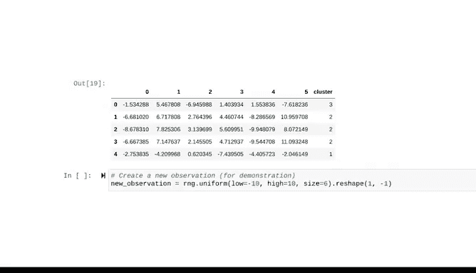

# 034：使用Python计算惯性与轮廓分数 📊


在本节课中，我们将学习如何构建一个K均值模型，并使用**惯性**和**轮廓分数**这两个关键指标来评估它，从而帮助我们确定数据中最合适的聚类数量K。我们将涵盖从导入必要的包、数据预处理、模型构建到最终评估的完整流程。

---

## 概述

上一节我们介绍了惯性和轮廓分数的概念，它们是评估K均值模型效果、帮助确定最佳K值的核心指标。由于K均值是一种无监督学习模型，没有所谓的“正确答案”，因此数据专业人员必须依赖这些指标来判断模型是否识别出了对业务需求有用的数据特征。

本节中，我们将动手实践，在Jupyter Notebook中构建一个K均值模型，并使用惯性和轮廓分数来评估它，最终确定最佳的K值。

---

## 第一步：导入必要的包

首先，我们需要导入构建模型和进行分析所需的Python包。

以下是需要导入的包和模块：

*   **numpy** 和 **pandas**：用于数据处理和操作。
*   **sklearn.cluster** 中的 **KMeans**：用于构建K均值聚类模型。
*   **sklearn.metrics** 中的 **silhouette_score**：用于计算轮廓分数。
*   **sklearn.preprocessing** 中的 **StandardScaler**：用于数据标准化（缩放）。
*   **sklearn.datasets** 中的 **make_blobs**：用于生成本次演示所需的合成数据。
*   **seaborn**：用于数据可视化。

```python
import numpy as np
import pandas as pd
from sklearn.cluster import KMeans
from sklearn.metrics import silhouette_score
from sklearn.preprocessing import StandardScaler
from sklearn.datasets import make_blobs
import seaborn as sns
```

---

## 第二步：准备数据

在实际工作中，你会从真实数据集开始，并进行数据探索、清洗等预处理步骤。为了简化流程并专注于建模与分析，本节我们将使用合成数据。

首先，我们创建一个随机数生成器，以确保生成的合成数据可复现。

```python
rng = np.random.default_rng(42)
```

接下来，使用 `make_blobs` 函数和随机数生成器来创建具有未知数量聚类的数据。我们将结果转换为Pandas DataFrame，以便于查看和处理。

```python
X, y, centers = make_blobs(n_samples=300, centers=None, n_features=6, random_state=rng, return_centers=True)
df = pd.DataFrame(X)
```

我们的数据有6个特征。由于维度较高，我们无法在二维或三维空间中直观地观察聚类情况，因此需要借助惯性和轮廓分数来“探测”数据的结构。

---

## 第三步：数据标准化

K均值模型基于数据点之间的距离来衡量相似性。如果数据的特征尺度不一致，距离计算会被尺度大的特征主导，从而影响聚类效果。因此，建模前对数值数据进行标准化至关重要。

我们将使用 **StandardScaler**。它通过以下公式对每个特征进行缩放：

**公式：** `x_scaled = (x - μ) / σ`

其中，`μ` 是特征均值，`σ` 是特征标准差。这使得所有特征的均值为0，标准差为1。

Sklearn的预处理包中还有其他缩放方法（如MinMaxScaler、Normalizer等）。虽然没有固定规则决定哪种方法最好，但对于K均值模型，使用任何缩放方法几乎总比完全不缩放效果更好。

我们使用 `.fit_transform()` 方法一步完成标准化器的实例化和数据转换。建议保留一份未缩放的原始数据副本以备后续分析。

```python
scaler = StandardScaler()
X_scaled = scaler.fit_transform(df)
```

---

## 第四步：构建K均值模型并计算惯性

数据标准化后，我们就可以开始建模了。由于我们不知道数据中存在多少个聚类，我们将从检查不同K值对应的惯性开始。我们先尝试一个任意值，例如K=3。

默认情况下，Sklearn使用一种优化的K均值算法——**K-means++**。它通过让初始质心彼此远离来帮助确保模型达到更优的收敛状态。因此，我们无需多次重新运行模型。

现在，让我们实例化模型，设置聚类数 `n_clusters=3`，并指定一个 `random_state` 以确保结果可复现。

```python
kmeans3 = KMeans(n_clusters=3, random_state=42)
kmeans3.fit(X_scaled)
```

模型拟合完成后，我们可以调用其属性来查看结果：
*   `.labels_`：获取每个数据点的聚类标签。
*   `.inertia_`：获取模型的惯性值（所有样本到其最近质心的平方距离之和）。

```python
labels_3 = kmeans3.labels_
inertia_3 = kmeans3.inertia_
print(f"K=3时，惯性值为：{inertia_3}")
```

单一的惯性值意义不大。我们需要比较多个K值下的惯性，以寻找“拐点”。

---

## 第五步：通过惯性确定最佳K值

为了系统地比较，我们创建一个函数，计算K从2到10时的惯性，并绘制“惯性-聚类数”曲线图。

```python
def get_inertia(data, max_k=10):
    inertia_values = []
    for k in range(2, max_k+1):
        kmeans = KMeans(n_clusters=k, random_state=42)
        kmeans.fit(data)
        inertia_values.append(kmeans.inertia_)
    return inertia_values

inertia_list = get_inertia(X_scaled)
# 使用seaborn或matplotlib绘制 inertia_list 随K值变化的折线图
```

观察生成的曲线图，我们发现在 **K=5** 处存在一个清晰的“拐点”（肘部）。当聚类数超过5时，惯性下降不再明显。这表明5个聚类可能是一个最优选择。

---

## 第六步：通过轮廓分数验证最佳K值

惯性分析给出了一个候选K值，我们再用轮廓分数来验证。轮廓分数衡量了每个样本与自己所属聚类和其他聚类的分离程度，其值越接近1越好。

首先，计算我们之前构建的K=3模型的轮廓分数。

```python
score_3 = silhouette_score(X_scaled, labels_3)
print(f"K=3时，轮廓分数为：{score_3}")
```

同样，单一的分数没有比较价值。我们编写另一个函数，计算K从2到10时的轮廓分数，并绘制曲线图。

```python
def get_silhouette(data, max_k=10):
    silhouette_scores = []
    for k in range(2, max_k+1):
        kmeans = KMeans(n_clusters=k, random_state=42)
        labels = kmeans.fit_predict(data)
        score = silhouette_score(data, labels)
        silhouette_scores.append(score)
    return silhouette_scores

score_list = get_silhouette(X_scaled)
# 绘制 score_list 随K值变化的折线图
```

轮廓分数图显示，当 **K=5** 时，分数最接近1。这证实了我们从惯性分析中得出的结论。

---

## 第七步：最终建模与聚类分析

由于我们使用的是合成数据，可以验证真实的聚类数量。回顾我们在创建数据时保存的 `centers` 变量，确认数据确实有5个中心点。我们的分析是正确的！

现在，我们用确定的最佳K值（5）来实例化最终的K均值模型，并拟合数据。

```python
final_kmeans = KMeans(n_clusters=5, random_state=42)
final_kmeans.fit(X_scaled)
final_labels = final_kmeans.labels_
```

模型给出了0到4的五个唯一标签。我们可以将这些标签作为新列添加到原始的未缩放DataFrame中，以便进行后续分析。

```python
df['cluster'] = final_labels
```

接下来，我们可以基于 `df` 分析不同聚类之间的特征差异（例如，计算每个聚类在各个特征上的均值）。这一步在缩放后的数据上难以进行，因为数值失去了原有的业务含义。

需要注意的是，在许多实际案例中，区分不同聚类的特征可能并不明显，需要结合领域知识和大量分析工作，才能判断某种聚类方式是否合理、是否有意义。这正是实践经验和专业知识极具价值的地方。

---

## 总结

本节课中，我们一起学习了如何完整地应用K均值聚类模型：
1.  **导入工具**：引入了建模和评估所需的Python包。
2.  **准备与标准化数据**：理解了数据标准化对基于距离的算法的重要性，并使用了 `StandardScaler`。
3.  **构建与评估模型**：实例化K均值模型，并利用 **`.inertia_`** 属性计算惯性，利用 **`silhouette_score`** 函数计算轮廓分数。
4.  **确定最佳K值**：通过绘制惯性和轮廓分数随K值变化的曲线，寻找“拐点”和最高分，综合确定最佳的聚类数量。
5.  **最终分析与验证**：使用最佳K值重建模型，并将聚类结果用于后续的数据解读与分析。



通过结合使用惯性和轮廓分数，我们能够更有信心地为无监督的K均值聚类模型选择合适的参数，从而发现数据中潜在的有价值结构。