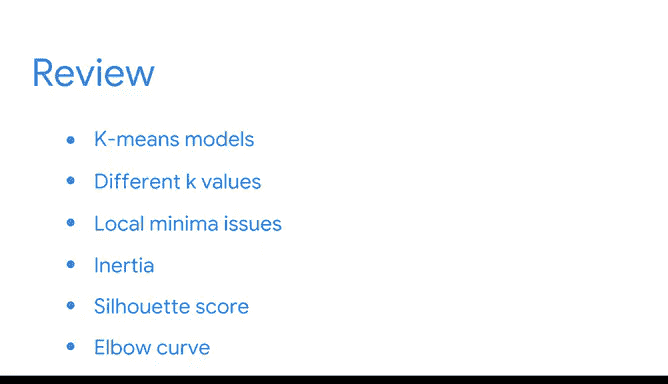
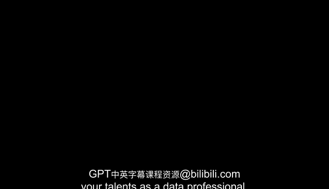

# 035：无监督学习总结 🎯

在本节课中，我们将总结无监督学习部分的核心内容，特别是K均值模型的关键概念和应用方法。

---

恭喜你完成了本课程的又一个重要部分。在此过程中，你已经发现无监督学习是一个拥有众多不同应用的广阔领域。

首先，你学习了用于从数据中提取结构的K均值模型。😊

你被引入了围绕质心对相似数据组进行聚类的概念，并学习了如何构建一个K均值模型。

我们探讨了使用不同的K值多次运行K均值模型的重要性。

我们还解释了局部最小值的问题，以及如何通过不同的质心初始化来构建模型，以确保获得最准确的结果。

现在，你对用于选择最佳聚类数量和评估模型有效性的**惯性**和**轮廓系数**方法更加熟悉了。

并且，你能够识别惯性曲线的“肘部”，并利用它来帮助确定最优的K值。

无监督学习模型和方法论的世界非常广阔。这仅仅是一个开始。但现在，你已经掌握了在这个领域中导航并发展你作为数据专业人士才能的关键工具。😊

---

## 核心概念回顾

以下是本部分课程中涉及的核心概念和方法总结：

*   **K均值聚类**：一种将数据点围绕质心（中心点）分组的方法。其目标是最小化每个点到其所属簇质心的距离平方和。
    *   **公式/目标**：最小化 `J = Σ Σ ||x_i - μ_j||²`，其中 `x_i` 是数据点，`μ_j` 是第j个簇的质心。
*   **惯性**：衡量模型性能的指标，表示每个样本到其最近质心的距离平方和。惯性越小，聚类效果通常越好。
*   **轮廓系数**：用于评估聚类质量的指标，结合了内聚度和分离度。其值在-1到1之间，越接近1表示聚类效果越好。
*   **肘部法则**：一种通过绘制不同K值对应的惯性曲线，并寻找曲线拐点（“肘部”）来确定最优K值的方法。
*   **局部最小值**：K均值算法可能收敛到的非全局最优解，这通常与质心的初始随机选择有关。
*   **多次初始化**：为了克服局部最小值问题，通常使用不同的随机种子多次运行K均值算法，并选择惯性最小的结果。

---

## 总结

本节课中，我们一起学习了无监督学习，特别是K均值聚类的基础知识。你了解了如何构建和评估K均值模型，掌握了使用惯性、轮廓系数和肘部法则来选择最佳聚类数量的关键技能。同时，你也认识到了处理局部最小值问题的重要性。这些工具为你进一步探索更广阔的无监督学习世界奠定了坚实的基础。