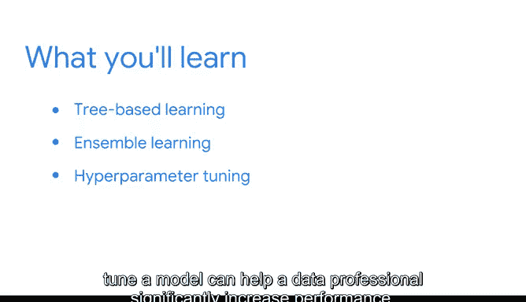

# 036：欢迎来到模块4 🌳


在本模块中，我们将深入探讨更高级的机器学习技术。你将重新审视监督式机器学习，并研究一些更先进的分类方法。这些进展对数据专业人员而言非常令人兴奋，因为它们使我们能够克服一些典型的建模限制。

## 基于树的学习 🌲

上一节我们介绍了本模块的学习目标，本节中我们来看看第一种高级技术：基于树的学习。

基于树的学习是一种监督式机器学习，用于执行分类和回归任务。它使用决策树作为预测模型，从代表项目特征的**分支**出发，最终到达代表项目目标值的**叶子**节点，从而得出结论。

决策树模型可以用以下伪代码逻辑表示：
```
如果 条件A 成立:
    如果 条件B 成立:
        预测为 类别1
    否则:
        预测为 类别2
否则:
    预测为 类别3
```

很快，你将学习到单一决策树如何为各种数据工作中更先进的方法奠定基础。

## 集成学习技术 🤝

了解了单一决策树后，我们将继续前进，探索集成学习技术。这些技术使你能够同时使用多个决策树，以构建非常强大的模型。

以下是集成学习的核心思路：
*   **核心思想**：结合多个较弱的模型（如浅层决策树），共同做出比任何单一模型都更准确、更稳定的预测。

## 超参数调优 ⚙️

除了学习这些新模型的工作原理及其应用场景，你还将接触到超参数调优。了解如何以及何时调整或优化模型，可以帮助数据专业人员显著提升模型性能。

超参数调优可以理解为寻找模型的最佳配置，例如：
```python
# 例如，在决策树中调整最大深度
model = DecisionTreeClassifier(max_depth=5)
```

## 学习成果与展望 🎯

我们将共同构建能够对各种商业应用产生巨大影响的模型。你即将学到的内容将使你在行业雇主面前脱颖而出。

让我们开始学习吧。




---

**本节课总结**


本节课中我们一起学习了模块四的概述。我们了解到本模块将重点介绍基于树的学习和集成学习这两种强大的监督机器学习技术，以及优化模型性能的关键技能——超参数调优。这些知识是构建高效、实用预测模型的重要基础。