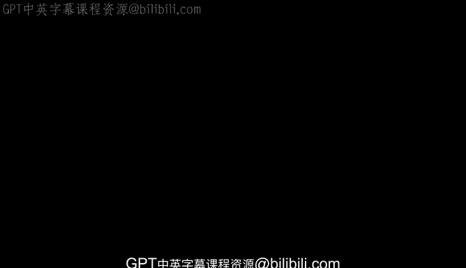
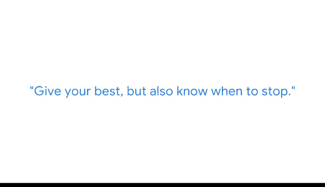

# 037：突出技术和人际技能 🎯

在本节课中，我们将学习谷歌数据科学经理Daisy分享的关于数据科学家求职的核心见解。她将结合自己过去三年进行约200场面试的经验，详细阐述在招聘中高级和初级数据科学家时所看重的技术能力与软技能，并为希望入行的初学者提供实用的建议。

---

## 技术能力：坚实的分析基础 💻

上一节我们了解了课程背景，本节中我们来看看数据科学家需要具备哪些核心技术能力。Daisy指出，面试的技术部分主要考察候选人的编程技能以及对机器学习和统计学的理解。

以下是技术能力的具体考察点：

*   **编程技能**：重点考察在 **`R`**、**`Python`** 和 **`SQL`** 方面的熟练程度。
*   **理论知识**：需要理解**机器学习**与**统计学**的核心概念。

---

## 人际技能：连接技术与业务的桥梁 🤝

掌握了技术基础后，数据科学家还需要具备将技术应用于实际业务的能力。因此，面试的另一部分会重点考察候选人的软技能。

以下是人际技能的具体考察点：

*   **协作与沟通**：能够与业务方合作，理解他们的问题。
*   **分析与建议**：能够推荐合适的分析和见解，以帮助解决业务问题。

Daisy特别提到一个常见的面试误区：有时候选人会在第一个问题上卡住，并在整个面试中持续纠结于此。她鼓励候选人尽力而为，但也要知道何时应该停止，继续前进。

---

## 给初学者的建议：如何迈出第一步 🚀

如果你对成为数据科学家感兴趣，但没有相关工作经验，Daisy提供了清晰的入门路径。核心在于构建一个能够证明你能力的作品集。

以下是构建作品集的具体方法：

*   **完成实践项目**：参与在线课程或认证项目中的**毕业设计项目**。
*   **进行公益工作**：尝试一些**无偿的公益项目**来积累经验。
*   **参加算法竞赛**：参与 **Kaggle** 等类型的竞赛，这有助于你理解接近真实世界的问题。

她强烈建议通过上述方式构建作品集，并开始接触那些接近真实世界的、“杂乱”的数据。

---

本节课中我们一起学习了谷歌数据科学家面试的核心要求。总结来说，成功的候选人需要兼备扎实的**技术能力**（如`Python`编程和机器学习知识）和出色的**人际技能**（如业务理解和沟通）。对于初学者而言，积极构建一个包含实际项目的**作品集**是开启职业生涯的关键一步。