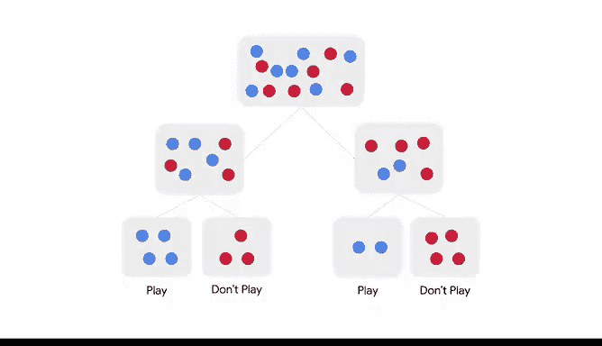

# 038：基于树的建模 🌳

在本节课中，我们将要学习监督学习中的一种重要技术——决策树。决策树是一种流行的分类和预测工具，也是当今工业界使用的一些最有效模型的基础。我们将了解它的工作原理、组成部分、优点与缺点，并通过一个简单的例子来直观理解其决策过程。

---

## 什么是决策树？

决策树是一种类似流程图的监督分类模型。它代表了基于相关选择可能产生的各种结果，来解决给定问题的多种方案。

与所有监督学习分类技术一样，决策树使数据专业人员能够根据当前可用信息对未来事件进行预测。在某些特定领域，它比其他监督学习模型具有非常明显的优势。

---

## 决策树的优势与局限

上一节我们介绍了决策树的基本概念，本节中我们来看看它的主要特点和需要注意的地方。

决策树具有以下优势：
*   **无需数据分布假设**：决策树不要求底层数据符合特定分布。
*   **处理非线性关系**：与我们之前介绍的模型不同，决策树可以轻松处理非线性关系。
*   **数据预处理简单**：准备用于训练决策树的数据过程通常不那么复杂，几乎不需要预处理。

然而，决策树并非完美。任何模型都有其局限性。决策树尤其容易**过拟合**。模型可能在预测训练数据时表现得极其出色，但一旦引入新数据，其性能可能大打折扣。在构建此类模型时，你需要牢记这一点。

---

## 决策树的组成部分

了解了决策树的优缺点后，我们来深入其内部结构。一个决策树由**节点**和**边**组成。边将节点连接起来，本质上沿着树从一个节点指向下一个节点。

在每个节点处都会做出决策，每次考虑数据的**一个特征**并据此决定。最终，所有相关特征都会被解析，从而得出分类预测。

让我们通过一个例子来进一步探索。

---

## 一个决策树实例

假设我们有一个决策树，用于帮助你在任何给定的一天决定是否外出踢足球。

以下是决策过程：
1.  **根节点**：第一个决策与天气展望有关。选项有三个：晴天、多云或雨天。这个做出第一个决策的节点称为**根节点**。它是树中的第一个节点，做出预测所需的所有决策都源于它。它是一种特殊的决策节点，因为它没有前驱节点。
2.  **决策节点**：做出决策的节点就是决策节点。决策节点总是指向树内的一个叶节点或其他决策节点。
    *   在我们的例子中，如果天气是晴天或雨天，树将继续做出更多决策以得出最终预测。
    *   如果天气是多云，树会直接到达一个预测：**去踢足球**。😊
3.  **叶节点**：这便引出了**叶节点**的概念。叶节点是做出最终预测的地方。整个过程在此结束，因此在此之后不需要进一步的决策。
4.  **继续决策**：现在，让我们看看如果天气展望是晴天，决策树会走向何方。我们还没有到达叶节点，仍有决策要做。
    *   这次，考虑的因素是**湿度**。如果湿度高于75%，树会在一个叶节点结束，该节点说：**不去踢足球**。
    *   如果湿度低于75%，决策树会说：**去踢足球**。
5.  **父子节点关系**：被指向的节点（无论是叶节点还是其他决策节点）称为**子节点**。指向它们的节点称为**父节点**。

---

## 决策树如何选择分裂点？

你可能会问，算法如何决定在何处、以何种方式分裂变量？其核心原则是基于**预测能力**。

算法决定在何处以及如何分裂变量，基于的是**什么能提供最强的预测能力**。

例如，如果90%的下雨天都不踢足球，那么“天气展望”这个变量就非常有预测性。根据“天气展望”分裂数据会产生新的数据组，每组中“踢球”和“不踢球”的结果会占大多数。😊

---

## 总结与展望

本节课中，我们一起学习了决策树的基础知识。你现在知道了决策树是一种用于分类的流程图模型，它由节点和边组成，包括根节点、决策节点和叶节点。我们讨论了它的优势（如无需数据假设、处理非线性）和主要局限（容易过拟合），并通过一个生动的“是否踢足球”的例子理解了其决策过程。

现在你掌握了决策树的基础，这个基础将有助于你继续学习基于树的建模。接下来，你将学习构建树的具体方面，以及如何使用训练数据来发展节点和边。然后，你将学习如何优化基于树的模型，以及作为一名数据专业人员，可以做些什么来最大化它们的能力。