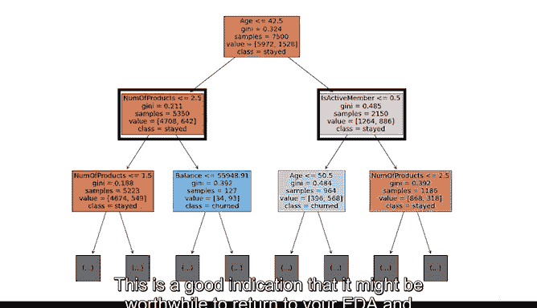

# 039：用Python构建决策树 🌳


在本节课中，我们将学习如何使用Python构建一个标准的决策树模型。我们将以预测银行客户流失为例，从导入必要的库开始，逐步完成数据准备、模型训练、评估和可视化分析的完整流程。

上一节我们介绍了分类模型的基础，本节中我们来看看如何构建一个更高级的模型——决策树。

## 概述与准备

首先，我们需要导入构建决策树所需的Python包和库。

以下是需要导入的库：

```python
from sklearn.tree import DecisionTreeClassifier, plot_tree
from sklearn.metrics import confusion_matrix, ConfusionMatrixDisplay, accuracy_score, precision_score, recall_score, f1_score
import pandas as pd
from sklearn.model_selection import train_test_split
```

我们将读取原始数据集，并像往常一样将其转换为Pandas DataFrame。通常，在此步骤之后会进行探索性数据分析（EDA），并根据模型的使用场景选择合适的评估指标。

对于我们的银行客户流失模型，我们假设需要一个能平衡精确率和召回率的指标。F1分数是实现这种平衡的指标，其定义为精确率和召回率的调和平均数，即它们的乘积除以它们的总和。重要的是，您需要根据具体的使用场景做出明智的选择。

## 数据准备

现在我们已经确定了评估指标，接下来开始为建模准备数据。

以下是数据准备步骤：

1.  删除无预测性的特征以及“性别”列，以防止模型基于性别进行预测。
2.  对“地理位置”列进行虚拟编码，将分类列转换为布尔列。
3.  将目标变量与其余数据分离。
4.  使用 `train_test_split` 函数将数据划分为训练集和测试集，并记得根据目标变量进行分层。

## 训练基准决策树模型

我们将首先训练一个基准决策树模型，不对其进行调优，仅为我们提供一个参考分数。

以下是训练基准模型的步骤：

1.  实例化分类器并设置随机状态，将其赋值给变量 `dec_tree`。
2.  将模型拟合到训练数据上，这将在我们的数据上“生长”出一棵决策树。
3.  使用 `predict` 方法，利用刚生成的树对 `X_test` 数据进行预测，并将结果赋值给变量 `dtp`。

现在，我们可以使用导入的不同评估指标函数来获取结果。该模型的F1分数优于我们之前构建的朴素贝叶斯模型。

## 评估与可视化

让我们检查决策树预测的混淆矩阵。首先，编写一个简短的辅助函数来帮助我们显示矩阵。

从这个混淆矩阵中注意到，模型正确预测了许多真阴性，这是可以预期的，因为数据本身偏向于阴性类别。当模型出错时，它预测假阳性的可能性似乎略高于假阴性，但总体上是平衡的。这反映在精确率和召回率分数非常接近上。

接下来，让我们检查决策树的分裂情况。我们将使用导入的 `plot_tree` 函数来实现。

我们将拟合好的模型以及一些额外参数传递给该函数。请注意，如果我们不设置 `max_depth=2`，该函数将绘制出直到叶节点的整棵树。但我们最感兴趣的是靠近根节点的分裂，因为它们能告诉我们最具预测性的特征。

`class_names` 参数显示每个节点中的多数类，`filled` 参数根据节点的多数类为其着色。

我们如何解读这个图？

*   每个节点中的第一行信息是模型识别出的最具预测性的特征和分裂点。换句话说，这就是在该分裂点提出的问题。对于我们的根节点，问题是：客户年龄是否小于或等于42.5岁？
*   在每个节点，如果问题的答案是“是”，样本将移动到左侧的子节点；如果答案是“否”，样本将移动到右侧的子节点。
*   `gini` 指的是节点的基尼不纯度。这是衡量节点纯度的一种方式，其值范围从0到0.5。基尼分数为0表示没有不纯度，节点是叶节点，其所有样本都属于单一类别。分数为0.5表示该节点中各类别的样本数量相等。
*   `samples` 表示该节点中的样本数量。
*   `value` 表示该节点中每个类别的样本数量。回到根节点，我们有 `value = [5972, 1528]`。注意这些数字之和为7500，即该节点中的样本总数。这告诉我们，该节点中有5972名客户留住了，1528名客户流失了。
*   `class` 告诉我们每个节点中样本的多数类。

如果我们查看树的顶部，这个图告诉我们，如果只能对单个变量进行一次分裂，那么最能帮助我们预测客户是否会流失的变量是他们的年龄。

如果我们查看深度为1的节点，会注意到产品数量以及客户是否为活跃会员也都是预测他们是否会流失的强指标。这是一个很好的迹象，表明可能值得回到您的EDA中，更仔细地检查这些特征。



## 总结

本节课中我们一起学习了如何在Python中构建和评估一个决策树分类器。我们完成了从数据准备、模型训练、使用F1分数等指标进行评估，到可视化决策树结构并解读其节点的完整流程。通过分析树的分裂，我们能够识别出最具预测性的特征，例如客户年龄。

现在您已经对Python中基于树的建模工作原理有了基本了解，在继续学习更强大的优化技术之前，还有两个技巧需要掌握：超参数调优和交叉验证。使用这些技术，我们可以进一步优化单个决策树，并且您将运用这些概念来增强后续将要学习的模型。