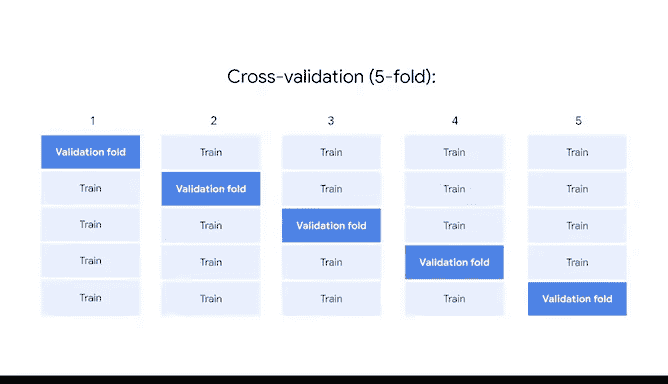

# 041：模型验证 🧪

在本节课中，我们将要学习机器学习中一个至关重要的环节：模型验证。我们将探讨什么是模型验证，以及如何使用验证集和交叉验证来评估模型的性能，确保模型能够按照预期工作。

---

## 模型验证概述

上一节我们介绍了构建强大模型所需的多种工具。本节中，我们来看看如何验证这些模型的性能。

模型验证是一系列旨在确认模型是否按预期执行的过程和活动。这通过一个验证数据集来实现，该数据集是在训练期间被保留下来的一部分数据。验证数据集用于对最终调优模型的技能提供一个无偏估计。需要注意的是，验证数据与测试数据不同，并且必须在整个流程的最后阶段之前保持“不可见”。

## 传统的数据拆分方法

在我们之前构建的一些模型中，我们并没有严格遵循这一流程。但这没关系，因为我们当时主要是为了理解构建和评估的过程。

此前，在训练模型之前，我们会将数据拆分为两个集合：一个训练集和一个测试集。这两个集合分别用于训练和测试模型。

## 引入验证集

当引入验证时，数据实际上被拆分为三个集合。前两个集合仍然是训练集和测试集，但现在增加了一个额外的验证集。这个验证集将代替测试集来评估模型，从而使测试集保持原封不动。

## 交叉验证方法

除了标准验证，另一种流行的方法是交叉验证。交叉验证是一个在多次迭代中使用数据的不同部分来测试和训练模型的过程。

它的工作原理类似于验证，但略有不同。它不是使用一个固定的验证集来评估模型，而是将训练数据分割成多个部分，称为“折”。然后，模型在这些折的不同组合上进行训练。

以下是交叉验证的一个典型流程示例：

1.  首先，数据被拆分为训练数据和测试数据。
2.  然后，训练数据被进一步拆分为预定数量的折（例如，5折）。
3.  第一个模型迭代将使用第1、2、3、4折进行训练，并使用第5折来获取模型指标。
4.  下一个迭代将使用第1、2、3、5折进行训练，使用第4折来获取指标。
5.  此过程重复进行，直到所有组合都完成。
6.  最后，将所有迭代的评估指标进行平均，得到最终的验证分数。

## 如何选择验证技术

选择哪种验证技术主要取决于你正在处理的数据集。

交叉验证在处理较小的数据集时特别有用，因为它能最大化可用数据的效用，效果通常优于标准验证。

然而，在处理非常大的数据集时，交叉验证并非必需。数据量如此之大，以至于最大化效用不再是必须的，并且根据你拥有的计算资源，交叉验证甚至可能带来问题。

但是，如果计算资源有限或数据约束不是问题，那么交叉验证几乎总是会被应用。

## 总结

本节课中，我们一起学习了模型验证的核心概念。验证方案对于构建和选择有效模型至关重要。从事此类商业项目的数据专业人员有责任确定使用的最佳方案。这需要经验，以及对数据和可用工具的理解。掌握这些知识，你就在培养这些重要技能的道路上迈出了坚实的一步。