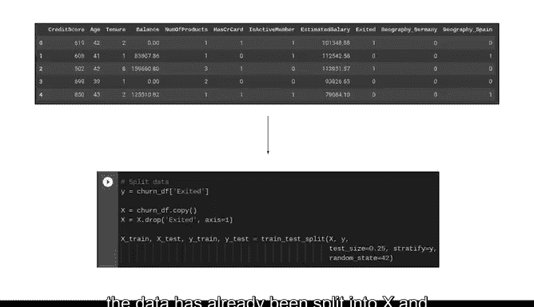
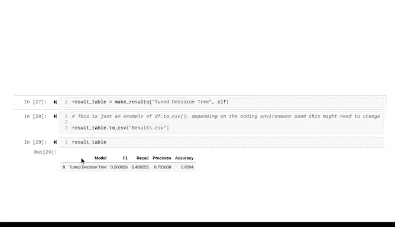

# 042：使用Python调整和验证决策树 🌳


在本节课中，我们将学习如何对之前构建的决策树分类器进行超参数调优，以优化模型性能。我们将重点介绍网格搜索方法，并使用Python代码实现决策树的调优与验证过程。

---

## 概述

上一节我们介绍了决策树分类器的构建。本节中，我们将在此基础上，学习如何通过调整模型的超参数来提升其性能。核心内容包括理解超参数调优的概念、掌握网格搜索方法，并最终在Python中实现一个经过调优的决策树模型。


---

## 超参数调优回顾

超参数调优是指在模型学习过程开始之前，调整那些直接影响模型训练方式的参数。不同的模型拥有不同类型的可调超参数。

对于基于树的模型，有两个重要的超参数：
*   **`max_depth`**：定义了决策树的最大深度。
*   **`min_samples_leaf`**：定义了叶节点所需的最小样本数。

我们将对单个决策树的这两个超参数进行调优。

---

## 网格搜索方法

最初探索超参数调优时，我们考虑了寻找超参数最优值的步骤。随机输入数值无法产生最佳结果，因此我们使用网格搜索。

网格搜索为每个待调优的超参数指定一系列值。它会系统地检查这些值的所有组合，根据选定的评估指标确定哪一组能产生最佳结果。



可以将其理解为对不同的超参数值进行“暴力”尝试。想象一下忘记PIN码，然后尝试从0000到9999之间的每一个数字。虽然耗时，但最终总能找到正确的组合。网格搜索就是这样工作的。

---

## 代码实现

现在让我们进入代码部分。您将在之前创建其他分类模型相同的框架下工作。我们从决策树笔记本中上次结束的地方开始。请注意，我们已经完成了特征工程，数据也已分割为X和Y数据，以及训练集和测试集。

我们将添加一个新函数。从`sklearn`的`model_selection`包中导入`GridSearchCV`，以实现超参数调优。`GridSearchCV`中的`CV`代表交叉验证。

每次使用一组超参数时，都会根据验证集对其进行评分，从而保证测试数据不被“窥见”。在后续比较模型时，您将使用这些验证分数。

请注意，您不会将此调优后的决策树与现有模型进行比较。所有其他模型都是使用测试数据进行评分和比较的，这实际上是一种不正确的做法。当数据专业人员在工作中进行模型选择时，测试数据必须始终对正在处理的模型保持不可见，这些数据仅在模型开发过程的最后阶段使用。

如前所述，您将调优的参数是`max_depth`和`min_samples_leaf`。

以下是实现步骤：

1.  **定义参数字典**：创建一个字典，其中键是超参数的名称，值是将作为该超参数进行尝试的数字列表。
    ```python
    # 示例
    tuned_parameters = {
        'max_depth': [6, 8, 10, 12, 14],
        'min_samples_leaf': [10, 20, 30, 40, 50]
    }
    ```

2.  **定义评估指标**：虽然网格搜索基于F1分数，但您仍然希望了解其他分数。因此，创建一个名为`scoring`的集合，包含每个所需指标的名称。
    ```python
    scoring = ['accuracy', 'precision', 'recall', 'f1']
    ```

3.  **创建模型与网格搜索对象**：创建一个名为`tuned_decision_tree`的决策树分类器实例。然后调用`GridSearchCV`函数，传入决策树分类器对象、参数字典、评分方法、交叉验证折数，并指定搜索将重点关注的指标。
    ```python
    tuned_decision_tree = DecisionTreeClassifier(random_state=0)
    clf = GridSearchCV(tuned_decision_tree,
                       tuned_parameters,
                       scoring=scoring,
                       cv=5,
                       refit='f1')
    ```

4.  **拟合模型**：最后，将模型拟合到数据。
    ```python
    clf.fit(X_train, y_train)
    ```

5.  **检查最佳参数与分数**：通过从网格搜索对象获取`best_estimator_`属性来检查网格搜索识别出的超参数，您可以观察它找到的值。例如，当使用F1分数作为衡量标准时，`max_depth`为8且`min_samples_leaf`为20可能是最佳组合。
    ```python
    print(clf.best_estimator_)
    ```
    获取`best_score_`属性可以确认在所有超参数组合中，不同交叉验证折上的最佳平均F1分数。请注意，此模型获得的分数约为0.5607。

6.  **提取并保存结果**：最后的代码块是一个辅助函数，用于提取模型的分数。它生成一个包含模型名称以及您一直在使用的四个分数的数据框。在最后调用此函数，并将结果数据框保存为CSV文件以供后续使用。
    ```python
    # 假设有一个函数 get_scores(model_name, clf)
    results_df = get_scores('Tuned Decision Tree', clf)
    results_df.to_csv('tuned_decision_tree_scores.csv', index=False)
    ```

目前，还没有其他分数可以与此分数进行比较。然而，请注意该模型的F1分数为0.5605。很快，您将继续创建其他更高级的基于树的模型，并找到分数与此模型进行比较。

有了这些数字，您将能够确定哪个模型不仅性能最佳，而且在业务需求的背景下也是最优的。

---



## 总结


本节课中，我们一起学习了如何对决策树模型进行超参数调优。我们回顾了`max_depth`和`min_samples_leaf`这两个关键超参数，详细介绍了使用网格搜索系统化寻找最优参数组合的方法，并完成了在Python中实现调优决策树的完整代码流程。通过这个过程，我们确保了模型评估的严谨性，为后续与其他更复杂模型的性能比较奠定了基础。