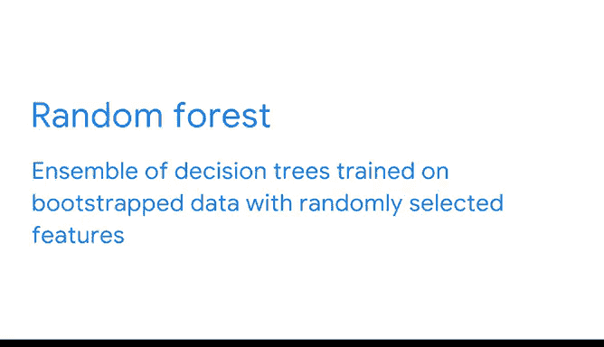

# 043：自助聚合（Bagging） 🧠

在本节课中，我们将要学习一种强大的机器学习技术——自助聚合（Bagging）。我们将探讨如何通过组合多个模型来提高预测的准确性和稳定性，并特别介绍如何将这种方法应用于决策树，从而构建出随机森林模型。

---

## 决策树的优势与局限

上一节我们介绍了决策树模型。决策树很有用，因为它们易于理解和解释，对使用的数据类型非常灵活，并且用途广泛。决策树可以是很好的预测器。

然而，你也知道它们容易过拟合，并且对训练数据的变化非常敏感。

我们如何解决这些问题呢？答案是利用群体的智慧。

## 群体智慧与集成学习

或许你对这个概念很熟悉，因为它也适用于日常情况。如果我有一个装满软糖豆的罐子，我请一位空间数学专家来检查并猜测里面有多少颗软糖豆，他们的估计通常不如我请1000个普通人做同样的事情，然后取他们猜测的平均值来得准确。

我们可以将同样的概念应用于建模，使用一个称为**集成学习**或简称为**集成**的过程。

集成学习涉及构建多个模型，然后聚合它们的输出来做出最终预测。就像在我们的软糖豆例子中一样，使用模型集成做出的预测非常准确，即使单个模型本身的准确度仅比随机猜测略高。

构建集成模型的一个最佳实践是为其中的每个模型使用非常不同的方法，例如逻辑回归、朴素贝叶斯模型和决策树分类器。这样，当模型出错时（它们总是会出错），这些错误将是不相关的。目标是让它们不会因为相同的原因而犯相同的错误。

## 构建集成模型的方法

以下是构建集成模型的一种方法：

你可以使用我刚才提到的三个模型构建一个集成。你将在相同的数据上训练每个模型，然后使用每个模型的单独预测来做出最终预测。对于分类任务，可以通过**多数投票**来保存结果；对于回归任务，可以通过**平均结果**来保存。

但是还有另一种构建集成的方法，这种方法对集成中的每个贡献模型使用相同的方法论。在这种集成中，构成它的每个单独模型被称为**基学习器**。为了使这种方法有效，你通常需要很多基学习器，并且每个基学习器都在训练数据的唯一随机子集上进行训练。

如果所有基学习器都在完全相同的数据上进行训练，那么错误之间就会存在太多的相关性，这将影响基学习器的强度。如果一个基学习器的预测仅比随机猜测略好，它就变成了一个**弱学习器**。

## 自助聚合（Bagging）

为了解决这个问题，数据专业人员会进行一种称为**Bagging**的操作，以确保数据的随机子集和强学习器。**Bagging**这个词来源于**Bootstrap Aggregating**。让我们来分解一下。

从统计学中记住，**Bootstrap**指的是**有放回抽样**。在Bagging过程中也会发生这种情况。每个基学习器都通过有放回抽样从数据中抽取样本。这意味着不同的基学习器可以抽取到相同的观测值，并且单个学习器在训练期间可以多次抽取到同一个观测值。

Bagging中的**聚合**部分指的是将所有单个模型的预测聚合起来以产生最终预测。对于回归模型，这通常是所有预测的平均值。对于分类模型，通常是获得最多预测的类别，也就是**众数**。

## 随机森林

当Bagging与决策树一起使用时，我们就得到了**随机森林**。随机森林是一个基于决策树的基学习器的集成，这些学习器在Bootstrap数据上进行训练。基学习器的预测被全部聚合以确定最终预测。

随机森林将Bagging的随机化更进一步。一个常规的决策树模型会寻找用于分割节点的最佳特征。而一个随机森林模型将通过从训练数据中可用的特征中随机抽取一个子集来生长它的每一棵树，然后在每棵树可用的最佳特征处分割每个节点。

这意味着随机森林模型中的每个基学习器都有不同的可用特征组合，这有助于防止集成中学习器之间出现相关错误的问题。

每个单独的基学习器都是一棵决策树。它可能是完全生长的（因此每个叶子是一个单独的观测值），也可能非常浅，这取决于你如何选择调整你的模型。集成许多基学习器有助于减少你通常从单个决策树中获得的高方差。

---

## 总结

本节课中我们一起学习了集成学习，特别是自助聚合（Bagging）技术。集成学习之所以强大，是因为它结合了许多模型的结果，有助于做出更可靠的最终预测。此外，与其他独立模型相比，这些预测具有更小的偏差和更低的方差。接下来，我们将更详细地探讨随机森林。还有很多内容即将到来。😊