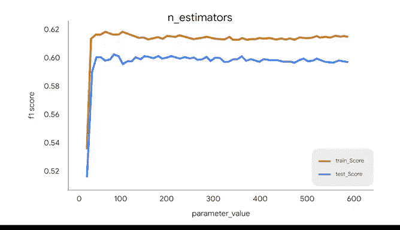

# 045：调整随机森林模型 🌲⚙️

在本节课中，我们将基于对决策树生长方式的理解，学习如何调整随机森林模型的核心参数。这是优化模型性能的关键步骤。

## 决策树的生长与停止条件

上一节我们介绍了决策树的基本原理，本节中我们来看看一棵树是如何决定停止生长的。决策树会持续进行分裂，直到满足以下任一条件：

以下是决策树停止分裂的主要条件：
*   **节点纯度**：当一个叶节点（leaf node）包含的所有观测数据都属于同一个类别时，该节点被视为“纯”的，分裂停止。
*   **达到预设限制**：当树达到预设的**最小叶节点样本数**（`min_samples_leaf`）或**最大深度**（`max_depth`）时，分裂停止。
*   **达到性能阈值**：如果分裂带来的性能提升低于某个阈值，分裂也会停止。这个阈值的具体值和评估指标可以由建模者指定。

这些控制模型如何拟合数据的预设条件，被称为**超参数**。调整它们可以显著影响模型性能。

## 决策树的关键超参数

我们之前演示过，决策树最重要的超参数之一是**最大深度**（`max_depth`）。它指定了树可以拥有的层级数，最终决定了树能进行多少次分裂。请记住，每次节点分裂，数据都会被分割成更小的子集，模型就在绘制另一条决策边界。

我们还介绍了**最小叶节点样本数**（`min_samples_leaf`），它定义了一个叶节点所需的最小样本数。有了这个限制，一次分裂只有在能保证生成的子节点都满足最小观测数时才会发生。

现在，引入一个新概念：**最小分裂样本数**（`min_samples_split`）。这个参数可以用来控制节点成为叶节点的阈值，即一个节点必须包含多于`min_samples_split`个样本才有资格继续分裂。

## 随机森林的超参数

随机森林模型拥有上述所有超参数，因为它本身就是决策树的集成。这些超参数控制着其中每棵“学习树”的生长方式。

然而，随机森林还有一些额外的超参数，用于控制集成过程本身。

以下是控制随机森林集成的两个关键超参数：
*   **最大特征数**（`max_features`）：这个参数控制着树的随机性。它指定了每棵树在决定如何分裂时，从训练数据中随机选取的特征数量。例如，如果你的数据集有特征A、B、C、D、E，并将`max_features`设为3，那么第一棵树可能使用特征A、C、E来决定分裂，下一棵树可能使用B、D、E，依此类推。
*   **评估器数量**（`n_estimators`）：这个参数控制着模型将为集成构建多少棵决策树。例如，如果你将`n_estimators`设为300，模型将训练300棵独立的树。如果是构建回归树，模型的最终预测将是这300棵树预测结果的平均值；如果是分类树，最终预测将由300棵树中投票最多的类别决定。

对于随机森林模型，性能通常会随着集成中树的数量增加而提升，但只会达到一个临界点。超过这个点后，性能提升会趋于平缓，而增加新树只会增加计算时间。这是因为新树会与现有树变得非常相似，从而无法为模型贡献新的信息。

## 超参数调优实践

最后需要指出，许多数据专业人员并非手动设置每个超参数。实际上，在使用Scikit-learn等库时，模型即使不设置任何超参数也可能表现良好，因为它有有效的默认设置。

请记住，要充分利用**网格搜索**（Grid Search）等工具来帮助你迭代。数据专业人员知道如何通过实验不同的超参数组合，来构建能够做出最佳预测的模型。

---

本节课中我们一起学习了决策树的停止生长条件，并深入探讨了随机森林模型的核心超参数，包括控制单棵树的`max_depth`、`min_samples_leaf`，以及控制集成过程的`max_features`和`n_estimators`。理解这些概念是有效调整和优化随机森林模型的基础。