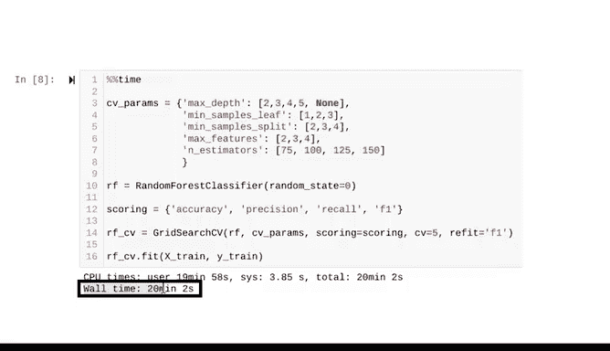

# 046：用Python构建和交叉验证随机森林模型 🌲🤖


在本节课中，我们将学习如何使用Python构建一个随机森林模型，并利用网格搜索进行交叉验证和超参数调优。我们将从导入必要的库开始，逐步完成数据准备、模型构建、交叉验证和性能评估的全过程。

---

## 概述

上一节我们介绍了随机森林的基本逻辑及其关键超参数。本节中，我们将动手实践，使用Python的Scikit-learn库构建一个随机森林分类器。我们将通过网格搜索进行交叉验证，以找到最优的超参数组合，并评估模型的性能。

---

## 数据准备与导入库

首先，我们需要导入必要的Python库并准备数据。

```python
import numpy as np
import pandas as pd
import matplotlib.pyplot as plt
from sklearn.model_selection import GridSearchCV, train_test_split
from sklearn.metrics import classification_report, confusion_matrix, accuracy_score, f1_score
from sklearn.ensemble import RandomForestClassifier
```

请注意，我们导入的是`RandomForestClassifier`，因为我们要解决的是一个分类问题（预测客户是否会关闭银行账户）。如果预测的是连续型数据，则应导入`RandomForestRegressor`。

在数据准备阶段，我们已经移除了没有预测价值的列（如行号、客户ID和姓氏），并删除了性别列，以避免模型基于性别进行预测。同时，我们对分类变量进行了哑编码，为建模做好了准备。

建模前的最后一步是使用`train_test_split`将数据划分为训练集和测试集。

```python
X_train, X_test, y_train, y_test = train_test_split(X, y, test_size=0.25, stratify=y, random_state=42)
```

我们将测试集大小设置为总数据的25%，并根据目标列进行分层抽样，同时将随机种子设为42，以确保与之前的朴素贝叶斯和决策树模型使用相同的数据划分，从而进行公平比较。

---

## 构建随机森林模型

现在，我们开始构建随机森林模型。集成模型的一个特点是训练时间通常比单一模型长得多，因为我们需要为指定的每一组超参数组合构建数十甚至上百棵树。

为了了解模型训练所需的时间，我们可以在代码单元格顶部使用`%%time`这个魔术命令。魔术命令是IPython内置的、用于简化常见任务的命令，总是以`%`或`%%`开头。

```python
%%time
```

接下来，我们定义要进行网格搜索的超参数空间。

以下是需要调优的5个超参数：
*   **max_depth**: 树的最大深度。`None`表示允许树生长而不限制深度。
*   **min_samples_leaf**: 叶节点所需的最小样本数。
*   **min_samples_split**: 内部节点再划分所需的最小样本数。
*   **max_features**: 寻找最佳分割时考虑的特征数。
*   **n_estimators**: 森林中树的数量。

```python
param_grid = {
    'max_depth': [None, 10, 20, 30],
    'min_samples_leaf': [1, 2, 4],
    'min_samples_split': [2, 5, 10],
    'max_features': ['auto', 'sqrt'],
    'n_estimators': [75, 100, 150]
}
```

然后，我们实例化随机森林分类器，并为其指定一个随机种子以确保结果可复现。同时，我们指定模型需要记录的评估指标。

```python
rf = RandomForestClassifier(random_state=42)
scoring = {'accuracy', 'f1', 'recall', 'precision'}
```

接着，实例化网格搜索对象。它需要两个位置参数：分类器和参数网格。我们告诉它使用上面定义的评分指标，并将交叉验证的折数`CV`设为5。

```python
grid_search = GridSearchCV(estimator=rf, param_grid=param_grid, scoring=scoring, cv=5, refit='f1')
```

将`refit`参数设为`'f1'`非常重要。当我们指定了多个评分指标时，这告诉网格搜索：尽管我们想查看多个指标，但我们最关心的是F1分数。F1分数是精确率和召回率的调和平均数，它将两者结合为一个单一的指标。调用`best_estimator_`时，返回的将是五折交叉验证中平均F1分数最高的模型。

现在，将模型拟合到训练数据上。

```python
grid_search.fit(X_train, y_train)
```

根据可用的计算能力、网格搜索中指定的超参数组合数量、数据集大小以及交叉验证的折数，这个过程可能需要很长时间。在本例中，`%%time`魔术命令显示拟合过程大约需要20分钟。

---



## 权衡与模型保存

在搜索大的超参数空间和获得良好的运行时间之间，总是存在权衡。搜索的超参数越多，模型性能可能越好，但拟合所需的时间也越长。

当模型需要很长时间来拟合时，你肯定不希望因为内核断开连接或关闭笔记本导致输出丢失而不得不重新运行。好消息是，有一种方法可以将拟合好的模型对象保存到指定位置，然后快速读回。我们将在下一个视频中学习具体如何操作。

---

## 总结

本节课中，我们一起学习了如何使用Python构建随机森林分类模型。我们回顾了数据准备的步骤，使用`train_test_split`划分了数据集，并通过`GridSearchCV`进行了五折交叉验证来调优多个关键超参数。我们还了解了在训练复杂模型时管理运行时间和保存模型的重要性。在下一节，我们将学习如何保存和加载训练好的模型。