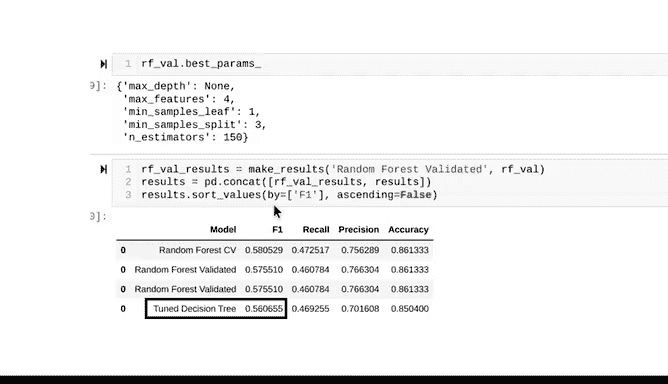

# 047：使用验证数据集构建和验证随机森林模型 🧠🌲

## 概述

在本节课中，我们将学习如何使用一个独立的验证数据集来构建和验证随机森林模型。我们将从上一节结束的地方开始，介绍如何保存和加载已训练的模型，然后详细讲解如何将训练数据分割为新的训练集和验证集，并使用此验证集来评估模型性能。

---

## 从保存模型开始

上一节我们介绍了使用网格搜索进行交叉验证和超参数调优来创建随机森林模型。

本节中我们来看看如何利用一个独立的验证数据集来验证模型。但在此之前，我们先回顾一下上节课的遗留问题。我们发现了数据领域的一个常见问题：在搜索大范围超参数空间和获得良好运行时间之间需要权衡。

我们观察到，搜索的超参数越多，模型可能越好，但模型拟合所需的时间也越长。当模型需要很长时间来拟合时，反复运行和重新拟合它们是低效的。一旦找到一个满意的模型，你不会希望每次打开笔记本时都从头开始。

这就是 `pickle` 工具的用武之地。Pickle 是一个工具，它能将拟合好的模型对象保存到指定位置，并能快速读回。它还允许你使用在其他地方拟合的模型，而无需自己重新训练。

让我们接着上节课的内容，开始保存模型。

首先，指定一个文件路径，指向保存模型的目录。

然后创建一个 `with open` 语句，向其传递文件路径，加上你想用来保存此模型的名称，并以 `.pickle` 结尾。这会创建一个空的 pickle 文件。第二个参数 `‘wb’` 授予以二进制模式写入文件的权限，这是 pickle 的工作方式。

使用 `as` 将 `open` 的返回值分配给一个名为 `to_write` 的局部变量。

调用 `pickle.dump` 并将拟合的模型对象和 `to_write` 变量传递给它。

在下一个单元格中，从保存的位置读回 pickled 模型。语法上的唯一区别是使用 `‘rb’` 来指定我们将读取二进制文件，并使用 `pickle.load` 来分配一个新变量，该变量指向拟合的模型。确保这个新变量的名称与你上面用于拟合模型的名称相同，本例中是 `rfc_cv`。

如果你注释掉拟合模型的那行代码以及保存模型的单元格，你可以关闭笔记本，重新打开它，并重新运行所有单元格，而无需等待模型重新拟合。

你也可以将预拟合的模型发送给其他人使用。

现在，使用 `best_params_` 属性来识别在所有交叉验证折叠中平均 F1 分数最高的模型的超参数值。

要找到最佳模型的平均 F1 分数，使用 `best_score_` 属性。

然后使用 `make_results` 函数生成所有结果的表格，并将其与总表连接起来以比较所有模型。

有趣的是，交叉验证的随机森林模型在所有五个验证折叠上的平均 F1 分数为 0.58，比单个调优的决策树稍好一些。它还具有更好的召回率、精确度和准确率。

---

## 使用独立验证集

现在，让我们使用一个独立的验证数据集来验证模型。

为此，将训练数据分割成一个新的训练集和验证集。使用 `train_test_split`。记住要对 `y` 数据进行分层。使用 80/20 的分割比例。

不要忘记，这只是对训练数据进行分割，而训练数据本身占所有数据的 75%。这意味着我们的新训练集将是数据的 75% 中的 80%，而新的验证集将是数据的 75% 中的 20%。测试数据保持不变。

接下来的部分有点棘手。`GridSearchCV` 希望交叉验证数据。实际上，如果 `cv` 参数留空，默认情况下它会将数据分成五折进行交叉验证。

因为你使用了一个独立的验证集，所以明确告诉函数如何执行验证非常重要。这包括告诉它训练集和测试集中的每一行。

使用列表推导式生成一个与我们的 `X_tr` 数据长度相同的列表，其中每个值要么是 -1，要么是 0。

使用此列表向 `GridSearchCV` 指示每个标记为 -1 的行在训练集中，每个标记为 0 的行在验证集中。将此列表称为 `split_index`。

现在，从 `sklearn.model_selection` 包中导入一个名为 `PredefinedSplit` 的新函数。`PredefinedSplit` 提供预定义的训练/测试索引，以使用预定义方案将数据分割为训练集和测试集。

下一步与你之前所做的几乎相同。搜索所有相同的超参数，并保持语法与交叉验证时相同。

但现在，将新的 `split_index` 列表传递给 `PredefinedSplit` 并将其分配给一个变量。我们称这个变量为 `custom_split`。最后，将网格搜索的 `cv` 参数设置为 `custom_split`。

现在，是时候拟合模型了。使用 `%%time` 魔法命令来获取模型训练所需的时间。

在这个示例场景中，模型训练只花了大约四分钟。在交叉验证期间，训练数据被分成五折。使用特定的超参数组合在数据的四折上生长一个树集成，并用被保留的第五折对其进行验证。这个过程对五个保留折中的每一个都发生一次。然后使用下一个超参数组合训练另一个集成，重复整个过程。这一直持续到没有更多的超参数组合需要运行为止。

但现在有一个独立的保留集用于验证。为每个超参数组合构建一个集成。每个集成在新的训练集上训练，并在验证集上进行验证。但这对于每个超参数组合只发生一次，而不是像交叉验证那样发生五次。这就是为什么训练时间只有原来的五分之一。

---

## 再次保存并评估模型

现在，再次保存模型。运行写入 pickle 的单元格。然后返回并注释掉拟合模型的代码行以及对写入 pickle 的调用。记得要有一个可以读回 pickled 模型的单元格。

检查结果。当你调用 `best_params_` 时，请注意，具有最佳 F1 分数的集成所使用的超参数与交叉验证模型略有不同。

现在，F1 分数是 0.576，优于单个决策树模型，但不如交叉验证模型。两者都可能产生相似的结果，但请记住，交叉验证模型更可靠一些，因为它经过了更严格的验证。

事实上，如果使用不同的随机种子来创建验证集，我们可能运气好，甚至得到一个比交叉验证模型表现稍好的模型。

但请注意，这并不意味着它在测试数据上的预期表现会更好。

本笔记本的目的是演示使用交叉验证和独立数据集验证随机森林模型所涉及的不同过程。

在实践中，你不太可能同时使用两种方法。相反，根据时间要求、数据量以及要探索的不同超参数组合的数量来选择一种方法会更有效。

一如既往，数据专业人员所做的工作需要深思熟虑的权衡和适应性。

---

## 总结

本节课中我们一起学习了如何保存和加载机器学习模型，以及如何使用一个独立的验证数据集来构建和评估随机森林模型。我们比较了交叉验证与使用独立验证集在流程和结果上的差异，并理解了在实际工作中根据具体情况选择合适验证策略的重要性。