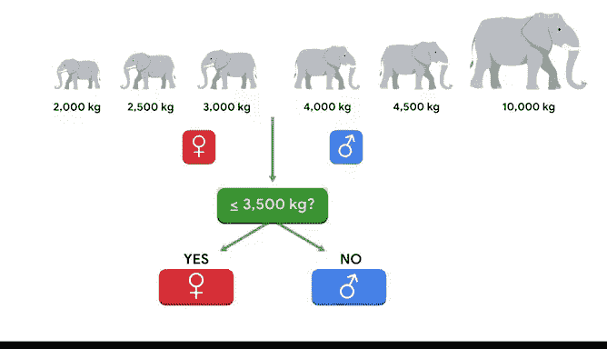

# 048：AdaBoost提升算法入门 🚀

在本节课中，我们将学习一种强大的集成建模方法——提升（Boosting），特别是其经典实现之一：自适应提升（AdaBoost）。我们将了解其工作原理、与随机森林的区别，以及它的优缺点。

---

上一节我们介绍了随机森林这种并行构建的集成方法。本节中，我们来看看另一种思路迥异但同样强大的集成技术——提升（Boosting）。

提升是预测建模领域中最强大的方法之一，被几乎所有依赖预测建模的行业所使用。许多Kaggle等竞赛的获胜模型都采用了提升算法，它是任何建模者工具箱中的必备工具。

提升是一种监督学习技术，通过**顺序构建一系列弱学习器**来形成一个集成模型。每一个后续的基础学习器都试图纠正前一个学习器的错误。请记住，**弱学习器**是指其预测仅比随机猜测稍好一点的模型，而**基础学习器**是集成中的任何一个独立模型。

这种方法与随机森林和袋装法有相似之处。和随机森林一样，提升也是一种集成技术，它也构建许多弱学习器，然后聚合它们的预测。但存在一些关键差异。

与随机森林**并行构建**基础学习器不同，提升是**顺序构建**学习器的。这是因为序列中的每个新基础学习器都专注于前一个学习器预测错误的样本。

提升模型与随机森林的另一个区别是，对于提升模型，你为弱学习器选择的方法并不仅限于基于树的方法。然而，在本课程中我们将使用基于树的实现，因为这是构建提升模型常见且有效的方式。

有多种不同的提升方法可用。在本课程的这一部分，我们将探讨两种最常用的方法。第一种称为自适应提升（AdaBoost）。

AdaBoost是一种基于树的提升方法，其中每一个后续的基础学习器会为前一个学习器错误预测的观测值分配更大的权重。

以下是其工作原理的演示：
AdaBoost在训练数据上构建第一棵树，该树为每个观测值分配相等的权重。
然后，算法评估哪些观测值被这第一棵树错误预测。
它会**增加**第一棵树预测错误的观测值的权重，并**减少**预测正确的观测值的权重。
这个过程不断重复，直到某棵树做出完美预测，或者集成达到最大树的数量（这是一个由数据专业人员指定的超参数）。

一旦所有树都构建完成，集成模型通过聚合集成中每个模型的预测来做出最终预测。由于AdaBoost可用于分类和回归问题，这最后一步根据处理的问题类型略有不同。

对于**分类**问题，集成使用一个**加权投票**过程。在最终聚合中，预测更准确的基础学习器拥有更重的权重。
对于**回归**问题，模型计算集成中所有树预测的**加权平均值**。

关于提升，有一个缺点需要注意：你无法在许多不同的服务器上并行训练模型，因为集成中的每个模型都依赖于它前面的模型。这意味着，在计算效率方面，与袋装法相比，它不太能很好地扩展到非常大的数据集。然而，除非你处理的是特别大的数据集，否则这通常不是问题。

但提升有许多值得注意的优点，包括它是当今可用的更准确的方法之一。此外，就像随机森林一样，它基于弱学习器集成这一事实意味着**高方差问题得到了减少**，因为没有单棵树在集成中占过大的权重。

以下是提升的一些关键优势：
*   **减少偏差**：与随机森林不同，提升还能有效减少模型的偏差。
*   **易于理解**：模型原理相对直观。
*   **无需数据缩放**：不需要对数据进行缩放或标准化。
*   **处理混合特征**：可以同时处理数值型和类别型特征。
*   **容忍共线性**：即使在特征间存在多重共线性的情况下也能良好运行。
*   **对异常值稳健**：对异常值具有鲁棒性。

需要注意的是，对异常值的鲁棒性是所有基于树的方法的一个主要优势。这是因为无论一个值多么极端，模型都以相同的方式分割数据。

这里有一个例子：假设你有六头大象，3头是雌性，体重分别为2250、3000、3000公斤；3头是雄性，体重分别为4000、4500和5000公斤。如果你用这些数据生成一棵决策树，它会在3500公斤处（最重雌性和最轻雄性体重的中点）划出雄性和雌性的决策边界。现在，假设最后一头雄性大象不是5000公斤，而是10000公斤。你的模型仍然会在3500公斤处划分雄性和雌性。最后一头大象的体重翻倍并不影响决策边界。

---

本节课中我们一起学习了AdaBoost提升算法。我们了解到，提升是一种顺序构建弱学习器集成的强大技术，每个新模型都专注于纠正前序模型的错误。AdaBoost通过动态调整样本权重来实现这一点。虽然其顺序训练的特性可能影响大规模数据下的计算效率，但它在准确性、减少偏差和方差、以及对数据预处理要求低等方面表现卓越，是机器学习实践者不可或缺的工具。