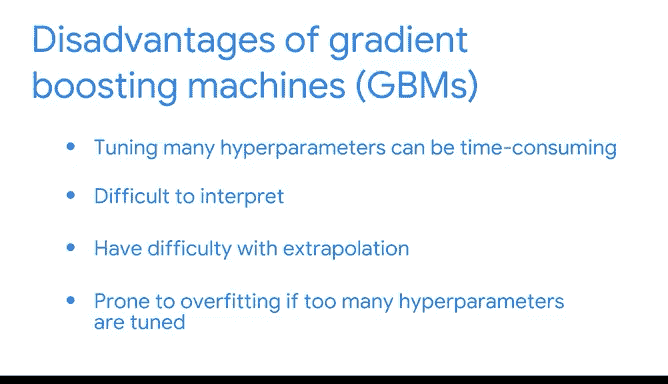

# 049：梯度提升机 🚀

在本节课中，我们将要学习梯度提升机（Gradient Boosting Machine, GBM）的核心概念、工作原理、优势与局限性。梯度提升是一种强大的集成学习技术，通过顺序构建模型来提升预测性能。

---

## 从AdaBoost到梯度提升 🔄

上一节我们介绍了AdaBoost，它是一种通过调整样本权重、让后续模型专注于前序模型错误预测的集成技术。

本节中我们来看看梯度提升。梯度提升与AdaBoost不同，它不直接为错误预测分配权重，而是让序列中的每个基学习器去预测前一个模型的残差（预测误差）。

---

## 梯度提升的工作原理 🛠️

以下通过一个回归决策树的例子，逐步演示梯度提升的工作流程。

1.  **初始训练**：我们拥有特征 `X` 和连续型目标变量 `Y`。首先在原始数据 `(X, Y)` 上训练第一个基学习器（例如决策树），我们称之为 **Learner 1**。
2.  **计算残差**：Learner 1 做出预测 `Ŷ₁`。其预测的残差 `error₁` 通过从真实值中减去预测值得到：`error₁ = Y - Ŷ₁`。
3.  **训练后续学习器**：接下来，我们使用相同的特征 `X`，但将目标变量替换为前一个学习器的残差 `error₁`，来训练第二个基学习器 **Learner 2**。这意味着 Learner 2 的学习目标是预测 Learner 1 犯下的错误。
4.  **迭代过程**：Learner 2 对残差进行预测，得到 `error₁_hat`。然后计算 Learner 2 的预测与真实残差 `error₁` 之间的新残差 `error₂`。此过程可以重复进行，直到达到预设的基学习器数量。
5.  **集成预测**：最终，对于任何新的输入 `X`，集成模型的预测是所有基学习器预测值的总和。例如，使用三个学习器时，最终预测为：`Ŷ_final = Ŷ₁ + error₁_hat + error₂_hat`。

使用梯度提升的集成模型被称为**梯度提升机（GBM）**。

---

## 梯度提升机的优势 ✅

以下是GBM被广泛使用的主要原因：

*   **高准确性**：梯度提升模型在许多机器学习竞赛中因其卓越的准确性而屡获佳绩。
*   **良好的可扩展性**：尽管基学习器是顺序构建的，无法像随机森林那样并行训练，但GBM依然能很好地处理大规模数据集。
*   **处理缺失值**：GBM将特征值的缺失本身视为有价值的信息，在决定如何分割特征时，会像处理其他值一样处理缺失值，这使其易于处理混乱的数据。
*   **无需数据缩放**：基于树模型的特性，GBM不需要对数据进行标准化或归一化。
*   **对异常值鲁棒**：树模型对异常值不敏感，GBM继承了这一优点。

---

## 梯度提升机的局限性 ⚠️

尽管强大，GBM也存在一些缺点：

*   **超参数众多**：GBM拥有大量超参数（如树的数量、深度、学习率等），调优过程可能非常耗时。
*   **可解释性差**：GBM通常被视为“黑盒模型”。它可以提供特征重要性评分，但不像线性模型那样能给出明确的系数和方向性解释，这在需要模型可解释性的领域（如医疗、金融）可能是个问题。
*   **外推能力有限**：GBM难以预测训练数据范围之外的新值。例如，如果训练数据中面包价格在1到3美元之间，一个训练良好的线性模型可以合理推断10个面包的价格，而GBM则可能无法做出可靠预测。
*   **容易过拟合**：如果训练不谨慎（例如，树生长过深或学习率不当），GBM很容易对训练数据过拟合，导致在未见数据上泛化性能下降。

---

## 总结 📚

本节课中我们一起学习了梯度提升机（GBM）。我们了解了它与AdaBoost的核心区别在于通过拟合残差来顺序构建模型。我们探讨了GBM的工作流程、其在高准确性和处理复杂数据方面的显著优势，同时也指出了它在超参数调优、模型解释性和外推能力方面的挑战。掌握这些知识将帮助你在合适的场景下有效地应用这一强大的机器学习工具。

---

你正在出色地充实你的数据科学工具箱。我们一起探索的所有内容都在为你激动人心的职业生涯奠定基础。请继续保持出色的学习状态！😊