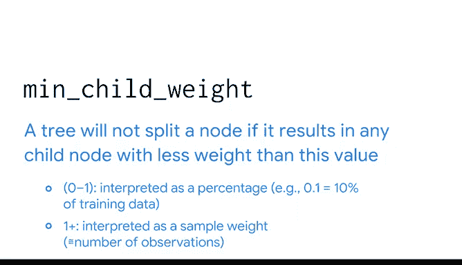

# 050：调整GBM模型 🎯

在本节课中，我们将学习如何调整梯度提升机（GBM）模型的关键超参数，以构建更准确、泛化能力更强的预测模型。我们将重点介绍XGBoost这一流行实现中的核心参数及其作用。

---

许多机器学习包都包含我们之前探讨过的提升模型的实现。由于最流行的提升模型使用基于树的学习器，因此它们大多具有与决策树相同的可调超参数。它们也与随机森林类似，拥有控制整个集成模型的额外超参数。本节视频将探讨其中一些超参数，以便您能够构建出与数据拟合良好且预测准确的模型。

从此刻起，我们将使用的GBM建模实现称为XGBoost。XGBoost代表极端梯度提升，在预测建模领域被广泛使用。作为数据专业人士，您很可能会经常遇到它。虽然Scikit-learn有自己的GBM实现且与之相似，但XGBoost是一个常用的梯度提升包，具有许多有用的优化功能。这些优化包括快速训练、有效的特征正则化以及可调的超参数，这些都能改进模型预测。

上一节我们回顾了集成模型的基础，本节中我们来看看如何具体调整GBM模型。

以下是XGBoost中几个关键的超参数及其调整方法：

**1. 最大深度 (max_depth)**
此参数在决策树和随机森林中均有使用，在XGBoost中功能相同，即控制每个基学习器（树）的生长深度。寻找最佳值的最佳方法是通过交叉验证。模型的最终`max_depth`值通常较低。请记住，树越深，模型学到的特征交互可能越特定于训练数据，但泛化到新信息的能力可能越差。由于集成效应，即使是浅树也很有威力。`max_depth`的典型值在2到10之间，但这取决于数据中的特征数量和观测值数量。

**2. 估计器数量 (n_estimators)**
此参数是集成模型将生长的估计器或基学习器的最大数量。最佳值应使用网格搜索确定。对于较小的数据集，更多的树可能比更少的树更好；对于非常大的数据集，情况可能相反。典型范围在50到500之间。

**3. 学习率 (learning_rate)**
这是一个非常重要的参数。您会记得，每次集成模型构建一个新的基学习器时，它都会根据前一个模型的误差来拟合数据。在基础实现中，所有树的预测结果会被求和以确定最终预测，此时每棵树的预测对最终预测的贡献被视为同等重要。在实践中，我们使用学习率来指示模型应给予每个后续基学习器预测多少权重。低学习率意味着每棵后续树对集成模型最终预测的贡献较小，这有助于防止过度校正和过拟合。这个概念另一个常见的名称是“收缩”，因为在最终的集成中，每棵连续树的预测被赋予的权重越来越小。如果您使用较低的学习率，您的模型通常需要更多的树来补偿。同样，最佳值应通过网格搜索确定。典型值范围从0.01到0.3。

**4. 最小子节点权重 (min_child_weight)**
我们考察的最后一个超参数与决策树中的`min_samples_leaf`非常相似，但名称不同。它被称为`min_child_weight`。如果一个节点的分裂会导致任何子节点的权重低于您在此超参数中指定的值，那么树将不会分裂该节点；相反，该节点将变为叶节点。这是一个正则化参数，因此过高的值会导致模型欠拟合数据。此设置的取值范围是0到无穷大。如果设置在0到1之间，算法会将其解释为数据的百分比。例如，0.1意味着一个节点不能分裂，除非其每个子节点拥有的训练观测值大于或等于10%。通常，大于1的值可视为子节点中观测值的数量。例如，值10意味着任何子节点包含的观测值不能少于10个。

---

我们已接近本课程的尾声，您已经学到了很多知识。请充分利用课程资源，并随时可以回看任何视频以持续练习。

在本节课中，我们一起学习了调整XGBoost GBM模型的四个核心超参数：`max_depth`、`n_estimators`、`learning_rate`和`min_child_weight`。理解并合理调整这些参数，对于构建一个既强大又不易过拟合的梯度提升模型至关重要。