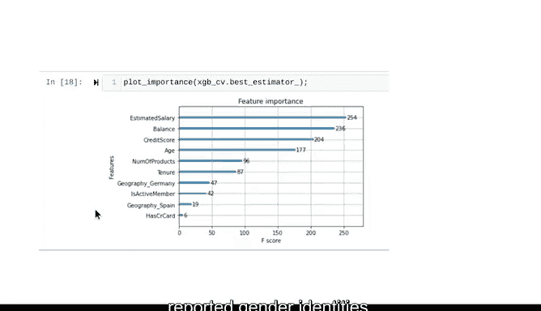

# 051：使用Python构建XGBoost模型 🚀


在本节课中，我们将学习如何使用Python构建并调优一个XGBoost分类模型。我们将使用这个模型来比较之前所有模型的性能，并最终选择一个最佳模型。

---

## 数据准备与库导入

上一节我们介绍了多种机器学习模型，本节中我们来看看如何实现一个强大的集成模型。首先，我们需要导入必要的库并准备数据。

我们使用与之前模型相同的大部分库、包和函数，包括`Numpy`、`pandas`、`Matplotlib`、`pickle`、所有模型评估指标、网格搜索和训练测试分割函数。此外，我们有两个新的导入：`XGBClassifier`和`plot_importance`，它们都来自`XGBoost`库。

```python
import numpy as np
import pandas as pd
import matplotlib.pyplot as plt
import pickle
from sklearn.model_selection import train_test_split, GridSearchCV
from sklearn.metrics import accuracy_score, precision_score, recall_score, f1_score
from xgboost import XGBClassifier, plot_importance
```

数据方面，我们继续使用银行客户流失数据集。请注意，某些列已被删除，包括`customer_id`和`gender`。同时，`geography`列已进行了虚拟编码。

---

## 划分训练集与测试集

与之前保持一致，我们将特征和目标数据分别赋值给变量`X`和`y`。

```python
X = data.drop(columns=['Exited'])
y = data['Exited']
```

然后，使用`train_test_split`函数将数据分割为训练集和测试集。我们基于目标变量进行分层抽样，并设置与之前模型相同的测试集大小和随机种子。这有助于在评估模型性能时进行直接比较。

```python
X_train, X_test, y_train, y_test = train_test_split(X, y, test_size=0.2, stratify=y, random_state=42)
```

---

## 使用网格搜索调优模型

现在，我们开始建模。我们将使用网格搜索来调优一些关键的超参数。

以下是网格搜索将遍历的参数值，我们将其定义为一个名为`cv_params`的字典：

```python
cv_params = {
    'max_depth': [3, 5, 7],
    'min_child_weight': [1, 3, 5],
    'learning_rate': [0.01, 0.1, 0.2],
    'n_estimators': [100, 200, 300]
}
```

接下来，实例化分类器。注意，`objective`参数被设置为`binary:logistic`。这意味着模型执行的是输出逻辑概率的二元分类任务。对于不同类型的问题（例如多分类或连续数据的线性回归），目标函数会有所不同。

```python
xgb = XGBClassifier(objective='binary:logistic', random_state=42)
```

我们设置与随机森林相同的评估指标：准确率、精确率、召回率和F1分数。

```python
scoring = {'accuracy', 'precision', 'recall', 'f1'}
```

最后，实例化网格搜索。记住将`refit`参数设置为`'f1'`，这告诉网格搜索在完成搜索后，重新拟合具有最佳平均F1分数的模型。

```python
grid_search = GridSearchCV(estimator=xgb, param_grid=cv_params, scoring=scoring, cv=5, refit='f1')
```

现在，将模型拟合到训练数据上。我们可以使用`%%time`魔法命令来输出单元格运行所需的时间。

```python
%%time
grid_search.fit(X_train, y_train)
```

在这个示例场景中，运行耗时9分45秒。

---

## 保存模型与性能比较

模型训练完成后，我们使用`pickle`将其保存。

```python
with open('xgb_model.pkl', 'wb') as f:
    pickle.dump(grid_search.best_estimator_, f)
```

也可以使用在其他笔记本中构建的模型。例如，要使用随机森林模型，可以使用另一个`with open`语句将其导入到此笔记本中。

```python
with open('rf_model.pkl', 'rb') as f:
    rf_cv = pickle.load(f)
```

现在，通过比较新XGBoost模型和之前随机森林模型的`best_score_`属性来对比模型性能。在本例中，XGBoost以微小的优势（仅0.003）超越了交叉验证的随机森林模型。

接下来，使用之前创建的`make_results`函数为此模型生成结果表，并将其附加到总体结果表中。这样可以方便地比较所有模型的分数。

以下是按F1分数降序排列的结果表：

| 模型 | 准确率 | 精确率 | 召回率 | F1分数 |
| :--- | :--- | :--- | :--- | :--- |
| XGBoost | 0.863 | 0.772 | 0.503 | **0.608** |
| 随机森林 | 0.862 | 0.769 | 0.498 | 0.605 |
| 逻辑回归 | 0.811 | 0.634 | 0.221 | 0.327 |
| 决策树 | 0.791 | 0.514 | 0.514 | 0.514 |
| 朴素贝叶斯 | 0.697 | 0.365 | 0.771 | 0.495 |

该表清楚地显示，在F1分数指标上，我们的XGBoost模型优于所有其他模型。

---

## 在测试集上评估模型

现在，是时候评估性能更优的XGBoost模型在测试集上进行预测时的表现了。

使用网格搜索的`predict`方法对`X_test`数据进行预测，并将结果赋值给变量。

```python
y_pred = grid_search.predict(X_test)
```

然后，将这些预测值与`y_test`中包含的实际值进行比较，并生成评估指标。

```python
test_accuracy = accuracy_score(y_test, y_pred)
test_precision = precision_score(y_test, y_pred)
test_recall = recall_score(y_test, y_pred)
test_f1 = f1_score(y_test, y_pred)
```

结果显示，模型在测试数据上的所有四个指标上都比在验证数据上表现得更好。虽然存在这种可能性，但如果你的模型在测试数据上表现稍差，也无需惊慌，毕竟测试数据是模型完全未见过的。

---

## 模型解释与业务建议

成功的数据专业人士知道，工作不会仅仅因为产生了一个具有有效性能指标的模型而结束。同样重要的是解释该模型，并根据发现提出建议。

例如，混淆矩阵在评估模型的变量和特征时非常有帮助。在我们的模型中，测试数据有2500人，其中509名客户离开了银行。我们的模型捕捉到了其中的256人。

混淆矩阵表明，当模型出错时，通常是第二类错误。换句话说，它给出了假阴性，未能预测客户会离开。另一方面，它犯的第一类错误（假阳性）要少得多。

这些结果是否可以接受，取决于为防止客户离开所采取措施的成本与保留客户的价值之间的权衡。在这种情况下，银行领导者可能决定他们宁愿有更多的真阳性，即使这意味着也会捕获更多的假阳性。如果是这样，也许仅基于F1分数优化模型是不够的，我们可能需要重新训练模型以专注于召回率。

可以肯定的是，我们的模型对银行有帮助。考虑一下如果决策者什么都不做会有什么结果：他们预计会失去509名客户。或者，他们可以给每个人激励以留住他们，但这将花费银行为我们测试集中所有2500名客户支付成本。最后，银行可以随机提供激励，比如抛硬币。这样做会激励到与我们模型选择的真响应者数量大致相同的人，但银行会浪费大量资金向那些不太可能离开的人提供激励。而我们的模型非常擅长识别这些客户。

---

## 特征重要性分析

另一种帮助解释我们模型的方法是检查最重要的特征。XGBoost为我们提供了一个非常有用的函数`plot_importance`，可以让我们观察模型的相对特征重要性。

导入该函数后，我们可以通过将网格搜索中的`best_estimator_`传递给它来输出条形图。

```python
plot_importance(grid_search.best_estimator_)
plt.show()
```

在我们的模型中，估计薪资、余额、信用评分和年龄是预测客户是否会离开的首要因素。此时，返回去针对这些特征进行另一轮探索性数据分析可能很有用。你可能还想将`gender`列以及最终模型的预测列添加回原始数据中，这将允许你衡量模型在不同报告的性别身份之间错误分布的均匀程度。

---

## 总结

本节课中我们一起学习了如何构建、调优和评估一个XGBoost分类模型。我们从数据准备开始，使用网格搜索进行超参数调优，并将XGBoost的性能与之前的模型（如随机森林、逻辑回归等）进行了比较。我们发现XGBoost在F1分数上表现最佳。接着，我们在未见过的测试集上评估了模型，并讨论了模型结果的业务解释和特征重要性。



从线性回归、逻辑回归到朴素贝叶斯、决策树、随机森林和XGBoost，你现在已经掌握了一套强大的工具。它们将帮助你在激动人心且回报丰厚的数据职业领域中脱颖而出。🚀