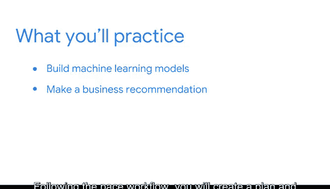

# 053：项目实战指南 🚀

在本模块中，我们将综合运用课程所学的知识，完成一个完整的机器学习项目。这个项目将帮助你巩固所学概念，并创建一个可以展示给潜在雇主的作品集。

## 项目概述与目标 🎯

很高兴再次与你相见。你可能在上一个课程中认识了我，我是Tiffany。现在，是时候完成一个作品集项目，并应用你在这门课程中学到的所有知识了。

与之前的课程一样，这个作品集项目将指导你完成一系列任务，并创建能够展示你技能的成果物。在面试中，你可能会被问到一些测试你对不同机器学习模型理解程度的问题。此外，在你的简历中拥有项目经验，可以帮助你在招聘经理面前脱颖而出，从而获得面试机会。在面试过程中，你可以依靠你的作品集来讨论数据科学，或者更具体地解释建模策略。

为了完成这个作品集项目，你将获得一些商业案例的详细信息。你需要选择其中一个案例，并按照指导说明，在你的PA策略文档中创建一个新条目，同时构建机器学习模型来解决该问题。完成这个项目后，你将拥有可以添加到作品集里的机器学习模型。

至此，你即将完成本课程，并且已经掌握了完成此项目所需的一切知识。你正在数据专业人士的职业道路上稳步前进。

## 项目核心任务 📋

在这个项目中，你将运用本课程学到的模型来解决一个数据问题，然后按照PACE工作流程提出商业建议。你将创建一个计划，并清晰地阐述你完成项目的整个过程。

以下是项目的主要步骤：

1.  **选择商业案例**：从提供的案例中选择一个你感兴趣的问题。
2.  **制定项目计划**：在你的PA策略文档中规划你的方法。
3.  **构建机器学习模型**：应用合适的算法来解决问题。
4.  **评估与优化**：分析模型性能并进行必要的调整。
5.  **形成商业建议**：基于模型结果，提出可执行的建议。
6.  **整理项目文档**：确保你的过程和结果清晰、可复现。

## 项目启动 🚦

准备就绪。那么，让我们开始吧。

---

在本节课中，我们一起学习了如何启动和规划你的机器学习作品集项目。我们明确了项目的目标、核心任务以及它对职业发展的重要性。接下来，你需要选择一个具体的商业案例，并开始应用你所学的知识，一步步构建解决方案。记住，清晰的过程记录和有效的沟通与模型本身同样重要。祝你项目顺利！