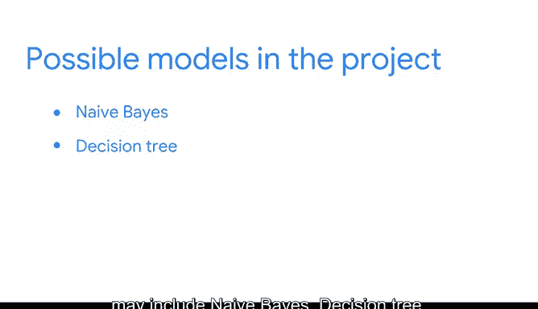

# 055：《机器学习的基础知识》课程期末项目介绍 🎯

在本节课中，我们将学习如何整合本课程所学的知识，完成一个综合性的期末项目。我们将回顾监督学习和无监督学习模型的核心概念，并了解如何应用PACE工作流程来解决一个实际的商业问题。

---

在本课程中，你学习了监督式和非监督式机器学习模型，了解了它们的工作原理以及如何在Python中构建它们。

在之前的课程中，你练习了构建、解释和评估回归模型。到目前为止，你也一直在努力培养Python数据可视化和统计方面的技能。

现在，是时候整合所有这些知识来完成这个期末项目了。

以下是项目的主要组成部分：

*   **商业问题与数据集**：你将获得一个商业问题和一个数据集。
*   **PACE工作流程**：你将遵循PACE工作流程来制定计划、构建机器学习模型、记录你的工作，并选择能最好解决问题的模型。
*   **模型类型**：你构建的所有模型都将是本课程中学过的模型，可能包括朴素贝叶斯、决策树、随机森林、XGBoost，甚至K-Means聚类。

---

上一节我们介绍了项目的整体框架，本节中我们来看看模型评估的关键环节。

你还需要选择一个合适的评估指标来衡量模型的性能。

正如你在本课程中学到的，数据专业人员通过分析和发现数据中的模式，来确定解决商业问题所需的最合适的模型。

然后，他们需要向同事和利益相关者沟通他们的工作和建议。

请记住，构建这些模型需要一些耐心。你在技能培养方面做得非常出色，这些技能在你完成本项目时肯定会派上用场。

如果你需要复习任何内容，请随时返回观看其他视频或查阅课程材料。

---

本节课中我们一起学习了期末项目的目标、流程和关键组成部分。我们回顾了需要应用的机器学习模型类型，并强调了遵循PACE工作流程、进行模型评估和有效沟通的重要性。现在，你可以运用所学的全部技能来迎接这个综合挑战了。