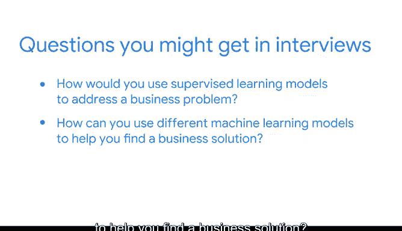

# 056：《机器学习的基础知识》课程总结与职业建议 🎓

在本节课中，我们将对课程项目进行总结，并探讨如何将所学知识应用于未来的职业面试与持续成功。我们将回顾你已完成的成果，并讨论如何向潜在雇主展示你的技能与经验。

---

## 项目成果回顾 📊

在课程进展至此阶段，你已经涵盖了众多主题。这些主题包括理解数据职业领域、Python编程、数据可视化、统计学、建模等。你的作品集中包含了用于解决特定问题的机器学习模型，并且你的PACE策略文档也新增了条目，用于详细解释你在项目每个阶段的工作。

通过课程的每一步，你创建了多个可加入作品集的成果，这些成果展示了你的知识与技能。你有很多值得自豪的成就。

---

## 在面试中展示你的工作 💼

有多种方式可以在未来的面试中向潜在雇主和招聘经理突出展示你的工作并解释你所完成的内容。

正如之前提到的，你需要在面试中留出时间讨论你学到的工具、你培养的可迁移技能以及你在本课程中的经历。

作为一名数据专业人士，你可能需要在工作中学习和适应新工具，正如我们在本课程中所展示的那样。市面上有许多优秀的工具，不同的企业根据其需求会使用不同的工具和技能。

在申请工作时，请记住，你已经学到了许多可以跨不同工具应用的可迁移技能。

---

## 核心机器学习概念的面试应用 🤖

在本课程中，我们讨论了根据待解决的问题和可用数据来确定最合适模型的重要性。在此过程中，你发现可以使用不同的机器学习模型来帮助寻找业务解决方案。

你还认识到，在使用机器学习模型时，解释你的工作流程非常重要。

在面试中，你可能会被问到以下问题：
*   如何使用监督学习模型来解决业务问题？
*   如何使用不同的机器学习模型来帮助你找到业务解决方案？
*   为什么在使用机器学习模型时解释你的过程很重要？

我鼓励你运用在本课程中学到的知识来开始回答这些问题。当然，面试中可能还会有其他讨论点。

---

## 期末项目总结与技能整合 🔗

在你刚刚完成的这个作品集项目中，你使用Python构建了不同的机器学习模型。这些模型帮助识别了针对独特业务挑战的潜在解决方案。

此外，你在PACE策略文档中记录了一个新条目，详细说明了你在该项目中的思考、考量和流程步骤。

我还想强调，这个项目建立在你随着课程进展所积累的知识之上。现在，你已经准备好承担数据专业人士的任务和职责了。

---

## 面向未来的准备：顶点课程与持续学习 🚀

提醒一下，你的面试官就像数据项目中的利益相关者一样，面临着一个业务挑战：他们有一个需要填补的职位空缺。思考一下，他们需要了解你的哪些信息才能做出解决该业务挑战的决定，就像你在每个作品集项目中一直在练习的那样。

在接下来的顶点课程中，你将整合整个课程的所有内容和技能，并将它们应用到一个项目中。这将是一个机会，让你运用早期课程中每个作品集项目的技能来解决一个新的业务问题。这将为你提供更多可以加入作品集的成果。

---

## 总结 📝

本节课中，我们一起回顾了你在《机器学习的基础知识》课程中取得的成就，包括构建的机器学习模型和更新的项目文档。我们探讨了如何在职业面试中有效地展示这些技能和经验，强调了解释工作流程和展示可迁移能力的重要性。最后，我们展望了顶点课程，它将是整合所有所学、解决新挑战的最终舞台。持续构建你的作品集，清晰阐述你的思考过程，这将为你的数据职业道路奠定坚实的基础。