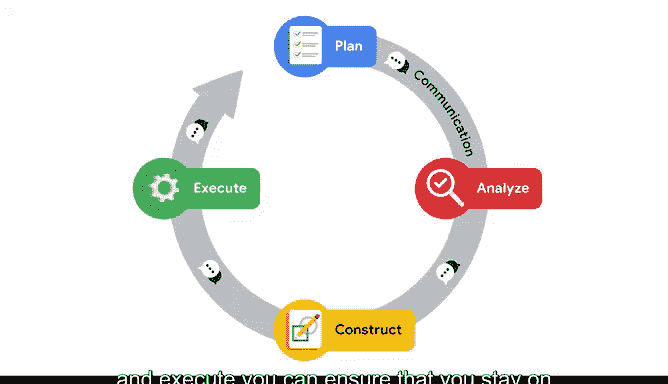

# 057：《机器学习的基础知识》课程总结 🎓

在本节课中，我们将回顾并总结《机器学习的基础知识》这一章节的核心内容。我们学习了机器学习的基础概念、不同类型的模型、构建模型的完整工作流程，以及一些关键的建模技术。现在，让我们一起来梳理这些知识点。

---

## 课程内容回顾 📚

恭喜你，你已经完成了本课程最后一个教学部分，准备好进入你的毕业项目了。在最后的这个章节中，你学到了非常多的知识，现在可以带着这些新知识，在你的数据之旅中继续前进。无论你的下一步是继续深造，还是将所学应用于工业界，你现在都已经拥有了一个可以继续构建或使用的全面基础。

上一节我们介绍了机器学习的基础，本节中我们来回顾整个学习路径。

### 机器学习的基石

我们从这个章节开始，学习了机器学习的基础，重点是数据专业人员可以使用的不同类型模型。你看到了不同类型的业务需求如何需要不同类型的模型。此外，你还学习了推荐系统以及这类模型最常见的用例，以及不同的流行技术及其优缺点。

以下是本阶段的核心模型类型：
*   **监督学习模型**：用于预测或分类任务。
*   **无监督学习模型**：用于发现数据中的模式或结构，如聚类。
*   **推荐系统**：用于向用户推荐物品。

### 构建你的机器学习工具箱 🧰

从那里开始，你开始构建自己的机器学习工具箱。不同的集成开发环境、Python文件类型和面向数据的Python包共同为你提供了处理任何数据驱动问题所需的工具。

### PACE工作流框架

PACE工作流是你运用这些工具的框架。通过花时间遵循计划、分析、构建和执行这些步骤，你可以确保保持在正轨上，从而构建出能够提供有意义结果的模型。

以下是PACE工作流的四个阶段：
1.  **计划**：仔细审视业务需求和可用数据，并确定适合的模型类型。
2.  **分析**：应用你在课程早期学到的许多探索性数据分析原则。
3.  **构建**：引入并构建新的模型，并应用评估指标来衡量模型性能。
4.  **执行**：执行任何需要的验证技术，进一步评估模型，并进行必要的调整以使其发挥最佳性能。

在分析阶段，你还学习了一个称为**特征工程**的新技术子集，它允许你以多种方式操作和准备数据以供建模。

### 深入无监督学习与基于树的模型

接下来，你更深入地研究了无监督学习模型。K均值是最广泛使用的无监督学习技术之一。在课程的这个部分，你构建了一个K均值模型，并使用常见的评估技术来充分理解其结果。

最后，你学习了基于树的建模。基于树的技术是当前业界存在的一些最有效的模型。你了解了单棵决策树的工作原理，从概念上学习了它们的功能，并亲自构建了一个。在此基础上，你被介绍了两种集成技术：装袋法和提升法。

在基于树的建模中，你看到了使用高级机器学习技术最重要的一个方面：**超参数调优**。这对于在工业界构建模型至关重要，它允许你优化模型以适应你的特定需求。

---

## 总结与展望 🚀

本节课中我们一起学习了机器学习的基础知识，包括模型分类、PACE工作流、特征工程、无监督学习（如K均值）以及强大的基于树模型及其集成与调优技术。

在接下来的部分，你将把在整个课程中学到的一切应用到一个毕业项目中，这将成为你作品集中非常宝贵的一部分。我们很快再见。😊