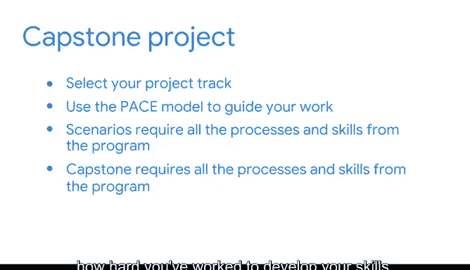

# 001：《谷歌高级数据分析项目》 🎓

在本课程中，我们将介绍整个数据分析专业课程的最终项目——毕业设计。你将综合运用此前学到的所有技能，完成一个完整的数据分析项目，并将其作为你作品集的重要部分。

---

在整个课程项目中，你一直在培养自己作为数据专业人士的技能，并练习有效的沟通。此外，你一直在构建一个作品集，以展示你的能力。

经过所有的奉献和努力，你终于到达了顶点——本课程的最终项目。恭喜你。

在之前每门课程结束时，你都完成了一个作品集项目。在每个项目中，你都练习了该课程中学到的技能。在这些作品集项目中，你使用了 **PACE 策略文档**。在那里，你概述了目标，并规划了执行每项任务所需的工作流程。

因此，你已经为作品集创建了许多优秀的示例，这些示例与你作为数据专业人士将要完成的项目类似。每个项目都突出了你执行依赖于特定技能和工具的专业任务的能力。

在本毕业设计课程中，你将首先选择一个项目选项并阅读项目概述。接下来，你将使用 **PACE 模型** 来指导你的工作流程。

这些毕业设计场景将汇集你在过去每个作品集项目中应用的所有内容和技能。最大的区别在于，毕业设计项目不是专注于单个课程主题，而是将你从本课程开始到结束所培养的所有技能结合起来。

通过将你的毕业设计项目添加到作品集中，雇主和商业伙伴将认识到你所取得的成就以及你为培养技能所付出的努力。

---

当你开始这个项目时，请知道你可以按照自己的节奏进行。如果你遇到挑战或需要帮助，可以随时参考你过去的工作。

本课程中的每一节课和活动都为你完成本项目中的步骤做好了准备。

现在，是时候开始毕业设计项目了。祝你好运。让我们开始吧。

---

**本节课总结**

本节课我们一起学习了毕业设计项目的总体介绍。我们了解到，毕业设计是综合运用整个课程所学技能的最后一步，需要使用 **PACE 模型** 来规划工作，并将最终成果加入个人作品集，以向外界展示你的专业能力。