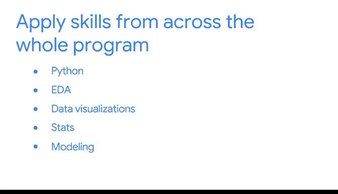

# 002：《谷歌高级数据分析项目》 🎓

在本节课中，我们将要学习顶点项目的内容概览，了解其结构、预期成果以及如何着手开始。

---

欢迎回来。我们来谈谈顶点项目的预期内容。

此时，你已经有机会回顾了项目详情和不同的项目选项。很快，你将有机会访问项目说明并查看一个顶点项目的示例。

一旦你审阅了说明，你将首先从选择一个项目选项开始。届时，你将获得所有必要的数据和项目信息。

接下来，使用 **PACE 模型** 来组织你的方法，并概述你需要采取的步骤。

顶点项目的结构与每个作品集项目类似。到课程的这个阶段，完成顶点项目所需的任何任务对你来说都不会是全新的。如果你遇到困难，可以回顾之前的项目。

你目前完成的顶点项目与作品集项目之间有一个主要区别：顶点项目是综合性的，因为它需要在整个课程中培养的技能和知识，包括 **Python**、**EDA（探索性数据分析）**、**数据可视化**、**统计学**、**建模** 和 **PACE 模型**。

现在，是时候开始了。在项目结束时，你将拥有一系列成果，可以添加到你的作品集中，向潜在雇主展示你的技能。祝你在顶点项目中好运。

---

本节课中，我们一起学习了顶点项目的整体概览，明确了其综合性特点、启动步骤以及最终目标。准备好运用你所学到的全部技能，开始你的项目吧。