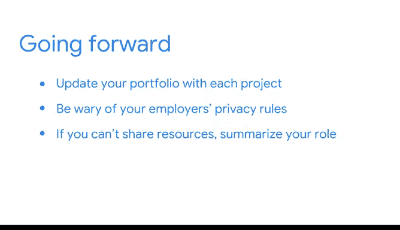

# 003：将项目成果融入数据分析作品集 📂

## 概述

在本节课中，我们将学习如何将你完成的数据分析项目成果有效地整合到你的个人作品集中。一个精心准备的作品集是向潜在雇主展示你技能与成就的关键工具。

---

如果你已经获得了谷歌数据分析证书，或者完成过任何数据项目，你可能已经拥有一个在线的作品集。需要提醒的是，我们的作品集是一个可以与潜在雇主分享的材料集合。它是你求职申请的一部分，是你成就的证明。

如果你还没有作品集，现在是时候创建一个了。作品集是一种可分享、可访问的展示你工作的方式。潜在雇主会对你通过本课程项目以及其他过往经验所获得的技能感兴趣。

在作品集中拥有具体的成果来向未来的雇主展示这些技能，将为你顺利进入面试环节做好充分准备。你也可以用它来展示你在非数据行业的背景。因此，创建一个全面的作品集非常重要。

## 作品集的内容与形式

作品集使你能够分享各种文档、代码仓库、演示文稿链接以及其他有助于展示你技能的资产。

以下是你可以考虑包含在作品集中的内容类型：
*   **项目文档**：如项目计划、分析报告。
*   **代码仓库**：例如 GitHub 上的代码库链接。
*   **演示文稿**：项目汇报的幻灯片链接。
*   **数据可视化**：仪表板或图表的截图或链接。

## 选择作品集平台

你可以将作品集托管在你自己的定制网站上，或者使用现有的数据共享平台。

上一节我们讨论了作品集的内容，本节中我们来看看如何选择展示平台。像你可能用于共享数据的 GitHub 或 Kaggle 这样的网站，可以用来链接到你的项目成果。Tableau 也拥有社交平台和分享功能。

一旦你选择了一个或多个平台来托管你的作品集，你就可以添加你的项目了。你可以选择通过包含你的数据、可视化的截图、嵌入代码或以上所有方式来展示你的项目。

如果你选择的平台无法嵌入内容，你始终可以包含链接，以便他人访问你的项目。

## 完善作品集内容

当你将项目中所有相关的部分都包含进作品集后，你还应该解释你的工作过程。

以下是完善项目描述时需要考虑的要点：
*   **工作内容**：描述你具体做了什么。
*   **决策原因**：解释你为什么做出某些选择。
*   **反思与改进**：说明你本可以采取哪些不同的做法。

包含一份简短的自我介绍也很有帮助。通过描述你的职业目标和兴趣，你可以个性化你的作品集，使其在其他申请者中脱颖而出。

## 持续维护与注意事项

展望未来，随着你通过教育经历、在线课程或工作完成项目，及时更新你的作品集非常重要。

你参与的某些项目可能涉及私有数据。因此，请务必遵守雇主关于数据共享的规章制度。在无法分享项目中的任何数据或可视化内容的情况下，你仍然可以在作品集中包含你所做工作的摘要。

你可以分享的细节可能由你的雇主决定，但记录你在参与的每个项目中所扮演的角色非常重要。

---

## 总结

本节课中，我们一起学习了创建和优化数据分析作品集的核心步骤。现在就是创建或更新你作品集的时候了。你可以现在开始做，或者安排时间稍后更新。这将是你整个职业生涯中需要定期进行的一个过程。

在作品集中展示你的成就，将为你现在乃至未来数年迎接新的机遇做好准备。