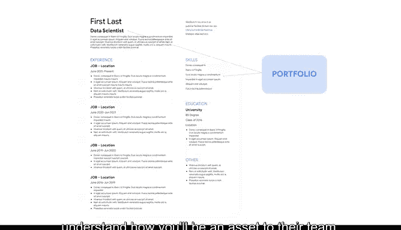

# 004：《谷歌高级数据分析项目》 - 优化你的简历 📄

在本节课中，我们将学习如何优化你的简历，以提升在数据领域求职时的竞争力。一份出色的简历能直接影响你获得职位的机会。我们将探讨雇主对数据专业人士简历的期望，并提供具体策略，帮助你脱颖而出。

---

## 回顾简历基础

在课程早期，你学习了在申请工作前创建作品集。准备一份简历同样重要。如果你已完成谷歌数据分析项目，你已经掌握了创建有效简历的大量知识。如需复习，可随时回顾相关资源。

随着你进入求职阶段，需要重新审视简历，确保它准确反映了你在此项目中积累的经验、技术能力、知识与技能。

---

## 针对职位定制简历

招聘信息中通常列出多种职责。为了提高被招聘人员和招聘经理注意到的几率，首要任务之一是为你申请的具体职位量身定制简历。

以下是具体步骤：

*   **分析职位要求**：仔细阅读职位要求，并找出你简历中能展示招聘信息所列技能的部分。
*   **调整描述用语**：你可能需要修改简历中的描述，使其反映招聘信息中使用的语言和术语。
*   **突出专业性**：由于数据领域的许多职位都具有专业性，你的简历也应如此。

---

## 展示技术能力

大多数雇主都期望简历中包含技术和软件熟练度部分。这是你列出用于分析数据的编程语言、平台和软件的地方。

完成此项目后，建议你添加 **Python** 和 **Tableau**。在修改简历时，也可以包含你之前在其他数据相关软件方面的工作或教育经历。

有时，你可能会遇到列出你不熟悉的编程语言、软件和技能的职位描述。在这种情况下，请考虑你现有简历上的哪些工具和技能可以迁移到你申请的职位。在此项目中，你学到了许多在数据领域各角色间通用的宝贵技能。

---

## 强调可迁移技能与新技能

不要忘记列出你新开发的技能，包括 **E**（可能指探索性数据分析）、**统计学**、**建模** 和 **沟通能力**。

请记住，招聘经理希望看到过去工作的实例。正如我们之前在项目中所讨论的，这通常通过在线简历或作品集来展示。

---

## 整合作品集与简历

作品集和简历相辅相成，帮助潜在雇主和招聘经理更好地理解你将如何成为他们团队的宝贵资产。由于你在此项目中的辛勤工作，你已经创建了一个包含多个策略条目和数据项目的作品集。

所有这些都强有力地证明了你作为数据专业人士的熟练程度。你甚至可以在简历的某些部分，简要描述你在项目中学到的内容。

---

## 为面试做好准备

当你开始申请职位时，请花时间用你已完成的作品集来修订和更新简历。准备好简历和作品集后，你将进入申请流程的最后阶段——面试。

---

## 总结

本节课中，我们一起学习了如何优化简历以提升求职成功率。关键步骤包括：针对特定职位定制简历、清晰展示技术能力与软件熟练度、强调可迁移技能与新技能，以及将作品集与简历有效整合。完成这些准备后，你将更有信心地进入面试环节。