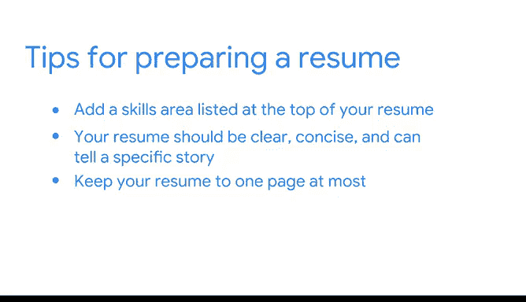

# 005：《谷歌高级数据分析项目》 - 打造一份引人注目的简历 📄

在本节课中，我们将学习如何为数据分析岗位打造一份出色的简历。课程内容基于谷歌技术招聘专家Daniel的经验分享，旨在帮助初学者在众多求职者中脱颖而出。

---

我的名字是Daniel，我是谷歌产品分析师和数据科学团队的一名技术招聘人员。

我认为帮助候选人获得一份理想的工作，是一种改变人生的体验，能参与这个过程非常棒。

在谷歌的职业生涯中，我可能已经审阅了成千上万份简历。因此，我希望通过这次分享，能为你提供一些技巧，帮助作为初入数据分析领域的新人，在人群中脱颖而出。

对于首次进入数据分析领域的新人，你可以对简历做很多事情来让自己脱颖而出。

以下是你可以采取的几个关键步骤。

**首先**，你需要确保将技能部分列在简历的顶部，并在该部分明确指出与你申请职位相关的内容。

对于数据分析岗位，我们真正关注的是**统计学**、**编程语言**、**软件**和**分析框架**等领域。在简历顶部突出这些内容非常重要。

同时，你也需要突出软技能，我认为这在很多方面都至关重要。

软技能可以通过多个不同领域来体现，例如在你过去的工作中，可以包括**协作**、**跨部门合作**以及**解决问题的能力**。

**其次**，你需要确保简历非常清晰、简洁，并能讲述一个具体的故事。

在经历部分，这不一定是特定的工作经验，可以是你在学校参与的项目，也可以是实习经历。

但你确实需要突出任何与解决分析问题、使用指标以及运用这些分析框架真正解决问题的经历。

**最后**，我要说的是，简历最多保持在一页，并确保你的经历按**倒序时间**排列，真正讲述你在数据分析领域所做工作的故事。

---

上一节我们讨论了简历的核心结构，本节中我们来看看，如果你希望进入某个领域但没有直接经验，该如何处理。

如果你想进入一个领域但没有相关经验，你过去的很多经历可能与他们寻找的内容高度相关。

因此，我建议的第一件事是查看职位描述，研究分析领域通常关注的关键领域，然后审视你过去的经历，看看如何与之匹配。

除了那些核心的硬性技术技能，我们在数据科学领域寻找的，很大程度上是你如何**分解问题**、**应用分析方法**、**提供建议**并与业务部门合作的能力。

很多时候，你可以从过去的经历中提取这些能力，它们与我们在这里的工作高度相关，只是在分析领域的具体应用可能略有不同。

---

本节课中我们一起学习了打造数据分析简历的三个核心要点：**在顶部突出相关技能**、**用清晰简洁的经历讲述故事**，以及**如何将过往的非直接经验与目标职位的要求联系起来**。记住，一份好的简历是开启你数据分析职业生涯的关键第一步。