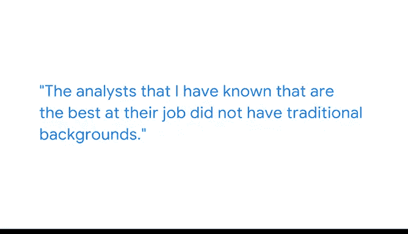

# 006：《谷歌高级数据分析项目》课程笔记 📝

## 概述

在本节课中，我们将跟随谷歌产品分析负责人 Eva 的分享，了解数据分析师职业道路的多样性。她将讲述自己从非技术背景转型为分析团队负责人的经历，并强调业务理解与多元化背景在数据分析领域中的独特价值。

---

## 个人背景与职业起点 🚀

大家好，我是 Eva，目前在谷歌担任产品分析负责人。我管理着一个分析师团队，我们共同协助产品经理和工程合作伙伴解答业务问题，从而帮助广告商更好地优化他们在谷歌广告平台上的账户。

我的职业生涯起点并非数据分析。最初，我主要从事销售、市场营销和活动策划类的工作。那时，我对朋友们参与的任何项目都持开放态度，愿意尝试各种机会。

这段融合了不同背景和职责的经历，最终教会了我如何讲述故事。我认为这项技能在我初入谷歌时显得尤为重要。

---

## 从销售到分析的转型 🔄

上一节我们了解了 Eva 的多元化起点，本节中我们来看看她是如何迈入数据分析领域的。

我加入谷歌时，实际上是一名销售人员。我的工作是帮助客户优化他们的谷歌广告账户。在执行这项工作的过程中，我意识到，为了更有效、更大规模地帮助客户，我需要提升自己的能力。

因此，我会在下班后回家，观看大量关于如何学习 **SQL** 的 YouTube 视频。我也会与一些分析师和合作伙伴团队的同事会面，一起研究解决一些 **SQL** 问题。

我开始将所学知识教给其他人。在这个过程中，我与销售分析部门的一些同事建立了友谊。坦诚地说，他们给了我一个机会，使我最终得以转入一个分析团队。

我认为，对销售项目的深入了解，然后转到一个专注于帮助销售人员的团队，这对我很有帮助，因为我具备了深厚的业务背景知识。

---

## 非传统背景的优势 💡

我们看到了 Eva 如何通过主动学习实现转型。接下来，她将分享一个关键洞察：非传统背景并非劣势，反而是巨大优势。

我认识的那些最出色的分析师，都没有传统的背景。我最敬佩的人中，有 **大提琴手**、**鼓手**、**生物学家**、**物理学家**、**教师** 等等。

你没有传统背景，但现在正在学习相关技能，这实际上让你处于一个特别有利的位置。原因在于：

以下是 Eva 认为非传统背景从业者具备的核心优势：

*   **深刻的业务理解**：一名分析师如果对其所服务的业务缺乏深刻理解，不了解其合作伙伴，就无法有效地帮助他们解答问题。
*   **独特的领域知识**：正因为你不在那个传统的世界里，所以你拥有那些“圈内人”可能不具备的外部视角和特定领域知识。

所以，不要觉得自己落后了或类似的想法。你应该明白，来自非传统背景实际上具有相当大的价值。

---

## 总结

本节课中，我们一起学习了 Eva 从销售到数据分析负责人的职业路径。她的经历告诉我们：

1.  **数据分析师的起点可以多种多样**，销售、市场等经验都能成为宝贵财富。
2.  **主动学习和传授知识**（如自学 **SQL**）是转型的关键推动力。
3.  **深刻的业务背景** 与 **技术技能** 同等重要，甚至更为关键。
4.  **非传统的多元化背景**（如艺术、科学、教育）能为数据分析带来独特的视角和价值，是差异化优势而非短板。

记住，你的独特经历就是你最强大的资产。