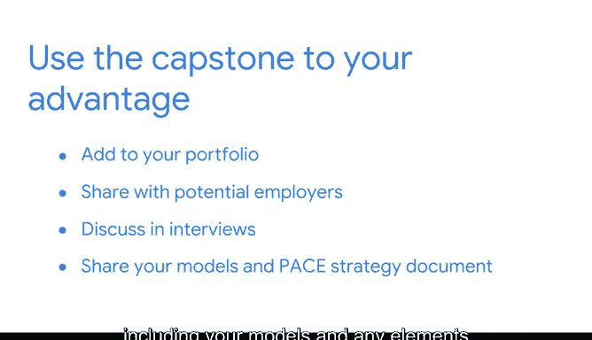

# 007：《谷歌高级数据分析项目》顶点项目总结与持续职业成功建议 🎓

在本节课中，我们将总结整个顶点项目的完成过程，并为你提供将项目成果应用于求职、构建个人作品集的实用建议，最后为你的职业发展送上祝福。

---

## 顶点项目完成总结 🏁

恭喜你完成了顶点项目。这是一个巨大的成就，它证明了你在本课程中付出的所有努力。

你运用了数据科学知识和高效沟通技巧，创造了一个能动态展示你专业技能的代表性作品。

现在，你可以将这个顶点项目纳入你的个人作品集。在面试时，你可以与潜在雇主分享并讨论它。😊

你还可以分享在此过程中生成的任何材料，包括你构建的模型以及你的项目策略文档中的任何组成部分。

---

## 如何展示你的工作成果 📂

以下是展示项目成果时可以考虑包含的内容，这些材料有助于解释你的工作流程、思考过程以及最终做出的决策。

*   **完整项目报告**：展示从问题定义到结论的完整分析链条。
*   **数据模型**：例如，如果你构建了一个预测模型，可以分享其核心代码片段：`model.fit(X_train, y_train)`。
*   **策略文档**：包含业务理解、数据清洗步骤、分析方法和建议方案的部分。
*   **可视化图表**：能够清晰传达关键发现的数据图表。

理想情况下，你会分享以上所有内容。每一个组成部分都阐释了你作为一名数据专业人士的成长步骤。

---

## 职业发展准备与庆祝 🚀

上一节我们介绍了如何展示项目成果，本节中我们来看看如何为进入职场做好准备。

请允许我首先祝贺你完成顶点项目。你对本课程的投入令人印象深刻，我迫不及待地想看到你与未来的雇主分享对数据科学的热情。

在此之前，我们将帮助你为就业市场做好准备。😊

首先，我们将优化你的简历，并为你做好面试准备。然后，在你结束本课程之前，我们将花点时间来庆祝你所取得的惊人成就。😊

---

## 课程总结

本节课中，我们一起学习了如何将完成的顶点项目转化为有力的职业资产。我们总结了项目的价值，探讨了展示工作成果的最佳方式，并为你接下来的求职步骤指明了方向。你已成功完成了一个综合性的数据科学项目，这是你专业能力的有力证明。祝你未来在数据科学领域的职业道路一帆风顺！