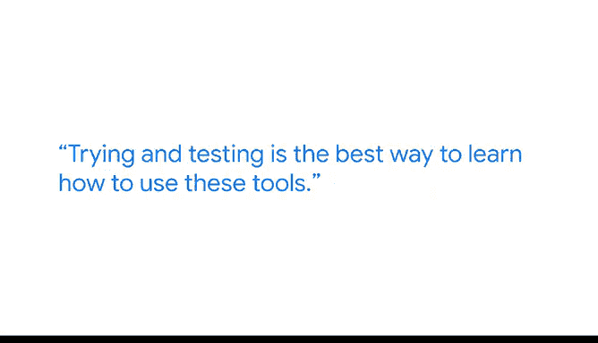

# 008：《谷歌高级数据分析项目》 - 人工智能在工作场所的驱动影响 🚀

在本节课中，我们将跟随谷歌数据工程师迈尔斯的分享，了解数据分析师的核心价值，并探讨人工智能如何成为现代工作场所中提升效率和创造力的关键驱动力。我们将学习如何将数据分析与AI工具结合，以解决实际问题并提升个人技能。

## 数据分析师的角色与价值

上一节我们介绍了课程背景，本节中我们来看看数据分析师的具体工作及其独特价值。

我是迈尔斯，是谷歌的一名数据工程师。我的主要职责是维护大型数据库，这些数据库也被称为数据湖，其中包含我们从资本支出到运营支出，再到收入的广泛财务信息。我的工作是为利益相关者提供这些数据。

我非常热爱数据分析师这份工作。它并不总是关于处理数字，很大程度上也关乎于“讲故事”。能够创建吸引人且视觉上引人入胜的内容呈现给业务伙伴，这是一项非常独特的技能，许多其他职业并不具备这方面的经验。

数据分析是我们所做一切工作的、容易被遗忘的支柱。没有数据，我们真的无法像现在这样准确地做出任何决策。

## 人工智能：数据分析的下一前沿

理解了数据分析的基础价值后，我们来看看它如何与人工智能结合，迈向新的阶段。

人工智能是一件大事。我们认为它是下一个前沿领域。如果我们将数据分析视为第一步，那么人工智能就是第二步。

在我的日常工作中，我每天都会使用AI。它让我和我的所有同事都更高效、更有生产力。更不用说它让我们能够自动化那些我们不喜欢做的、重复性或繁琐的任务了。

## 实战案例：利用AI简化数据访问文档

理论需要结合实际，以下是一个迈尔斯在谷歌工作中使用AI的具体案例。

最近，我在谷歌的岗位上使用AI的一个例子是，当我们必须围绕数据访问创建文档时。我们基本上需要为业务伙伴整合大约10种不同的访问权限，并创建文档让他们知道在何时何地申请访问。

我们这样做是因为我们维护着大量财务数据，众所周知，这些数据非常机密且需要知悉。因此，创建易于阅读和易于应用的文档至关重要。

作为谷歌的数据分析师，我每天都会使用这个新工具，或者说Gemini的摘要功能。无论是处理电子邮件、长表格还是解析代码，它都能真正帮助你更快地触及你想要找到的核心要点。

## 给初学者的建议：如何学习并运用AI

了解了AI的实际应用后，以下是迈尔斯给希望进入数据分析领域并利用AI的学习者的建议。

我给出的建议是，对于刚开始学习数据分析并希望利用AI达到目标的人来说，尝试和测试是学习如何使用这些工具、理解你需要提供什么才能获得你想要的结果的最佳方式。

请将其视为一个游乐场。

以下是具体的学习方法：
*   尽情尝试，搞乱一些东西。
*   向它提出假问题。
*   向它提出真实问题。
*   尽你所能去真正理解它会给出什么样的输出，这样当你真正需要做一些有成效的事情时，就能更好地利用它。

## 进阶技巧：用AI学习AI

掌握了基础学习方法后，这里还有一个有趣的小技巧可以进一步提升你的AI技能。

一个有趣的小技巧是，你实际上可以使用AI来教你AI。你甚至可以要求聊天机器人教你如何使用它自己。基本上，AI给你一个输出，你可以问它，它认为这个输出在多大程度上满足了我的输入。

## 总结与展望

本节课中，我们一起学习了数据分析师通过“讲故事”创造价值的核心，并深入探讨了人工智能作为提升工作效率和生产力的强大工具。

使用这些新技术是极其令人兴奋的。它几乎就像在你工作时有一个私人助理就在你身边。无论是向工具抛出问题和想法，还是向其输入数据以帮助你更快地完成某项工作，它不仅能够节省你的时间，还能教会你一大堆东西。

