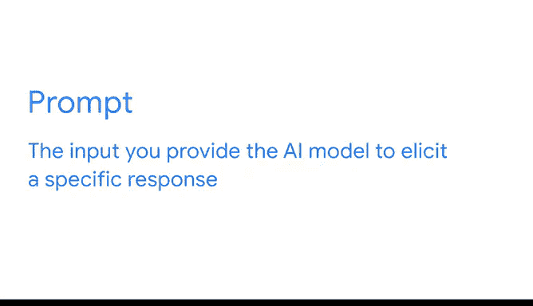
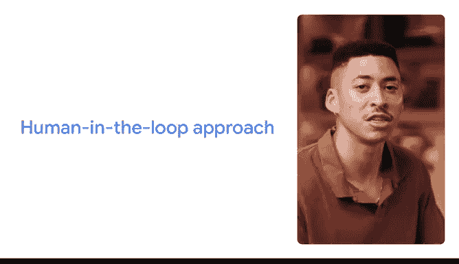

# 009：《谷歌高级数据分析项目》 - 利用人工智能提升数据分析技能 🚀

在本节课中，我们将学习如何利用人工智能（AI）来提升数据分析工作的效率与创造力。AI正在改变我们处理工作和生活中日常任务的方式。我们将探讨如何通过AI加速数据清洗、创建引人注目的数据可视化图表、构思数据分析问题等，并学习如何有效地向AI工具提问以获得最佳结果。

---

## 如何构建有效的AI提示词 💡

上一节我们介绍了AI在数据分析中的潜力，本节中我们来看看如何与AI有效沟通。要充分利用生成式AI，关键在于编写有效的提示词。提示词是你提供给AI模型的输入，用以引导其产生特定回应。

一个好的提示词遵循一个简单的框架：**任务、背景、参考、评估与迭代**，简称 **TCREI**。如果你记不住步骤，只需记住这句口诀：**“深思熟虑，创造真正优秀的输入”**。

以下是该框架的详细分解：

**1. 任务**
任务是指你希望模型做什么。这部分应简单明了。我们可以将任务细分为“角色”和“格式”。
*   **角色**：指你希望生成式AI工具借鉴何种专业知识。你可以要求它扮演特定角色，例如“专业的演讲稿撰写人”或“拥有15年经验的营销主管”。你也可以要求它为特定受众（如客户或你的经理）生成内容。
*   **格式**：指你希望输出以何种形式呈现。无论是项目符号列表、短句还是表格。请记住，任务描述应清晰、具体地说明你希望模型做什么。

**2. 背景**
背景是帮助AI工具理解你需求所必需的细节信息。这决定了输出结果的相关性和准确性。
*   例如，对比以下两个提示：
    *   “给我一些30美元以下的生日礼物点子。”
    *   “给我5个生日礼物点子。我的预算是30美元。礼物是送给一位29岁、热爱冬季运动、最近刚从单板滑雪转向双板滑雪的朋友。”

**3. 参考**
有时，你需要为AI工具提供参考信息，以便它在生成输出时使用。
*   例如，如果你要求AI提供生日礼物点子，同时附上你过去送过的礼物作为参考，AI工具就能给出更有用的建议。
*   请注意，并非所有任务都有明确的参考信息，尤其是在处理更抽象的问题或寻找灵感和创意时。关键在于指令要清晰、具体，使用自然语言，就像与另一个人交谈一样，表达完整的想法。

**4. 评估与迭代**
在提供了任务、背景和参考信息后，你会得到输出结果，接下来就是评估。
*   **评估**：问问自己，你提供的输入是否得到了你需要的输出。
*   **迭代**：如果你评估后发现输出不符合需求，可以通过添加更多信息或编辑你的提示词来重试。这是有效提示的关键部分。

关于框架的最后一点说明：构建有效提示词的方法有很多种。提示词的构建顺序不如其内容本身重要。只要你“深思熟虑，创造真正优秀的输入”，你的输出结果就会很棒。

---

## 负责任地使用AI：人在回路 🔄

在我们探索如何在数据分析中使用AI时，请记住，AI作为我们独特人类技能和能力的补充时效果最佳。你应该始终通过应用“人在回路”的方法来负责任地使用AI。

AI是帮助你完成任务的有用工具，但它需要人类的参与。没有任何AI工具拥有我们人类所具备的深厚经验、实践知识和互动技能。

这就是为什么“人在回路”方法是负责任使用AI的关键。它结合了机器和人类的智能来训练、使用、验证和完善AI结果。

在实际操作中，这意味着：
*   **注意输入内容**：谨慎考虑你是否需要使用机密或敏感信息来执行任务，并务必首先查阅你所在组织的规则或政策。
*   **评估和验证输出**：始终评估和验证AI工具的输出结果。
*   **保护隐私**：即使在工作之外使用AI工具，也应避免输入个人或机密信息，并始终检查你输入的数据可能被如何使用。

最后一点，市面上有很多生成式AI工具。我将使用Gemini来演示如何构建提示词，但你学到的所有技巧和最佳实践都可以应用于其他生成式AI工具，如ChatGPT、Copilot或Claude。

---

## AI如何赋能数据分析师 📊

像我们这样的数据分析师常常被耗时的任务所困扰，比如清洗和整理数据。我想我从未遇到过有人说这是他们工作中最喜欢的部分。真正的兴奋点在于从数据中发现新知、深入挖掘洞察，并与团队合作将这些洞察转化为决策。

AI工具可以赋能我们数据专业人士，让我们在为我们团队或组织解锁机遇方面发挥更大的作用。

---

## 总结 ✨

本节课中，我们一起学习了如何利用人工智能提升数据分析技能。我们介绍了构建有效AI提示词的TCREI框架，强调了“人在回路”对于负责任使用AI的重要性，并探讨了AI如何帮助数据分析师从繁琐任务中解放出来，从而专注于更具影响力的洞察发现和决策支持工作。记住，AI是一个强大的辅助工具，但人类的判断、经验和创造力始终是不可或缺的核心。