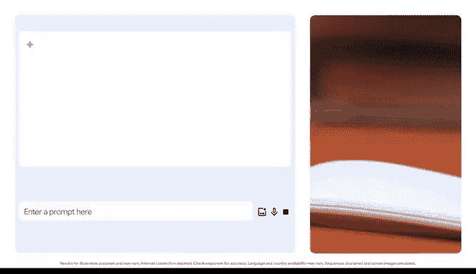

# 010：借助人工智能清理和准备数据 🧹🤖

在本节课中，我们将学习如何利用人工智能工具来高效地清理和准备数据，从而节省大量手动处理时间，为深入分析奠定坚实基础。

你是否曾花费大量时间准备用于分析的数据？例如清理电子表格、修正错误数据、更改数据类型以确保准确性，或者重命名列。对于数据分析师而言，答案是肯定的，我们投入了大量时间。在我们的领域，干净的数据是任何分析的基础。数据分析师通常会从利益相关者、外部供应商，甚至旧的代码和数据库中，获得庞大、不完整甚至包含错误的数据集。对于每个数据集，我可能需要花费高达30%的时间来清理、验证和准备分析。这个过程可能非常繁琐。

人工智能帮助我收回了一些时间，让我能专注于我真正热爱的深度分析工作。像Gemini这样的生成式人工智能工具，可以帮助数据分析师快速识别数据质量问题、标准化日期格式、检测并删除重复项，以及识别数据集中的潜在特征。例如，Gemini可以提供实现高质量数据的详细流程。借助更高级的工具，如Gemini for Google Workspace，我们可以授予其对数据集的访问权限，并让工具自动完成更改。

回想一个你最近处理过的数据集。它可以是本证书课程中的数据集，也可以是你最近完成的工作项目。请暂停视频，认真思考一下。在尝试清理该数据时，你遇到的最常见问题是什么？是错误的数据类型、缺失的信息，还是不清晰的字段名称？如果人工智能能在你的一些提示下帮助解决所有这些问题呢？

让我展示一个例子。假设我有一个描述每日销售数据的数据集。这个数据集的日期格式不一致。这很令人沮丧，对吧？我该如何修复它们呢？我可以输入这样一个提示：

> “我收到了一个销售数据集，其中包含许多格式问题，特别是日期格式不一致。我将输入一些通用日期作为示例。请描述一个在Google Sheets中专门用于清理和标准化日期格式的分步过程，以确保数据已准备好进行准确分析。”

现在，让我们看看输出结果。

Gemini提供了步骤，指导我如何识别数据中可能包含日期的列。然后，它提供了技巧，以便更容易地找出哪些字段包含日期，以及如何选择标准格式，使所有日期以相同方式显示。它甚至给出了关于错误处理的说明，以确保以最安全的方式将信息转换为我选择的标准格式。

这很酷，对吧？人人都能获得干净的数据。在这个例子中，Gemini引导我们完成了清理和标准化日期格式的过程。但这只是生成式人工智能在数据分析中能力的冰山一角。许多企业级人工智能工具可以更进一步，自动化此类数据清理任务。这可以节省宝贵的时间和资源，让你专注于战略决策等事务。

现在，请亲自尝试一下。尝试和实验提示词是找出如何获得对你有用结果的最佳方式。打开一个你正在处理的数据集，看看生成式人工智能工具如何提供帮助。

获得你想要的输出有时可能是一个过程，而达到目标的唯一途径就是适应、探索并找到适合你的路径。

---

本节课中，我们一起学习了如何利用人工智能工具（如Gemini）来高效地识别和解决数据质量问题，例如标准化日期格式。通过具体的示例和提示词技巧，我们看到了AI如何将我们从繁琐的数据准备工作中解放出来，从而有更多时间进行更有价值的深度分析与决策。