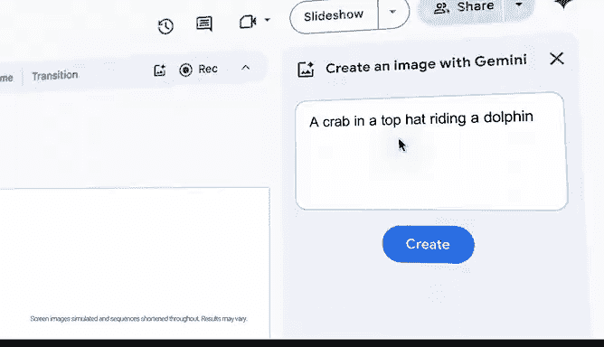

# 014：人工智能基础课程介绍 🤖

在本节课中，我们将学习谷歌人工智能基础课程的核心内容。课程旨在为初学者介绍人工智能的基本概念、应用及其在数据分析中的重要性。我们将从宏观视角理解人工智能，并了解如何开始学习这一领域。

---

## 课程概述

人工智能是当今技术发展的前沿领域，它致力于让机器模拟人类的智能行为。本课程将引导你进入这个充满可能性的未来。

正如上图所示，人工智能领域广阔而深邃。接下来，我们将深入探讨其基础。

---

## 什么是人工智能？

上一节我们概述了课程目标，本节中我们来看看人工智能的具体定义。人工智能是一门研究如何使计算机能够执行通常需要人类智能才能完成的任务的科学与工程。其核心目标是创建能够**学习**、**推理**和**解决问题**的系统。

一个简单的机器学习公式可以表示为：
`模型输出 = f(输入数据)`
其中，函数 `f` 是通过算法从数据中学习得到的映射关系。

---

## 人工智能的主要应用领域

理解了基本定义后，我们来看看人工智能在现实世界中的用武之地。人工智能已广泛应用于多个行业，改变着我们的工作和生活方式。

以下是人工智能的几个关键应用领域：

*   **图像识别**：让计算机“看懂”图片，例如人脸识别、医学影像分析。
*   **自然语言处理**：让计算机理解和生成人类语言，例如智能客服、机器翻译。
*   **预测分析**：基于历史数据预测未来趋势，例如销售预测、风险评估。
*   **自动化决策**：在特定规则下自动做出判断，例如信贷审批、游戏AI。

上图展示了人工智能技术如何集成到各种解决方案中。选择正确的方向并深入其中至关重要。

---

## 如何开始学习人工智能？

面对如此丰富的应用，初学者可能会感到无从下手。本节将为你提供清晰的学习路径。学习人工智能需要循序渐进，从基础概念到实践应用。

以下是给初学者的学习步骤建议：

1.  **打好数学与编程基础**：重点掌握线性代数、概率统计以及Python编程。
2.  **学习核心机器学习概念**：理解监督学习、无监督学习、深度学习等基本范式。
3.  **动手实践项目**：通过Kaggle等平台的项目，将理论知识应用于实际数据。
4.  **专精一个领域**：在广泛了解后，选择计算机视觉或自然语言处理等一个方向深入。

学习之路充满挑战，但坚持是通往成功的唯一途径。

---

## 人工智能的未来展望

人工智能的发展日新月异，其潜力巨大。它正在并将持续引领技术革命，将我们带向一个更智能的未来。

未来的可能性如同高悬的星辰，广阔无垠。我们将拥抱这个由人工智能驱动的未来。

---

## 总结

本节课中，我们一起学习了人工智能的基础介绍。我们明确了人工智能的定义，了解了其主要应用领域，为初学者规划了学习路径，并展望了其未来潜力。记住，在这个领域，只有持之以恒的“赢家”，没有轻易放弃的“初学者”。现在，你已经准备好向人工智能的未来迈出第一步了。