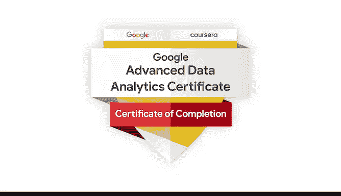

# 015：课程完结与祝贺 🎉

在本节课中，我们将回顾并祝贺你完成整个谷歌高级数据分析证书课程。你将看到来自课程团队的祝贺信息，并了解如何获取和展示你的结业证书。

---

## 课程完结祝贺

出色的工作。你已经完成了整个课程项目。

还记得你在课程开始时，承诺要提升自己的数据分析和技能吗？经过你所有的努力和奉献，你已经兑现了那个承诺。

我很荣幸能成为第一个祝贺你所取得成就的人，但我肯定不是最后一个。还有几位朋友正等着向你致意。

祝贺你完成这门课程。了不起的工作。

祝贺你获得证书。你应该为自己感到骄傲。

祝贺你取得的所有进步。干得好。大家做得太棒了。恭喜你。

你完成了课程。祝贺你完成项目的这一部分，并祝你接下来的旅程好运。

恭喜。干得好。祝贺你，希望有一天我们能一起工作，并在谷歌找到一份工作。

恭喜。这并非易事，而你坚持了下来。为你感到非常自豪。

太棒了。祝贺你。你做得非常出色。祝你好运。恭喜你。你做到了。

祝贺你，你已经完成了课程，现在可以迈出第一步，开始你的职业生涯了。你已经做到了。

你完成了课程。我期待在下次面试中见到你，听你讲述你所做的所有精彩事情。恭喜，祝贺，太棒了。

祝贺你，你做到了。祝你接下来的数据科学之旅好运。

是时候庆祝你的成就了。你为完成这个项目付出了巨大的努力，并对成为一名数据专业人士意味着什么有了深刻的了解。

剩下要做的就是领取你的结业证书，你可以将其展示在你的简历或领英个人资料上。

我希望你和我一样为自己的成就感到自豪。

在整个课程中支持你的学习之旅真是太棒了。

现在，是时候让你走出去，在数据职业领域产生影响。

暂时再见了。

---

## 总结

本节课中，我们一起回顾了整个谷歌高级数据分析证书课程的完结时刻。课程团队向你表达了热烈的祝贺，并鼓励你将所学知识应用于实践，开启数据领域的职业生涯。请记得领取并展示你的结业证书，这是你努力和能力的证明。