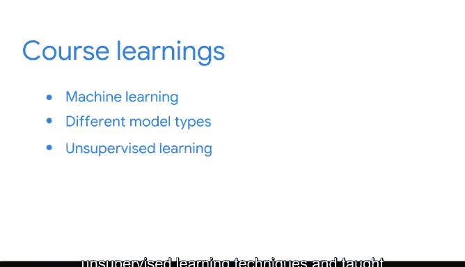

# 016：探索职业发展机会 🎯

在本节课中，我们将学习如何将你获得的谷歌职业证书转化为实际的职业机会，并回顾整个课程体系所涵盖的核心技能与知识。

---

你刚刚获得了谷歌职业证书。这是一个巨大的成就，它证明了你为未来学习新技能付出了努力。

我代表我的课程讲师同事和我自己，向你表示祝贺。

既然你已经获得了证书，你可以在求职过程中分享你的成就。

证书可以展示在诸如领英、Indeed和Glassdoor等求职平台上。

你也可以通过“与谷歌共同成长”雇主联盟，与你所在领域渴望招聘的公司建立联系。

正如你在本课程开始时了解到的，对数据技能的需求正以惊人的速度增长。

凭借你从本课程中获得的知识和技能，你可以开始申请工作，或在这个高增长、高影响力的领域中推动你的职业生涯发展。

这个过程可能需要一些时间。但你现在已经具备了在数据职业领域获得聘用所需的一切条件。

---

## 回顾课程所学 📚

上一节我们提到了证书的价值，本节中我们来系统地回顾一下你在整个课程中学到的所有内容。

你首先学习了数据科学的基础知识。在这里，你了解了数据专业人员在组织中所扮演的角色和职能。

接着，你学习了数据工具以及结构化工作流程的重要性。需要记住的是，作为一名数据专业人员，有效的沟通对于成功的协作至关重要。

最后，你了解了数据驱动领域的职业，以及如何为你的未来做好准备。

在下一门课程中，你学习了如何使用Python进行数据相关工作。你研究了Python语言中的各种概念，例如：
*   **语法**
*   **变量**
*   **循环**
*   **字符串**
*   **数据结构**
*   **面向对象编程**

此外，你还发现了如何通过库和包来扩展Python的功能。

接下来，你探索了如何通过探索性数据分析来发掘数据中的故事。在这里，你使用了Python中更多的工具来清理和准备数据以供分析。

你还学习了如何使用Tableau创建可视化图表，以帮助呈现大型数据集中的信息。

在你的统计学课程中，你学习了描述性统计和推断性统计。以下是核心概念：
*   **基本概率和概率分布**
*   **抽样**
*   **置信区间**
*   **假设检验**

你还有机会使用真实数据进行A/B测试。

然后，你研究了回归模型，并学习了其假设、验证、构建、评估和解释。所有这些内容都使用Python进行了探索，并融入了你的工作流程。

最后，在最后一门课程中，你专注于机器学习领域。基于你对机器学习的了解，你探索了不同类型的模型，例如：
*   **监督学习**
*   **连续变量模型**
*   **分类变量模型**

你还被介绍了无监督学习技术，并学习了如何使用它们来满足业务需求。

---

## 持续学习与职业发展 🚀

这是一项巨大的工作量。当你进入职业生涯的这个新阶段时，请务必通过关注数据职业领域的趋势来保持参与。

你的学习之旅并未在此结束。你可以通过以下方式保持与时俱进：
*   关注行业新闻。
*   了解新兴的数据洞察。
*   探索提升技能的新方法。

同时，请持续更新你的作品集和简历，以突出你的最佳工作和所取得的成就。

你已经展现了对该领域的认真投入。所以，请保持好奇心。

至此，再次祝贺你。能够带领你完成本课程的最后部分，我感到非常荣幸。我知道你已经为成为一名出色的数据专业人员做好了充分准备。

祝你好运。