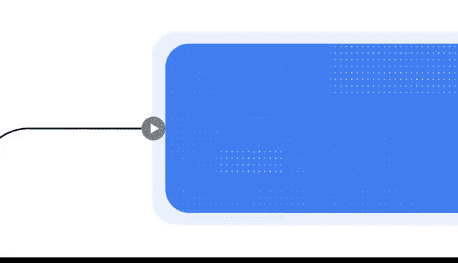

# 001：课程概述与AI简介

在本节课中，我们将要学习人工智能（AI）的基本概念，了解它如何改变现代工作方式，并介绍谷歌AI Essentials课程的目标与结构。

现代职场正在发生重大转变，而AI正处于这场激动人心变革的最前沿。正如互联网彻底改变了我们处理各项任务的方式，AI同样有潜力改变我们的工作和生活方式。

AI代表**人工智能**。它是一种实用的解决方案，旨在减少常规任务所耗费的时间。在工作中有效学习使用AI，能帮助你达成目标，并让你在不断变化的职场环境中为成功做好准备。

## AI如何助力日常工作

以下是一些AI如何协助日常工作的具体例子：

*   **数据分析**：AI可以在几秒钟内帮助你分析电子表格中的信息，而无需耗费数小时进行人工审查。
*   **报告撰写**：AI可以起草详细的销售报告，并突出关键见解以便与团队分享。
*   **日程管理**：AI可以为你安排会议。
*   **内容创作**：AI可以创建引人入胜的演示文稿。
*   **头脑风暴**：AI可以增强你的头脑风暴环节。
*   **任务处理**：AI可以承担各种其他任务，从而缩短你的待办事项清单。

无论你是想学习AI基础知识，还是希望简化常规任务，或是专注于提升个人技能，我们设计的谷歌AI Essentials课程都能提供帮助。

## 课程介绍与导师

大家好，我是玛雅，现任谷歌研究院战略与运营副总裁。在我的职责中，我领导一个团队，通过加速研究进程和培育卓越的研究环境来帮助谷歌实现其使命。

我很高兴能作为你的向导，一同探索这项正在重塑商业世界的技术——AI。在整个课程中，你将有机会向谷歌内部多元化的AI专家们学习，他们的角色涵盖从项目管理到AI产品与服务总监。他们将分享各自对AI的见解，以及AI如何提升你的工作表现并推动职业发展。

## 课程结构与收获

谷歌AI Essentials课程旨在适应你的日程安排。你可以完全在线、按照自己的节奏完成学习，并且无需具备任何AI经验。

本课程将包含以下内容：

*   **专家视频**：来自谷歌AI领域员工的讲解。
*   **阅读材料**：帮助你深化对概念的理解。
*   **互动活动**：为你提供使用AI的实践经验。

在课程结束时，你将有机会获得一项技能徽章。此徽章可以展示在你的简历、社交媒体个人资料和电子邮件签名中。

## 课程将解答的核心问题

如果你对AI尚不熟悉，可能心中有许多未解的疑问。你可能会想：

*   我该如何使用AI工具来提高工作效率？
*   我该如何在工作中负责任地应用AI？
*   我该如何为职场中AI的未来做好准备？

在谷歌AI Essentials课程中，我们将逐一解答这些问题，并涵盖更多内容。

## 总结

本节课中，我们一起学习了AI在现代工作中的变革性作用，了解了它如何通过自动化常规任务来提升效率。我们还介绍了谷歌AI Essentials课程的设计初衷、结构以及你将从中获得的实际技能与认证。希望你能与我一同踏上这段旅程，探索AI如何提升你的职业生涯与生活。让我们开始吧。