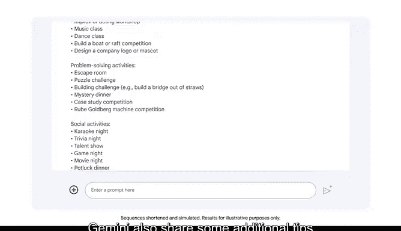

# 006：生成式AI基础

## 概述
在本节课中，我们将要学习生成式AI的基础知识。我们将了解什么是生成式AI，它是如何工作的，以及它如何通过自然语言与我们交互，从而为工作和创作带来新的可能性。

---

## 生成式AI简介
人工智能技术的进步正在重塑我们的工作方式。让我们来探索这一变革的核心发展之一：生成式AI。

顾名思义，生成式AI是一种能够生成新内容的人工智能，例如文本、图像或其他媒体。生成式AI工具的一个独特品质是你可以使用自然语言与它们交互。

自然语言指的是人们相互交流时说话或书写的方式。

## 生成式AI如何工作
以下是生成式AI工具如何使用自然语言工作的简化概述。

首先，你提供输入。输入是指发送给计算机处理的任何信息或数据。许多生成式AI工具接受文本和语音输入，有些也接受图像或视频文件。

接下来，数据由AI工具处理。然后，以文本、图像、音频或视频的形式生成输出。

## 生成式AI的可能性
生成式AI以及使用自然语言与计算机交互的能力，为人们利用AI进行创作开辟了无限可能的世界。

例如，假设你正在推广一项新业务。你需要新鲜、引人入胜的内容，比如一张宣传新产品的促销海报，但你没有创意团队来实现你的想法。

无需压力，只需几条指令，生成式AI就可以帮助你创建海报。如果生成的内容不符合你的期望，你可以提供额外的指令，直到它产出符合你需要的东西。

这只是生成式AI如何补充你技能的一个例子。但它还有许多其他方式可以使你和你的工作受益。

以下是生成式AI的一些主要优势：
*   **提升生产力**：帮助你完成诸如起草电子邮件回复等任务。
*   **避免错误**：协助你减少工作中的失误。
*   **改善决策**：通过回答问题并与你进行头脑风暴，来优化你的决策过程。

无论你从事医疗保健、教育、金融、零售还是任何其他领域，都有各种各样的生成式AI工具可以满足你的需求。

## 对话式AI工具示例
一个例子是对话式AI工具。对话式AI工具是一种处理文本请求并生成文本响应的生成式AI工具。你可以用它来进行头脑风暴、回答问题并提高生产力。

在Google AI Essentials课程中，你将获得使用Google开发的名为Gemini的对话式AI工具的实践经验。

当你思路受阻时，可以使用Gemini获取创意灵感，完善你的想法，并获得详细的解释，帮助你轻松探索主题。

例如，让我们请Gemini为我们的夏季工作静修会头脑风暴一份团队建设活动清单。AI工具会给出从有趣的海滩派对到轻松的陶艺课等一系列广泛的想法。Gemini还会分享一些在规划成功的工作静修会时需要考虑的额外建议。

---

## 总结
本节课中，我们一起学习了生成式AI的基础。我们了解到生成式AI能够创造新内容，并通过自然语言指令与我们交互。我们探讨了它的工作流程，以及它如何通过提升效率、辅助决策等方式为各行各业带来价值。最后，我们以Gemini为例，看到了对话式AI工具的实际应用。

生成式AI已经为激动人心的新前沿铺平了道路。但在我们能够挖掘这项技术所提供的全部潜力之前，有必要先整体探究AI的能力与局限性。请继续学习本课程的下一部分以开始深入了解。