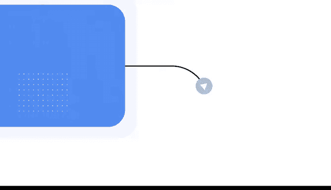
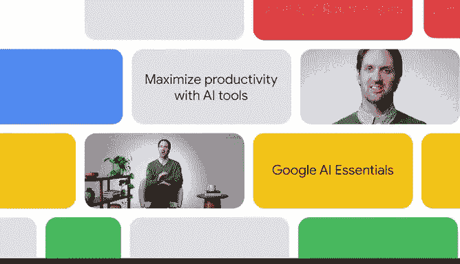

# 011：利用AI工具最大化生产力 🚀

在本模块中，我们将探索如何有效地使用AI工具来处理各种任务，从而提升您的工作效率。我们将了解生成式AI如何改变工作方式，并学习如何负责任地应用这些工具。

---

AI工具正在彻底改变我们的工作方式。这些工具能提供创造性的解决方案，帮助组织和个人应对大大小小的挑战。

无论您身处设计、金融还是其他任何领域，生成式AI都能帮助您简化流程并最大化生产力。

上一节我们介绍了AI工具的整体影响，本节中我们来看看它在不同场景下的具体应用。

以下是生成式AI可以帮助完成的一些具体任务：

*   **内容创作**：生成式AI可以帮助您在几分钟内撰写草稿和创建图像。
*   **数据分析**：生成式AI可以协助您预测趋势并向利益相关者传达见解。
*   **头脑风暴**：生成式AI同样可以帮助您构思创新想法。

---

嗨，我是Tris，是Google DeepMind的产品管理总监。我和我的团队共同构建能够简化复杂任务的AI产品，旨在让您的日常工作更顺畅、更高效。

我在谷歌工作了近10年，见证了AI领域的许多惊人项目。大约20年前，我在马萨诸塞州剑桥市的一家小型初创公司开始了我的AI职业生涯，当时我们正在构建一个自然语言搜索引擎。

在我的工作中，我使用AI与同事协作、研究新产品概念，并寻找解决问题的创造性方法。例如，我经常使用AI来集思广益，思考如何让我的团队会议更有趣、更高效。

本质上，我大量使用AI来帮助我提高生产力并更好地实现目标。

---

我很高兴能作为您的向导，带您进入充满活力的生成式AI世界。

在课程的这一部分，我们将探索生成式AI的实际应用，这些应用可以改变您的工作方式。在此过程中，您将学习如何利用AI工具提升生产力。

您还将学习如何通过应用“人在回路”的方法来负责任地使用AI。

那么，您准备好探索生成式AI如何改变您的工作日了吗？让我们一起来发现您可以用AI完成的所有奇妙事情。

---

**总结**

本节课中我们一起学习了生成式AI如何成为提升生产力的强大工具。我们了解了它在内容创作、数据分析和创意构思等不同领域的应用，并认识到结合人类智慧的“人在回路”方法是负责任使用AI的关键。准备好将这些知识付诸实践，让AI助力您的日常工作吧。