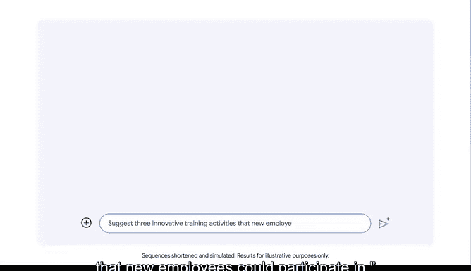

**AI基础知识：P16：使用Gemini进行提示词实践**

在本节课中，我们将通过一个连贯的求职与职场发展案例，学习如何为AI工具（如Gemini）创建清晰、有效的提示词，以生成有用的内容。

---

上一节我们介绍了提示词的基本概念，本节中我们来看看如何在实际场景中应用它。我们将模拟一个从求职到职业发展的完整流程，展示如何通过逐步优化与AI的交互来达成目标。

首先，访问Gemini工具。请前往 **`Gemini.google.com`**。

使用您的谷歌账户登录。如果您没有账户，可以点击“创建账户”免费注册一个。

登录后，您就可以开始向Gemini输入提示词了。

**场景一：撰写求职信**

假设您想申请一份社交媒体相关的工作。一个简单的初始提示词可以是：

> **`为一份社交媒体职位写一封求职信。`**

Gemini的回复将为您提供一个有用的起点或模板。您可以在此基础上进行定制和润色，让您的求职信脱颖而出。完成修改后，您就可以寄出这封信了。

好消息是，您收到了公司的面试邀请。😊

**场景二：准备面试**

您可以继续使用Gemini来帮助准备面试。您的下一个提示词可以是：

> **`有哪些面试技巧可以帮助我为社交媒体职位做准备？`**

输出的内容将包含一系列可供选择的建议。这些建议似乎很有见地，并且针对社交媒体行业，提供了面试前和面试中的行动指南。

**场景三：设计新员工培训**

时间快进几年。您成功获得了那份社交媒体工作，并在公司内不断成长，现在负责新员工的入职培训。您可以再次求助于Gemini，使用如下提示词：

> **`建议三项新员工可以参与的创新培训活动。`**

这些建议是非常有趣的新员工活动。

---

**总结与核心要点**

本节课中，我们一起学习了如何在实际任务中使用Gemini。通过从撰写求职信、准备面试到设计培训活动的连贯案例，我们实践了与AI工具的交互过程。

使用生成式AI工具时，编写清晰、具体的提示词至关重要。以下是有效提示词的两个关键原则：

*   **明确性**：直接说明您想要什么（例如，“写一封求职信”、“建议面试技巧”）。
*   **具体性**：提供相关背景（例如，“为社交媒体职位”），以获取更贴切的回复。

您实践编写提示词的次数越多，就越能熟练运用AI工具来实现您的目标。