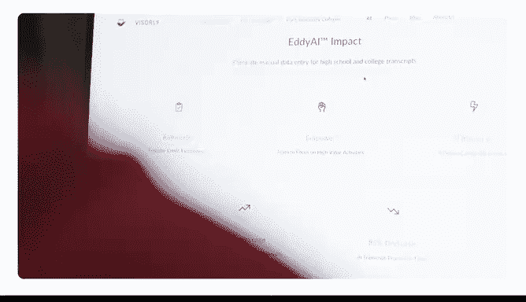

# 020：使用Gemini帮助分析业务表现 📊

## 概述
在本节课中，我们将学习如何利用Gemini与Google Sheets的结合来分析和解读业务数据，从而高效地做出数据驱动的决策。我们将通过一个产品反馈调查数据的实例，演示从简单提问到深入分析，再到生成可视化图表的过程。

---

拥有一个技术平台意味着我们会获得海量的数据。这些数据包括用户数据和性能数据。理解这些数据有时会是一项挑战。下一个最重要的功能是什么？下一个需要优化的关键点是什么？下一个最重要的决策是什么？利用Gemini与表格的结合，在帮助我们制定战略以及赋能团队使用分析工具做出数据驱动决策方面，效果非常显著。

将Gemini与Google Sheets结合使用的能力对我们的业务产生了不可思议的影响。这是一个改变游戏规则的工具。我们无法想象没有它的日子。



一个好的电子表格确实令人满意，它非常有序，内容集中。但必须承认，分析和理解所有这些数据也可能耗费大量时间。幸运的是，Gemini和Google Sheets可以加速这个过程，让你能直接做出明智的、数据驱动的决策。

上一节我们提到了数据驱动决策的重要性，本节中我们来看看如何实际操作。

## 开始分析：提出简单问题
我们来尝试一下。我将打开一个包含产品反馈调查数据的Google表格，并从一句非常简单的提示开始。

我们之所以能保持提问简单，是因为电子表格包含了Gemini所需的所有上下文信息。一个更开放式的提示有助于我们发现数据中更广泛的趋势或模式。

以下是分析数据的初始提示示例：
```
分析这份产品反馈调查数据。
```

就这样，Gemini分析了反馈调查数据，并开始帮助我识别需要改进的领域。有几个地方的得分我希望看到更高，但今天我将只关注“易用性”得分。我会向Gemini寻求更多帮助。

## 深入探究：获取具体建议
基于上一节得到的初步分析，我们现在可以提出更具体的问题来获取行动建议。

基于这些反馈，我可以做些什么来提高我的易用性得分？

Gemini提供了七条不同的改进建议。有些项目我可以很快解决，比如改进文档和教程。但其他项目则更具挑战性，比如减少故障和错误。总的来说，这些信息很有见地，将帮助我改善客户的体验。

如果你不擅长数据分析，不用担心，只需提示Gemini Sheets帮你开始。你可以问一些简单的问题，比如“趋势是什么？”或者“我应该关注哪些数据点？为什么？”这种从宽泛到具体的提问方法，在你试图从数据中发现新的趋势、关联或见解时特别有用。

## 数据可视化：分享你的发现
最后，你还可以使用Gemini生成数据可视化图表。一旦你收集到见解，就可以要求生成一个图表或图形来展示你的数据。现在，你可以轻松地与其他人分享你的发现。

以下是请求可视化的示例提示：
```
为这些数据生成一个图表。
```

准备好尝试了吗？你需要分析什么数据？

---


## 总结
本节课中我们一起学习了如何利用Gemini与Google Sheets的强大组合来分析业务数据。我们从提出一个简单的分析提示开始，逐步深入到获取具体的改进建议，最后通过生成可视化图表来清晰地展示和分享分析结果。这套方法能有效帮助你从海量数据中快速提取有价值的信息，并据此做出明智的业务决策。