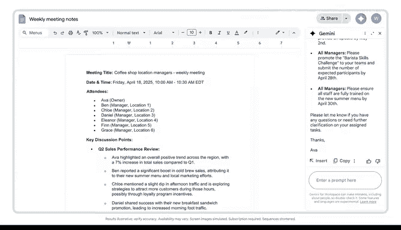
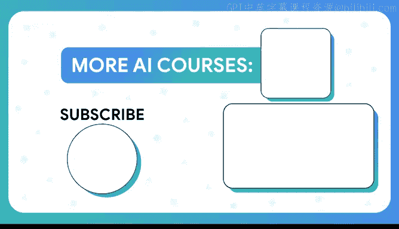

# 021：使用Gemini记录会议笔记 📝

在本节课中，我们将学习如何利用Google的AI助手Gemini来自动化会议记录流程。通过将记录任务交给AI，你可以更专注于会议本身的内容与互动，从而提高效率并确保信息的准确留存。

---

## 面临的挑战

我管理着50名员工，分布在六个不同的地点，每周都有大量的会议。这些会议常常让我手忙脚乱地记笔记，或者忙于安排会议、处理那些没人愿意做的会务工作。这就是我面临的主要问题。

## 解决方案：引入Gemini AI

在会议中引入Gemini AI来记录笔记，帮助我摆脱了所有这些负担。我现在的职责是与员工互动，确保他们得到支持并获得所需的答案。这为我的员工和我自己都建立了问责机制，我们可以回顾和参考这些历史记录。因此，我们现在不再是为了开会而开会，而是专注于运营业务、进行有效对话，并确保业务正式运转。


## 核心流程：如何使用Gemini记录笔记

为会议中讨论和达成一致的内容做记录很重要。但记录行为本身是否会分散你对会议进程的注意力？答案是肯定的。不过，你可以指示Gemini AI为你做笔记，从而让你保持专注和投入。

以下是具体操作步骤：

1.  **启动功能**：当你开始一个Google Meet会议时，选择“**使用Gemini记录笔记**”功能。
2.  **查看笔记**：会议结束后，你可以在一个Google文档中查看AI生成的笔记。
3.  **编辑与分享**：随后，你可以编辑这些笔记，并与所有与会者分享。

你还可以在文档中提示Gemini对笔记做更多处理，例如：
*   总结做出的关键决策。
*   创建下周会议的议程。
*   起草一封后续邮件，提醒经理们他们的待办事项。

现在让我们来尝试一下。创建一个后续邮件，提醒与会者他们的待办事项。看，我们得到了一封邮件草稿，我可以轻松复制并自定义，以便团队能够继续推进工作。



## 进阶技巧与提示


对于那些会议不断或希望获得帮助以保持条理的人来说，这是一个改变游戏规则的功能。当你使用Gemini和Docs进行会议跟进时，这里还有几个技巧。

假设文档中有一个非常具体的部分需要Gemini的帮助。我可以高亮显示那段文本，并指示Gemini将会议笔记中高亮的部分**缩减为两行摘要**。

另一个我喜欢做的操作是，假设我想加入一个关于我们项目目标的快速提醒，而这些信息存在于另一个文档中。没问题，你可以引入这些信息。只需使用 **`@`** 符号并输入文档名称，然后告诉Gemini你想用它做什么。

**代码示例：引入外部文档信息**
```
@项目目标文档 请将核心目标总结为三点。
```

测试一下这个功能。你正在处理哪些文档？你可能会如何使用Gemini来帮助你保持条理和进度？



---

## 总结


本节课中，我们一起学习了如何利用Gemini AI来高效管理会议记录。从启动Google Meet中的记录功能，到查看、编辑AI生成的笔记，再到利用提示词让Gemini总结要点、起草邮件或整合其他文档信息，这一整套流程将你从繁琐的记录工作中解放出来，让你能更专注于会议的核心讨论与决策，从而提升整体工作效率和团队协作的清晰度。