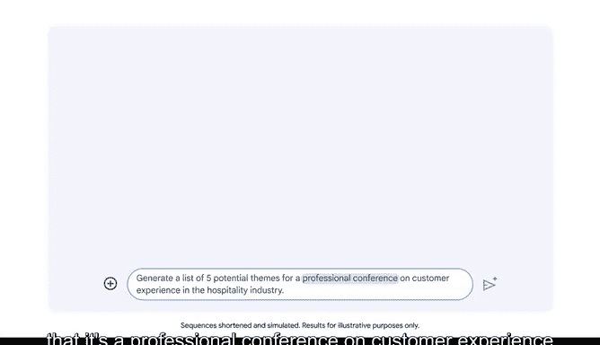

# 026：编写清晰具体的提示


## 概述
在本节课中，我们将学习如何编写清晰、具体的提示，以便从大型语言模型（LLM）中获得有用的输出。我们将探讨提示工程的基本概念，并通过实例演示如何通过改进提示来提升AI工具的回答质量。

## 提示工程的重要性
上一节我们介绍了AI工具的基本工作原理，本节中我们来看看如何与它们有效沟通。你投入的质量会极大地影响你产出的质量。

这类似于烹饪。如果你使用新鲜、高质量的食材，就更可能做出一顿美餐。反之，如果缺少某种食材或食材质量不佳，最终的菜肴可能就不那么理想。同样地，你输入到对话式AI工具中的提示质量，也会影响该工具输出的质量。

这就是提示工程发挥作用的地方。提示工程涉及设计最佳的提示，以从LLM中获得你想要的输出。这包括编写清晰、具体并提供相关背景信息的提示。

## 理解LLM所需的上下文
为了更好地理解LLM所需的上下文，我们来比较一下人和LLM对同一个问题的反应方式。

假设一位素食者问他的朋友：“我在旧金山应该去哪些餐厅？”这位朋友很可能会推荐那些有不错素食选择的餐厅。然而，如果向LLM提出同样的问题，它可能会推荐一些不适合素食者的餐厅。

人在回答问题时，会本能地考虑到朋友是素食者这一事实。但LLM没有这种先验知识。因此，要从LLM那里获得所需信息，提示必须更加具体。在这个例子中，提示需要明确指出餐厅应该提供良好的素食选择。

## 改进提示的实践案例
让我们通过一个例子来探索如何运用提示工程来提高LLM输出的质量。

假设我们承担了策划一场公司活动的任务。你需要为一个即将召开的会议寻找一个主题。我们首先写一个提示给Gemini，让它为一场活动生成五个潜在的主题列表。你可以在ChatGPT、Microsoft Copilot或任何其他对话式AI工具中使用类似的提示。

初始提示示例：
```
生成一个活动主题列表。
```

现在让我们回顾一下这个提示得到的回应。这并非我们想要的结果。我们得到的列表似乎更像是派对主题，而不是专业会议的主题。我们的提示没有提供足够的背景信息来产生我们需要的输出。它不够清晰，也不够具体。

## 编写清晰具体的提示
让我们再试一次。这次我们将输入一个更具体的提示。

改进后的提示示例：
```
为酒店业客户体验专业会议生成五个潜在主题列表。
```



这个提示具体得多，明确指出这是一个关于酒店业客户体验的专业会议。让我们检查一下这次的回应。这次好多了。我们通过工程化设计，让提示包含了具体、相关的背景信息，因此Gemini能够生成有用的输出。

当你提供清晰、具体的指令，并包含必要的上下文时，你就能使LLM生成有用的输出。请记住，由于LLM的局限性，在某些情况下，无论你的提示质量多高，都可能无法获得高质量的输出。例如，如果你提示LLM查找关于当前事件的信息，但LLM无法访问该信息，它就无法提供你需要的输出。

## 提示工程的迭代过程
与其他设计领域一样，提示工程通常是一个迭代过程。有时，即使你提供了清晰具体的指令，也可能无法在第一次尝试时就获得想要的输出。

当我们的第一个提示没有产生想要的回应时，我们修改了提示以改进输出。第二次迭代提供了足够清晰和具体的指令，从而产生了更有用的输出。

以下是编写有效提示的一些关键要点：

*   **提供上下文**：明确说明任务背景，例如行业、受众、目标。
*   **具体化要求**：避免模糊描述，使用精确的词汇定义你想要的输出类型。
*   **明确格式**：如果需要特定格式（如列表、报告、邮件），在提示中说明。
*   **包含示例**：如果可能，提供一个你期望的输出样例。
*   **分步指示**：对于复杂任务，将提示分解为清晰的步骤。

## 总结
本节课中，我们一起学习了编写清晰具体提示的核心原则。我们了解到，提示的质量直接决定AI输出结果的质量。通过为LLM提供充分的上下文和明确的指令，我们可以显著提高其回应的相关性和实用性。记住，与AI沟通就像与一位知识渊博但缺乏背景信息的助手合作，你的提示越清晰、越具体，你得到的帮助就越有效。提示工程是一个需要练习和迭代的技能，不断优化你的提问方式，是驾驭AI工具的关键。