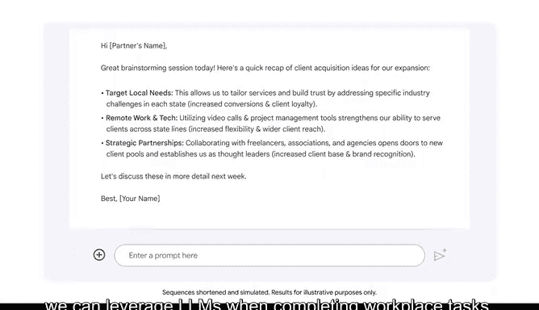

# 027：在工作中利用LLM的能力


## 概述
在本节课中，我们将学习如何利用大型语言模型（LLM）的能力来提升工作效率与创造力。我们将探讨LLM在内容创作、总结、分类、信息提取、翻译、编辑和问题解决等多个方面的具体应用。

---

## 内容创作 📝
上一节我们介绍了LLM的基本概念，本节中我们来看看如何利用LLM进行内容创作。你可以使用LLM来生成电子邮件、计划、想法等多种内容。

例如，你可以要求LLM帮助你撰写一篇关于工作相关主题的文章。让我们提示Gemini为一篇关于数据可视化最佳实践的文章创建大纲，这篇文章的目标读者是初级业务分析师。

**提示词示例：**
```
为初级业务分析师创建一篇关于数据可视化最佳实践的文章大纲。
```

请注意，提示词以动词“创建”开头。在提示词中包含动词通常有助于引导LLM为你的预期任务生成有用的输出。

LLM的输出为文章的初稿提供了一个有用的大纲。

---

## 总结 ✂️
除了创作，LLM还可用于总结。LLM能够总结冗长文档的要点。

例如，你可以要求Gemini总结一段关于项目管理策略的详细段落。我们将以动词“总结”开始提示词，并指定输出为单个句子，然后附上需要总结的段落。

**提示词示例：**
```
用一句话总结以下段落：[此处插入需要总结的段落]。
```

输出提供了该段落的便捷单句总结。虽然此示例展示了如何总结单个段落，但你也可以要求LLM总结更长的文本和文档。

---

## 分类 🏷️
分类是LLM的另一项可能用途。例如，你可以提示LLM将一组客户评论的情感或感受分类为正面、负面或中性。

让我们提示Gemini将关于零售网站新设计的客户评论分类为正面、负面或中性。提示词包含动词“分类”以引导输出，并附上评论内容。

**提示词示例：**
```
将以下客户评论分类为正面、负面或中性：[此处插入评论列表]。
```

输出准确地分类了评论。你可以考虑如何利用LLM来高效完成大型分类任务。

---

## 信息提取 📊
你还可以使用LLM进行信息提取，即从文本中提取数据并将其转换为更易于理解的结构化格式。

假设你有一份提供某全球组织信息的报告。你可以提示Gemini提取报告中所有提及的城市和收入，并将其放入表格中。

**提示词示例：**
```
从以下报告中提取所有提到的城市和收入，并放入一个表格中：[此处插入报告内容]。
```

请注意，你不应将机密信息输入LLM，但在此示例中，报告内容并非机密。输出会显示一个包含“城市”和“收入”列的表格，以组织良好的格式呈现信息。

---

## 翻译 🌐
翻译是LLM的另一项应用。你可以利用LLM在不同语言之间翻译文本。

例如，你可以要求Gemini将培训课程的标题从英语翻译成西班牙语。

**提示词示例：**
```
将以下英文标题翻译成西班牙语：[此处插入英文标题]。
```

输出会提供多种西班牙语翻译选项供你选择，并解释每种翻译背后的理由，这有助于你为受众选择最有用的选项。

---

## 编辑 ✏️
LLM也可用于编辑，例如将一段文本的语气从正式改为随意，或检查文本的语法是否正确。

例如，Gemini可以帮助你编辑一篇关于电动汽车的技术分析，使其语言对非技术背景的受众更易于理解。我们以动词“编辑”开始提示词，并指定语言应易于非技术受众理解，然后附上技术分析内容。

**提示词示例：**
```
编辑以下技术分析，使其语言易于非技术背景的受众理解：[此处插入技术分析]。
```

输出提供了一个版本的分析，让不熟悉技术细节的受众也能理解。这只是LLM如何帮助你编辑文档的一个例子，LLM可以快速定制文档的语气、长度和格式以满足你的需求。

---

## 问题解决 💡
我们将讨论的LLM另一个用途是问题解决。你可以利用LLM为各种工作场所挑战生成解决方案。

例如，在规划公司活动时，你可以提示LLM寻找既能适应多位宾客的饮食限制，又符合节日主题菜单的餐饮解决方案。

再举一个例子。假设你是一位最近推出了新的文案编辑服务的企业家。让我们请Gemini解决一个与文案编辑服务相关的问题，即征求增加客户基数的建议。

**提示词示例：**
```
为我的新文案编辑服务提供增加客户基数的建议。
```

输出提供了接触新客户、优化服务和拓展业务的具体建议。我们还可以请Gemini起草一封电子邮件，以便轻松地与其他人分享这些想法。

LLM可以帮助你为许多不同类型的问题集思广益，寻找解决方案。

---



## 总结
本节课中，我们一起学习了在工作中利用大型语言模型（LLM）提升生产力的多种方法。我们探讨了LLM在**内容创作**、**总结**、**分类**、**信息提取**、**翻译**、**编辑**和**问题解决**等方面的具体应用。掌握这些技能对于在职场上有效利用AI至关重要。


接下来，我们将更深入地关注如何评估LLM的输出并优化你的提示词。