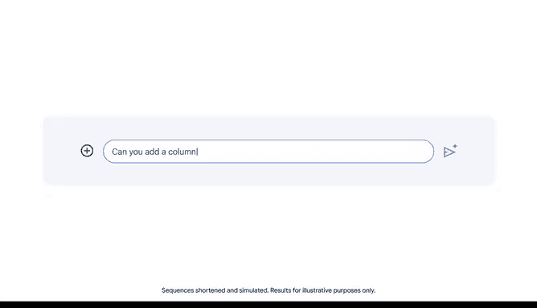

# 028：通过迭代改进AI输出 🔄

在本节课中，我们将要学习如何通过迭代过程来改进AI的输出。迭代是一种通过反复修改和优化来逐步接近目标的方法，这在提示工程中同样至关重要。

## 什么是迭代过程？

你是否曾为客户制作过演示文稿，或为自己的新业务设计过网站？如果答案是肯定的，那么你可能已经使用过迭代过程来实现目标。在迭代过程中，你先创建一个初始版本，然后对其进行评估和改进，从而产生下一个版本。接着，你重复这些步骤，直到获得满意的结果。

例如，如果你正在撰写一份提案、报告或其他需要与同事分享的文件，你可能会生成多个草稿，并在每一稿的基础上进行改进，直到对最终结果感到满意。

采取迭代方法通常是解决问题或开发产品最有效的方式。迭代过程在提示工程中也同样有效。

## 为什么需要迭代提示？

提示工程通常需要多次尝试才能获得最佳输出。大多数情况下，你无法在第一次尝试时就得到最理想的结果。如果尝试后没有成功，请不要气馁。相反，你应该仔细评估输出结果，找出未能获得预期响应的原因，然后修改你的提示以尝试获得更好的结果。

以下是即使创建了清晰具体的提示，也可能无法获得有用输出的几个可能原因：

**第一，大型语言模型之间的差异会影响输出。**
每个LLM都是基于独特的训练数据和编程技术开发的，并且对特定领域拥有不同的背景知识。因此，不同的模型可能对相似的提示做出不同的反应，并且可能无法为某些提示提供充分的回应。对你正在使用的LLM采取迭代方法将产生最佳结果。

**第二，LLM的局限性。**
之前我们了解到，LLM的输出有时可能不准确、存在偏见、不相关或不一致。你应该通过问自己以下几个问题来批判性地评估所有LLM输出：
*   输出是否准确？
*   输出是否无偏见？
*   输出是否包含足够的信息？
*   输出是否与我的项目或任务相关？
*   最后，如果我多次使用相同的提示，输出是否一致？

如果你在评估输出时发现任何问题，对你最初的提示进行迭代通常可以帮助你解决这些问题并获得更好的输出。

## 如何迭代改进提示？

首先，如果你注意到提示中缺少任何上下文，请将其添加进去。你的措辞选择也会显著影响LLM的输出。在提示中使用不同的词语或表达方式，通常会从模型那里得到不同的响应。尝试不同的措辞可以帮助你获得最有用的输出。

现在你对迭代提示有了更多了解，让我们来看一个例子。

## 实践案例：寻找宾夕法尼亚州的动画专业院校

假设你在一家视频制作公司担任人力资源协调员。公司希望为探索动画和动态图形设计职业的学生开发一个实习项目。公司位于美国宾夕法尼亚州。

你的团队希望与当地大学合作，为宾夕法尼亚州的学生提供实习机会。作为第一步，你需要创建一份宾夕法尼亚州设有动画专业的大学名单。这份名单应包含有关这些大学的必要详细信息，并且格式要组织良好，以便你的团队能够快速审阅。

**1. 初始尝试**
我们首先向Gemini（一个AI模型）提出一个基础请求：
`帮我找到宾夕法尼亚州有动画专业的大学。`

**2. 评估初始输出**
输出结果列出了宾夕法尼亚州拥有动画专业的大学，以及这些项目的进一步信息。这些信息很有用，但其结构方式不利于你的团队在联系这些大学时快速参考。将信息组织成表格会使它更易于阅读和理解，特别是对于像你的经理这样时间有限的利益相关者。

**3. 第一次迭代：指定输出格式**
我们可以通过添加上下文来迭代提示，以指定所需的输出格式。我们输入：
`以表格形式展示这些选项。`

现在，输出显示了一个表格，提供了每所大学的位置和所提供的具体学位类型的实用信息。这份名单现在采用了组织良好的格式，你的团队更容易跟进。

**4. 第二次迭代：添加关键细节**
虽然表格包含了你的团队所需的大部分信息，但它缺少一个关键细节：学校是公立还是私立机构。你的公司希望为公立和私立大学的学生都提供实习机会。

我们将向Gemini添加一个新的请求，将相关信息包含在表格中：
`你能添加一列显示它们是公立还是私立吗？`

现在，表格中包含了一列，用于指明大学是私立还是公立。

**5. 分享与利用结果**
为了以一种易于审阅和理解的格式与你的团队分享这些信息，你可以使用“导出到表格”功能。这将使你的团队能够轻松访问和分析数据，并根据结果做出明智的决策。

## 迭代提示的注意事项

你应该将同样的迭代方法应用于后续任务。在为其他任务开发提示时，请注意，在同一对话中先前所做的提示可能会影响你最新提示的输出。如果你注意到这种情况发生，可能需要开启一个新的对话。

## 总结

本节课中，我们一起学习了通过迭代改进AI输出的方法。迭代是提示工程的关键部分。通过对提示采取迭代方法，你可以利用LLM为你提供最符合需求的输出。记住，从清晰的提示开始，评估结果，识别不足，然后有针对性地修改和优化你的提示，是获得高质量AI协助的有效路径。